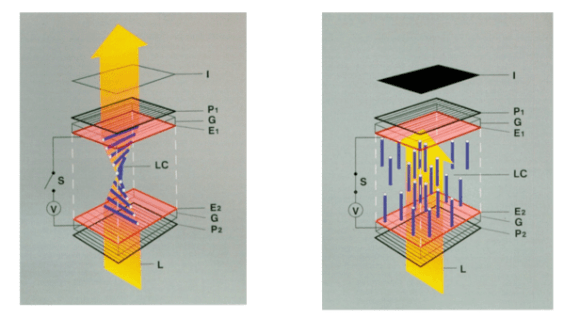
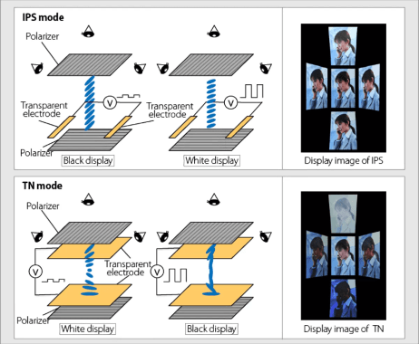
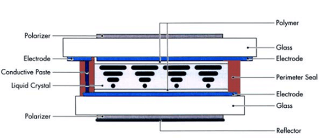

# TFT LCD 基础知识：结构、原理与优势

!!! abstract "快速结论"
    TFT LCD 的 "TFT" 指每个子像素都自带一个薄膜晶体管开关，这是它区别于无源矩阵 LCD 的核心。这个开关加上存储电容，让像素在整个帧周期内保持住自己的电压，从而同时做到高分辨率、高对比度与快速响应。本文拆解 TFT LCD 的层叠结构、像素架构与分类维度，并给出工程选型的验证清单。

## 核心要点

- TFT LCD 是在每个子像素上集成薄膜晶体管的有源矩阵液晶显示器，靠 TFT 开关 + 存储电容在一帧内保持电荷。
- 结构上由两片玻璃基板夹一层液晶构成：下基板是 TFT 阵列，上基板是 RGB 彩色滤光片，最外层各贴一片偏光片。
- 按液晶模式分 TN / VA / IPS / FFS，按晶体管材料分 a-Si / LTPS / IGZO，按照明方式分透射 / 半透半反 / 反射。
- 最终选型前，应同时确认光学、电气、结构、环境与量产五个维度的要求。

## 1. TFT LCD 是什么

TFT LCD（Thin-Film-Transistor Liquid Crystal Display，薄膜晶体管液晶显示器）是在每个子像素背后集成一个薄膜晶体管开关的有源矩阵液晶显示器。

液晶本身不发光，只充当一只受电压控制的"光阀"。要让每一个像素显示正确的灰阶，就必须把电压精确地加到该像素的液晶两端。无源矩阵靠行列电极逐行扫描直接驱动，像素越多，每个像素分到的时间就越短、占空比越低，画面随之变暗变糊；有源矩阵在每个子像素旁配一个 TFT 开关和一个存储电容，扫描到时把电压写进去，其余时间由电容把电压保持住。正是这一点，让 TFT LCD 能同时做到高分辨率、高对比度与快速响应。

<figure markdown="span" class="displaywiki-figure">
  [{ width="760" loading="lazy" }](tft-lcd-basics-tft-display-technology-how-does-it-work.gif){ .displaywiki-image-link title="查看原图" }
  <figcaption>TFT LCD 模组的层叠结构：自下而上依次为背光模组（LED 灯条、导光板、扩散片、棱镜片、反射片）、下偏光片、TFT 阵列玻璃基板、液晶层、彩色滤光片玻璃基板、上偏光片与外框。</figcaption>
</figure>

## 2. TFT LCD 的结构

TFT LCD 模组由十余层材料叠合而成。最下方是提供光源的背光模组，往上依次经过下偏光片、TFT 阵列玻璃基板、液晶层、彩色滤光片玻璃基板、上偏光片，最后由外框把整套层叠结构固定成型。

从单个像素的截面看，两片玻璃基板之间只隔着一层数微米厚的液晶：下基板做 TFT 与像素电极，上基板做公共电极与 RGB 彩色滤光片，两片玻璃最外侧各贴一片偏光片。

<figure markdown="span" class="displaywiki-figure">
  [{ width="760" loading="lazy" }](tft-lcd-basics-see-fig-1-for-tft-lcd-structure.png){ .displaywiki-image-link title="查看原图" }
  <figcaption>TFT LCD 的单像素截面：上下偏光片、两片玻璃基板、RGB 彩色滤光片、公共电极、液晶层、像素电极、TFT 与背光。</figcaption>
</figure>

- **下玻璃基板（TFT 阵列）**：在玻璃上沉积非晶硅等半导体薄膜，再刻出 TFT 阵列。每个 TFT 对应一个子像素，栅极接扫描线、源极接数据线、漏极接像素电极，像一个受控的开关。像素电极与上方的公共电极构成一个平板电容，把电荷储存在液晶两端。
- **上玻璃基板（彩色滤光片）**：RGB 三色滤光片与黑矩阵（Black Matrix）做在这一侧，公共电极（ITO）覆盖其下表面。黑矩阵把相邻子像素隔开，遮住走线与 TFT，避免漏光拉低对比度。
- **液晶层**：介于两片基板之间，分子兼具液体的流动性与晶体的各向异性。取向层让分子在无电场时保持特定排列，加电场后则让它们转向。
- **偏光片与背光**：上下两片偏光片的透振方向相互正交。液晶负责旋转偏振方向，从而决定光能否穿过上偏光片；由于液晶本身不发光，画面所需的亮度全部由背光提供。
- **ITO 透明电极**：公共电极与像素电极通常采用氧化铟锡（ITO），既导电又透光，是液晶两端施加电场的关键。

## 3. TFT 如何驱动像素：扭曲向列效应

以最常见的常白（normally white）扭曲向列（TN）模式为例，一个像素的明暗是这样被控制的：

<figure markdown="span" class="displaywiki-figure">
  [{ width="760" loading="lazy" }](tft-lcd-basics-tft-lcd-basics-structure-operation-and-benefits-diagram-6.png){ .displaywiki-image-link title="查看原图" }
  <figcaption>扭曲向列（TN）常白模式：左为未加电场时液晶呈 90° 扭曲、偏振光顺利通过（亮态）；右为加电场后液晶沿电场方向直立、光被上偏光片阻断（暗态）。</figcaption>
</figure>

- **无电场时**：液晶分子在上下取向层之间扭转 90°，把穿过下偏光片的线偏振光旋转 90°，使其正好能从透振方向正交的上偏光片射出，像素呈亮态。
- **加电场时**：液晶分子沿电场方向直立，不再旋转偏振光，光被上偏光片挡住，像素转为暗态。
- **中间电压**：只有部分分子转向，透过率随之变化，于是产生不同的灰阶。这一机制被称为扭曲向列效应。

TN 的代价是视角。分子倾斜后，从侧面观看时对比度与色彩会明显偏移。IPS（In-Plane Switching，平面转换）把电极改为同一平面内的梳状结构，让液晶在平面内旋转，分子长轴始终大致平行于基板，视角与色彩稳定性因此显著改善。

<figure markdown="span" class="displaywiki-figure">
  [{ width="760" loading="lazy" }](tft-lcd-basics-tft-lcd-basics-structure-operation-and-benefits-diagram-7.png){ .displaywiki-image-link title="查看原图" }
  <figcaption>IPS 与 TN 的液晶排列方式与视角对比：上排为 IPS 模式（黑态 / 白态与视角实拍），下排为 TN 模式，可见 TN 在斜视时色彩与对比度衰减更明显。</figcaption>
</figure>

## 4. TFT 像素的架构

一个彩色像素由 R、G、B 三个子像素组成。每个子像素都是一套独立的"TFT 开关 + 存储电容 + 像素电极 + 液晶单元"，因此三个子像素可以分别调光，按不同比例混合出几乎任意的颜色。

<figure markdown="span" class="displaywiki-figure">
  [{ width="760" loading="lazy" }](tft-lcd-basics-active-tft-color-display.png){ .displaywiki-image-link title="查看原图" }
  <figcaption>有源矩阵像素的截面：TFT 阵列基板上集成了 TFT 开关、存储电容（Storage Capacitor）与 ITO 像素电极，上方是带黑矩阵与彩色滤光片的对向基板，两者之间由间隔物（Spacer）维持盒厚。</figcaption>
</figure>

存储电容（Cst）是这套架构的关键。TFT 只在扫描到该行的一瞬间导通，把数据线上的电压写入像素；随后 TFT 关断，靠像素电容与存储电容把电压保持到下一帧，液晶才能在这段时间里持续维持对应的透过率。存储电容越大，漏电造成的电压漂移越小，画面越稳定。

像素密度由单位面积内的 TFT 阵列密度决定，密度越高、可呈现的细节越丰富。屏幕尺寸、分辨率、功耗与接口规格，共同定义了一款具体的 TFT 显示屏。

## 5. 无源矩阵与有源矩阵

在 TFT 大规模普及之前，主流是"无源矩阵"（被动矩阵）LCD：行列电极的交叉处就是像素，靠逐行扫描、在每个像素上瞬间施加电压来点亮。每个像素只在被扫描到的一小段时间内响应，其余时间依赖液晶与电容的余留。

<figure markdown="span" class="displaywiki-figure">
  [{ width="760" loading="lazy" }](tft-lcd-basics-monochrome-passive-lcd-display.png){ .displaywiki-image-link title="查看原图" }
  <figcaption>无源（被动）矩阵单色 LCD 的截面：电极走线直接作用在液晶上，没有独立的开关元件，结构更简单，但只适合低分辨率与单色显示。</figcaption>
</figure>

这一特性决定了无源矩阵只适合单色、低分辨率、低刷新需求的场景，例如计算器、电子表、温度计与电表。有源矩阵（TFT）在每个像素旁加了开关与电容，像素在整个帧周期内都在保持状态，因此可以做到高分辨率、高对比度、快速响应的全彩显示。

| 维度 | 无源矩阵（PM） | 有源矩阵（TFT / AM） |
|---|---|---|
| 驱动方式 | 行列电极逐行扫描直接驱动 | 每像素一个 TFT 开关 + 存储电容 |
| 像素占空比 | 低，仅在扫描瞬间点亮 | 高，整帧保持状态 |
| 对比度与响应 | 偏低 / 偏慢 | 高 / 快 |
| 典型分辨率 | 低，以单色为主 | 高，可覆盖 FHD、4K 等 |
| 典型应用 | 计算器、电子表、仪表 | 手机、笔记本、显示器、电视 |

## 6. TFT LCD 的分类

同样是 TFT LCD，性能差异可以非常大，原因在于三个分类维度可以独立组合。

<figure markdown="span" class="displaywiki-figure">
  [{ width="760" loading="lazy" }](tft-lcd-basics-classify-by-lighting-method-transmissive-transflective-reflective.png){ .displaywiki-image-link title="查看原图" }
  <figcaption>TFT 显示屏的三条分类维度：液晶模式（TN / VA / IPS / FFS）、晶体管类型（a-Si / LTPS / IGZO）与照明方式（透射 / 半透半反 / 反射）。</figcaption>
</figure>

| 分类维度 | 取值 | 主要影响 |
|---|---|---|
| 液晶模式（LC mode） | TN、VA（MVA / PVA）、IPS、FFS（AFFS） | 视角、对比度与色彩表现 |
| 晶体管材料（Transistor type） | a-Si、LTPS、IGZO | 电子迁移率、功耗、可支持的像素密度与刷新率 |
| 照明方式（Lighting Method） | 透射（Transmissive）、半透半反（Transflective）、反射（Reflective） | 强光下的可读性与功耗取向 |

其中照明方式直接决定户外可读性：透射型完全依赖背光，室内表现好但强光下容易看不清；反射型靠环境光成像，不需要背光，但暗处无法阅读；半透半反介于两者之间，兼顾两种环境。

## 7. 优势与局限

**优势**

- 轻薄低功耗：取代 CRT 与等离子显示器，使手机、笔记本、壁挂电视与各类手持设备成为可能。
- 有源矩阵带来高分辨率与高对比度，同时支持较快的像素响应。
- 产业链成熟、成本可控，且不存在 OLED 的烧屏问题，寿命表现稳定。

**局限**

- 液晶不自发光，画面亮度依赖背光；黑色靠遮挡而非熄灭实现，对比度与 OLED 仍有差距。
- 响应速度受液晶黏度限制，低温下会明显变慢。
- TN 模式视角受限，斜视时对比度与色彩衰减较快。
- 实际对比度受漏光、黑矩阵精度与背光均匀性影响，需在选型时逐项确认。

## 8. 选型要点

- **先定液晶模式**：宽视角与准确色彩优先选 IPS / FFS；高对比度、低成本选 TN；大尺寸、看重静态画质与黑色选 VA。
- **再看晶体管材料**：追求高像素密度、高刷新率与低功耗选 LTPS / IGZO；成本敏感、常规尺寸选 a-Si。
- **明确定照明方式**：室内为主选透射型；户外强光环境选半透半反或反射型。
- **核对五项要求**：光学（亮度、对比度、色域）、电气（驱动 IC、接口、功耗）、结构（尺寸、厚度、FPC、盖板）、环境（温度范围、抗振、防眩）与量产（供货、一致性、认证）。

## 9. FAQ

??? question "Q1：TFT 和 LCD 是什么关系？"
    LCD 是液晶显示器的统称，指的是"用液晶做光阀"这一类技术；TFT 是其中的驱动方式。带 TFT 开关的称为有源矩阵 LCD（即 TFT LCD），不带开关、靠行列电极直接驱动的称为无源矩阵 LCD。日常语境里说的"TFT 屏"，强调的是它采用有源矩阵驱动。

??? question "Q2：TFT LCD 和 OLED 有什么区别？"
    TFT LCD 靠背光加液晶光阀成像，OLED 则靠每个像素自发光。LCD 寿命更长、成本更低、大尺寸更容易实现，也没有烧屏问题；OLED 对比度更高、视角更宽、可做柔性形态。工业场景长期显示固定画面时通常优先 LCD，追求极致黑色或柔性形态时才考虑 OLED。

??? question "Q3：a-Si、LTPS、IGZO 三种晶体管材料该怎么选？"
    a-Si（非晶硅）工艺成熟、成本最低，适合常规尺寸与常规分辨率；LTPS（低温多晶硅）电子迁移率最高，可支持高像素密度与高刷新率，常用于手机与高分辨率小尺寸屏；IGZO（铟镓锌氧化物）介于两者之间，漏电小、适合低刷新省电场景。选择时要结合目标 PPI、刷新率与功耗预算综合判断。

??? question "Q4：为什么 TFT LCD 必须配背光？"
    液晶只改变光的偏振态，本身并不发光。透射型 TFT LCD 必须由背光提供光源，才能在暗环境下看清画面；反射型则依靠环境光反射成像，不需要背光，但暗处无法阅读。这也是同一块面板在不同光照环境下表现差异巨大的根本原因。

??? question "Q5：IPS 为什么比 TN 视角更好？"
    TN 模式下液晶分子在电场中倾斜，从侧面观看时偏振旋转量发生变化，对比度与色彩随之偏移。IPS 把电极做成同一平面内的梳状结构，让液晶在平面内旋转，分子长轴始终大致平行于基板，各个角度的偏振旋转量更一致，因此视角更宽、色彩更稳定。

??? question "Q6：TFT LCD 的响应速度受什么影响？"
    主要取决于液晶材料的黏度与盒厚，温度下降时黏度升高、分子转动变慢，响应时间随之变长，低温下容易出现拖影。具体型号的低温响应表现需要查阅对应 datasheet 的响应时间曲线，必要时可通过加热膜等方式补偿。

## 相关阅读

- [LCD 基础知识：液晶显示器的工作原理](lcd-basics.md)
- [TFT LCD 模组的组成与结构](tft-lcd-module.md)
- [如何读懂显示屏规格参数](display-specifications.md)

## 参考数据来源

本文涉及的标准、规格与应用资料：

- [TFT LCD 驱动 IC 数据手册：ST7701S](../../../assets/datasheet/display/ST7701S.pdf)
- [TFT LCD 模组规格书示例（7 英寸 WVGA）](../../../assets/datasheet/display/ALL-UE070WV-RB40-A092A.pdf)

!!! info "没有找到您需要的内容？"
    如果您需要更多产品、资源或技术支持，欢迎联系我们的团队：

    [**:material-archive-arrow-down: 知识库**](../../knowledge/tags.md){ .md-button .md-button--primary }
    [**:material-magnify: 产品与解决方案**](https://www.chinasunyee.com){ .md-button }
    [**:material-email: 联系技术支持**](mailto:info@chinasunyee.com){ .md-button }
