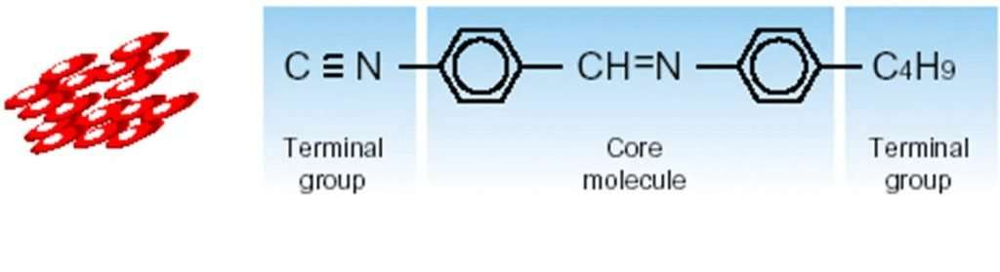
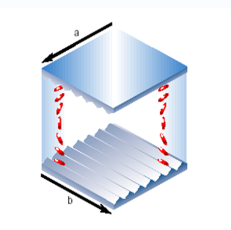
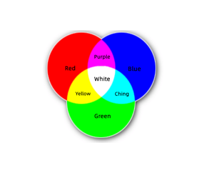

# TFT LCD 模组的组成与结构

!!! abstract "快速结论"
    本指南解释了TFT LCD 模组组件，相关的设计权衡以及在选择显示解决方案时工程师应验证的点。

## 核心要点

- 系统了解TFT LCD 模组的组成与结构，包括关键原理、优缺点、应用场景和工程选型要点。
- 根据下文比较相关技术、应用条件和设计取舍。
- 最终选型前，应确认光学、电气、结构、环境与量产要求。

## TFT LCD 模组

TFT LCM(LCD模块) 结构：

LCM主要由5个单位组成：

背光单元)

极化剂 (POL)

液晶显示器

IC(集成电路)

机械制造有限公司

下面的图表是TFT-LCD模块结构图。我们将简短介绍每个显示的主要功能。

<figure markdown="span" class="displaywiki-figure">
  [{ width="760" loading="lazy" }](tft-lcd-module-the-structure-of-tft-lcd-module.jpeg){ .displaywiki-image-link title="查看原图" }
  <figcaption>TFT-LCD模块的结构</figcaption>
</figure>

背光单元)

背光单元是LCD的关键组成部分之一。它由多层光片和光源组成。

背光装置的作用是提供足够的亮度，并均地分配光源到液晶面板上，因为液晶分子本身不能发出光。

通常，光源是LED带，所以它也被称为LED背光。

后照的质量决定了显示器的一些重要特征，例如亮度，出光的一致性和LCD屏幕的颜色水平。

极化剂 (POL)

极化器是将没有极化的自然光转换为极化的光，并控制哪些光图可以通过LCD面板。

没有这些过器，LCD面板生成的视觉图像对比率表现不佳。

集成电路

集成电路 (IC) 是由一组集成回路组成的芯片设备。

它用于调整和控制透明电极上的潜在信号的相，峰值值，频率和其他参数，以确定驱动电场，最后实现屏幕上显示的信息。

制造机械设备

FPC是灵活打印电路板的缩写。

通过连接LCD面板，FPC可以实现电路的工作原理，并输出与主板匹配的接口，以便LCD能够实现电气连接。

液晶显示屏 (LCD) 面板/细胞层

细胞层是两种玻璃基板之间嵌入的液晶包装，一块顶部玻璃底层具有颜色过器 (CF) 和一个下面玻璃地层具有薄膜晶体管阵列 (TFT-Array).

它也被称为LCD面板，它是颜色显示器的重要单元。

在 TFT 基板上，它可以精确控制这个侧面的像素电压。

在CF基层上，一个像素分为三个子像素：红色 (R)，绿色 (G) 和蓝色 (B).

作为光的液晶 (LC) 可以调整通过CF基板的三种主要RGB颜色的光量，从而获得所需的颜色显示。

为了创建一个图像，上述所有层面都应该像乐团一样协作。

液晶显示器的工作

液晶是光电子产品。

我们可以从光学和电气角度了解LCD如何工作。

液晶显示器的光电子工作原理

光学视角

光可以分为不同的极化方向。

有不同的极化方向的灯光通过液晶，

在光线通过这种光学路径差异重新组合后，它将改变它的极化形式。

通过极化器在特定的极化方向阻光，可以确定光传输率。

电气视角

在不同的电压下，液晶会有不同的安排。

不同的液晶安排会导致不同的光线路径差异，从而使传输率发生变化。

因此，视频信号 (电力) 可以转换为明亮和黑暗的显示器 (光)

液晶显示器的工作过程

在下面，让我们看看每个层如何在内部协作来制作颜色显示。

液晶分子

(1) TFT-LCD中使用的液晶是TN (Twist Nematic) 整理的液体水晶。

(2) 液晶分子是圆形的；TN类液晶通常连接在长轴方向上串联，长轴与彼此平行。

<figure markdown="span" class="displaywiki-figure">
  [{ width="760" loading="lazy" }](tft-lcd-module-the-liquid-crystal-molecules.jpeg){ .displaywiki-image-link title="查看原图" }
  <figcaption>液晶分子</figcaption>
</figure>

(3) 液晶分子在触及槽表面时，沿着槽平行排列。

<figure markdown="span" class="displaywiki-figure">
  [{ width="760" loading="lazy" }](tft-lcd-module-molecules-on-the-lower-surface-along-the-b-direction.jpeg){ .displaywiki-image-link title="查看原图" }
  <figcaption>下面的分子：沿着b方向</figcaption>
</figure>

(4) 当液晶在两个槽表面中间存在，并且槽方向垂直对方时，液晶分子的排列将是：

下面的分子：沿着b方向

上面的分子：沿着a方向

在中间的分子：产生旋转效应，因此液晶分子在两个槽表面之间旋转90°.

<figure markdown="span" class="displaywiki-figure">
  [{ width="760" loading="lazy" }](tft-lcd-module-effects-of-light-and-liquid-crystal-molecules.png){ .displaywiki-image-link title="查看原图" }
  <figcaption>光和液晶分子的影响</figcaption>
</figure>

(1) 当线性分极光进入上层的表面时，光也随着液晶分子的旋转而旋转，使得光能够通过。

(2) 当线性极化光从底层的槽表面出发时，光已经旋转90°.

<figure markdown="span" class="displaywiki-figure">
  [{ width="760" loading="lazy" }](tft-lcd-module-working-of-polarizer.png){ .displaywiki-image-link title="查看原图" }
  <figcaption>聚合剂的加工</figcaption>
</figure>

(1) 过非偏光 (一般光) 成线性偏光；

(2) 当非偏光光通过a方向偏光器时，光被过为线性偏光，并行于a ?? 方向；

(3) 线性极光继续向前移动，

如果它在同一方向 (a) 穿过极化器，光会穿过；

如果光通过极化器朝B方向穿过，那么光完全被阻塞。

<figure markdown="span" class="displaywiki-figure">
  [{ width="760" loading="lazy" }](tft-lcd-module-optical-effect-in-the-combination-of-polarizers-grooved-surfaces-and-l.jpeg){ .displaywiki-image-link title="查看原图" }
  <figcaption>在极化器，槽表面和液晶组合中光学效果</figcaption>
</figure>

当上部和下部的极化器垂直对方时：

(1) 如果没有电压，光可以通过；

<figure markdown="span" class="displaywiki-figure">
  [{ width="760" loading="lazy" }](tft-lcd-module-1-if-power-voltage-is-not-applied-the-light-can-pass-through.jpeg){ .displaywiki-image-link title="查看原图" }
  <figcaption>(1) 如果没有电压，光可以通过；</figcaption>
</figure>

(2) 如果施加电压，光完全被阻塞。由于液晶分子从螺旋模式中直出并停止转向光角，因此光不能通过下面的过器。

<figure markdown="span" class="displaywiki-figure">
  [{ width="760" loading="lazy" }](tft-lcd-module-creating-images-through-tft-lcd.jpeg){ .displaywiki-image-link title="查看原图" }
  <figcaption>通过TFT-LCD创建图像</figcaption>
</figure>

(1) 扫描驱动 IC (也称为Gate驱动程序IC) 传输扫描信号并完成图像信号输入；

(2) 数据驱动 IC (也称为源驱动程序IC) 传输成像控制信号并控制TFT开关：

如果启动子像素，那么小像素会出现黑色，因为它不能传输光。

如果关闭子像素，则显示颜色，因为光通过颜色过器 (CF).

(3) 经过CF之后，产生红色，绿色和蓝色的光线，最后通过上方极化器。

(4) 由于光的合成效果，不同的颜色形成和显示。

<figure markdown="span" class="displaywiki-figure">
  [{ width="760" loading="lazy" }](tft-lcd-module-now-we-have-finished-our-journey-on-how-an-lcd-works-and-how-the-displ.png){ .displaywiki-image-link title="查看原图" }
  <figcaption>现在，我们已经完成了关于LCD如何工作以及显示屏如何产生颜色图像的旅程.</figcaption>
</figure>

<figure markdown="span" class="displaywiki-figure">
  [{ width="760" loading="lazy" }](tft-lcd-module-now-we-have-finished-our-journey-on-how-an-lcd-works-and-how-the-displ-2.png){ .displaywiki-image-link title="查看原图" }
  <figcaption>现在，我们已经完成了关于LCD如何工作以及显示屏如何产生颜色图像的旅程.</figcaption>
</figure>

<figure markdown="span" class="displaywiki-figure">
  [{ width="760" loading="lazy" }](tft-lcd-module-how-does-lcd-work-to-create-a-color-image.gif){ .displaywiki-image-link title="查看原图" }
  <figcaption>如何创建颜色图像的LCD工作</figcaption>
</figure>

## 相关阅读

- [LCD 基础知识：液晶显示器的工作原理](lcd-basics.md)
- [TFT LCD 基础知识：结构、原理与优势](tft-lcd-basics.md)
- [如何读懂显示屏规格参数](display-specifications.md)

!!! info "没有找到您需要的内容？"
    如果您需要更多产品、资源或技术支持，欢迎联系我们的团队：

    [**:material-archive-arrow-down: 知识库**](../../knowledge/tags.md){ .md-button .md-button--primary }
    [**:material-magnify: 产品与解决方案**](https://www.chinasunyee.com){ .md-button }
    [**:material-email: 联系技术支持**](mailto:info@chinasunyee.com){ .md-button }
