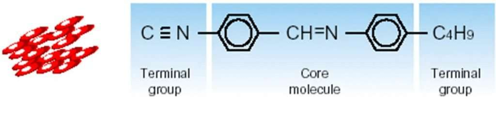
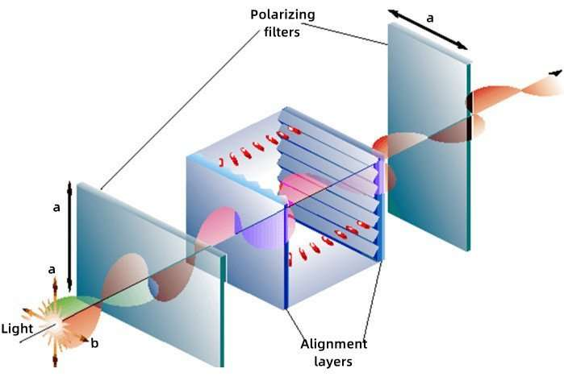
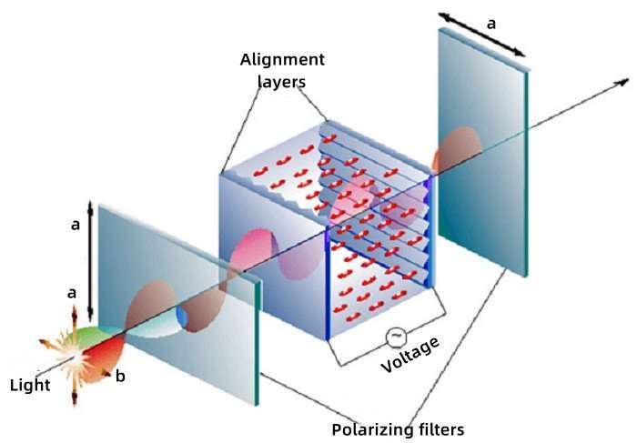
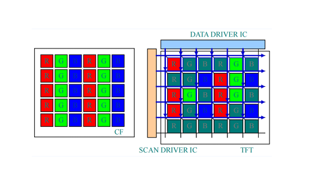

# TFT LCD 模组的组成与结构

!!! abstract "快速结论"
    TFT LCD 模组（LCM）由五部分组成：背光单元、偏光片、驱动 IC、FPC 与液晶面板。理解这五部分各自的作用与相互配合方式，是评估亮度、对比度、接口与结构可行性的前提。本文先拆解模组构成，再沿"偏振光—液晶调光—滤色片上色"的链路说明图像是如何被生成的。

## 核心要点

- TFT LCD 模组主要由背光单元、偏光片、驱动 IC、FPC 与液晶面板五部分组成，液晶面板由 TFT 阵列基板与彩色滤光片基板夹持液晶构成。
- 液晶本身不发光，只负责按电压调整透过率；亮度由背光单元提供，颜色由彩色滤光片提供。
- 上下两片偏光片的透振方向相互正交，液晶分子的扭转负责把偏振方向旋转 90°，从而决定光能否通过。
- 选型时应分别核对光学（亮度、均匀性、色域）、电气（驱动 IC、接口）、结构（厚度、FPC 出线）与环境要求。

## 1. TFT LCD 模组由哪五部分组成

一块 TFT LCD 模组（LCM，LCD Module）并不是单指那块玻璃屏，而是把显示所需的全部材料与电路封装在一起的整体。它主要由五个部分组成：

<figure markdown="span" class="displaywiki-figure">
  [{ width="760" loading="lazy" }](tft-lcd-module-the-structure-of-tft-lcd-module.jpeg){ .displaywiki-image-link title="查看原图" }
  <figcaption>TFT LCD 模组的结构：下半部分是背光单元（含底框、反射片、导光板、LED 灯条、扩散片、棱镜片），上半部分是液晶面板（含上下偏光片、玻璃基板、TFT 阵列、液晶、公共电极、彩色滤光片与外框），侧面引出 FPC 与驱动 IC。</figcaption>
</figure>

| 组成部分 | 英文 / 缩写 | 主要作用 |
|---|---|---|
| 液晶面板 | LCD Panel / Cell | 按电压逐像素调光并上色，是成像的核心单元 |
| 背光单元 | Backlight Unit（BLU） | 提供亮度并均匀铺满整个显示区，液晶自身不发光 |
| 偏光片 | Polarizer（POL） | 把自然光转为线偏振光，并筛选通过液晶后的偏振态 |
| 驱动 IC | Driver IC | 产生扫描与数据信号，控制每个 TFT 的开关与写入电压 |
| FPC 与结构件 | FPC / Mechanical | 连接面板与主板实现电气互连，并以框体固定层叠结构 |

## 2. 各部分的作用

### 2.1 背光单元（BLU）

背光单元是模组中最"厚"的部分，由多层光学膜片与光源组成：LED 灯条发出光，经导光板把点光源摊成面光源，再由扩散片进一步匀化，棱镜片把光向正视方向收拢，反射片把漏向背面的光回收利用。

它的作用是提供足够且均匀的亮度。由于液晶分子本身不发光，画面亮度完全由背光决定。通常光源采用 LED，因此也叫 LED 背光。背光的质量直接影响亮度、出光均匀性与色彩表现。

### 2.2 偏光片（POL）

偏光片把不带偏振的自然光转换为线偏振光，是液晶调光机制的前置条件。一片贴在液晶盒下侧（靠近背光），一片贴在上侧（靠近观察者），两片透振方向相互正交。

没有偏光片，液晶盒产生的画面将失去对比度，无法形成有效图像。

### 2.3 驱动 IC

驱动 IC 是一组集成在芯片上的电路，负责调整施加到透明电极上的电压信号的相位、幅值与频率等参数，从而建立所需的驱动电场，最终在屏幕上显示出对应的信息。

按功能可分为两类：扫描驱动 IC（Gate Driver）负责逐行选通，数据驱动 IC（Source Driver）负责把灰阶电压写入被选中的那一行。

### 2.4 FPC 与结构件

FPC 是柔性印制电路板（Flexible Printed Circuit）的缩写。它一端连接液晶面板的电极，另一端引出与主板匹配的接口，实现电气连接与信号传输。结构件则负责把背光、面板、FPC 与外框固定成一个可直接装配的整体。

### 2.5 液晶面板（Cell）

液晶面板是两层玻璃基板之间夹持液晶的封装体：上基板带彩色滤光片（CF），下基板带薄膜晶体管阵列（TFT Array）。它是决定色彩表现的核心单元。

在 TFT 基板一侧，每个像素的电压可以被精确控制；在 CF 基板一侧，一个像素被划分为红（R）、绿（G）、蓝（B）三个子像素。液晶作为"光的阀门"，调节穿过 CF 的 RGB 三色光的比例，从而混出目标颜色。要生成一幅完整图像，上述所有层必须像乐团一样协同工作。

## 3. 液晶与取向层：光阀的物理基础

液晶兼具液体的流动性与晶体的各向异性。常用的 TN 型液晶分子呈棒状，分子之间大致沿长轴方向彼此平行排列。

<figure markdown="span" class="displaywiki-figure">
  [{ width="760" loading="lazy" }](tft-lcd-module-the-liquid-crystal-molecules.jpeg){ .displaywiki-image-link title="查看原图" }
  <figcaption>液晶分子：左侧为棒状分子的排列形态，右侧为典型分子结构——两端是端基（如 C≡N、C4H9），中间是由苯环等构成的刚性核心，这种"刚柔相济"的结构使其既能流动又能保持取向。</figcaption>
</figure>

液晶盒的上下玻璃内侧各有一层取向层（Alignment Layer），表面带有一致的微沟槽。液晶分子接触沟槽时会沿着沟槽方向平行排列。

<figure markdown="span" class="displaywiki-figure">
  [{ width="760" loading="lazy" }](tft-lcd-module-molecules-on-the-lower-surface-along-the-b-direction.jpeg){ .displaywiki-image-link title="查看原图" }
  <figcaption>液晶分子在取向层沟槽上沿沟槽方向平行排列，形成确定的下表面取向方向（图中沿 b 方向）。</figcaption>
</figure>

当上下两片取向层的沟槽方向相互垂直时，中间的液晶分子会在两层之间逐渐扭转，形成 90° 的螺旋排列。这一结构是扭曲向列（TN）模式的基础。

<figure markdown="span" class="displaywiki-figure">
  [{ width="760" loading="lazy" }](tft-lcd-module-effects-of-light-and-liquid-crystal-molecules.png){ .displaywiki-image-link title="查看原图" }
  <figcaption>上下取向层的沟槽方向相互垂直（分别为 a 与 b 方向），液晶分子在两层之间连续扭转 90°，形成螺旋排列。</figcaption>
</figure>

## 4. 偏光片如何筛选偏振光

光可以分解为不同方向的偏振分量。自然光包含各种方向的振动，通过一片偏光片后，只剩下与透振轴平行的分量，即成为线偏振光。

<figure markdown="span" class="displaywiki-figure">
  [{ width="760" loading="lazy" }](tft-lcd-module-optical-effect-in-the-combination-of-polarizers-grooved-surfaces-and-l.jpeg){ .displaywiki-image-link title="查看原图" }
  <figcaption>偏光片对光的筛选：偏光片只允许与其透振轴（a 方向）平行的偏振分量通过，垂直方向的分量被吸收，因此单看一片偏光片就好比一只"光的筛子"。</figcaption>
</figure>

由此可以推出两个关键结论：当光继续沿同一方向（a）穿过下一片偏光片时可以通过；而当光穿过透振轴朝向另一方向（b）的偏光片时，则被完全阻断。液晶的作用，正是通过旋转偏振方向来"决定光落在哪一种情形"。

## 5. 一个像素如何被点亮

把偏光片与液晶盒组合起来，就得到了一个可电控的光阀。以下是有无电压两种状态的对比总览：

<figure markdown="span" class="displaywiki-figure">
  [{ width="760" loading="lazy" }](tft-lcd-module-working-of-polarizer.png){ .displaywiki-image-link title="查看原图" }
  <figcaption>电压切换对光路的影响：左侧为未加电压时，液晶分子在取向膜之间扭转、偏振光随之旋转后透过；右侧为施加电压后，液晶分子沿电场方向直立、不再旋转偏振光，光被上偏光片阻断。</figcaption>
</figure>

**无电压时，光可以通过。** 液晶分子保持 90° 扭转排列，从下偏光片射出的线偏振光随分子螺旋逐层旋转 90°，恰好能穿过透振方向正交的上偏光片。

<figure markdown="span" class="displaywiki-figure">
  [{ width="760" loading="lazy" }](tft-lcd-module-1-if-power-voltage-is-not-applied-the-light-can-pass-through.jpeg){ .displaywiki-image-link title="查看原图" }
  <figcaption>未加电压：液晶分子在取向层沟槽的约束下保持 90° 扭转，偏振光沿分子螺旋被逐层旋转，最终顺利穿过上偏光片，像素呈亮态。</figcaption>
</figure>

**施加电压时，光被完全阻断。** 液晶分子沿电场方向直立，脱离螺旋排列、不再旋转偏振光，光无法穿过上偏光片，像素转暗。电压的高低决定了分子直立的程度，也就决定了透过率——这正是灰阶的来源。

<figure markdown="span" class="displaywiki-figure">
  [{ width="760" loading="lazy" }](tft-lcd-module-creating-images-through-tft-lcd.jpeg){ .displaywiki-image-link title="查看原图" }
  <figcaption>施加电压：液晶分子在电场作用下沿场方向直立，不再旋转偏振光，光被上偏光片阻断，像素转暗。图中电压源符号与竖直排列的分子即为该状态。</figcaption>
</figure>

## 6. 从电压到彩色图像

在 TFT 基板上，扫描驱动 IC 逐行发送扫描信号、完成行选通；数据驱动 IC 则在该行被选中的瞬间把成像控制信号写入对应的 TFT，开启或关闭子像素。子像素被施加电压时不能透光，未被施加电压时光可以穿过彩色滤光片。

<figure markdown="span" class="displaywiki-figure">
  [{ width="760" loading="lazy" }](tft-lcd-module-now-we-have-finished-our-journey-on-how-an-lcd-works-and-how-the-displ.png){ .displaywiki-image-link title="查看原图" }
  <figcaption>彩色滤光片（CF）阵列与 TFT 阵列的对应：扫描驱动 IC（Scan Driver IC）逐行选通，数据驱动 IC（Data Driver IC）沿列写入电压，每个 TFT 控制其所在子像素的明暗。</figcaption>
</figure>

光穿过彩色滤光片后分离出红、绿、蓝三色。通过控制每个子像素的透光量，三色按不同比例叠加，就能混合出几乎任意的颜色。

<figure markdown="span" class="displaywiki-figure">
  [{ width="760" loading="lazy" }](tft-lcd-module-now-we-have-finished-our-journey-on-how-an-lcd-works-and-how-the-displ-2.png){ .displaywiki-image-link title="查看原图" }
  <figcaption>RGB 三原色的叠加：红、绿、蓝两两叠加得到黄、品红、青，三者等量叠加得到白色；子像素亮度比例的连续变化即可混出各种颜色。</figcaption>
</figure>

至此，光从背光出发，经偏光片起偏、液晶调光、彩色滤光片上色，再穿上偏光片射出的完整路径已经走通——一整块屏幕上无数像素的这种过程同步发生，最终形成我们看到的画面。

<figure markdown="span" class="displaywiki-figure">
  [{ width="760" loading="lazy" }](tft-lcd-module-how-does-lcd-work-to-create-a-color-image.gif){ .displaywiki-image-link title="查看原图" }
  <figcaption>完整路径回顾：背光单元提供光源，下偏光片起偏，液晶层按电压逐像素调光，彩色滤光片赋予颜色，最后由上偏光片输出画像。</figcaption>
</figure>

## 7. 选型要点

- **光学**：确认亮度（cd/m²）、亮度均匀性、对比度与色域是否覆盖目标环境的光照条件。
- **电气**：明确驱动 IC 与接口类型（RGB、MIPI DSI、LVDS、SPI 等）、供电电压与功耗预算。
- **结构**：核对模组外形尺寸、总厚度、可视区与外形区差异、FPC 出线方向与连接器规格。
- **环境**：确认工作温度范围、存储温度、抗振动与防眩光等要求，户外应用需同时评估透光方式。
- **量产**：确认供货稳定性、批次一致性、认证要求与最小起订量。

## 8. FAQ

??? question "Q1：TFT LCD 模组的 Cell 与 LCM 有什么区别？"
    Cell 指液晶盒本身，即两片玻璃基板夹一层液晶的封装体，只负责调光与上色；LCM（LCD Module）则是在 Cell 的基础上叠上背光单元、偏光片、驱动 IC、FPC 与结构件后的完整模组，可以直接接到主板上使用。采购时说的"模组"通常指 LCM。

??? question "Q2：为什么偏光片必须上下各贴一片，而且方向相互正交？"
    液晶的调光机制依赖偏振。下偏光片先把自然光变成线偏振光，液晶分子再根据电压旋转其偏振方向，上偏光片则依据旋转后的方向决定放行还是阻断。两片透振方向正交时，未加电压的透光态与加电压的遮光态差异最大，对比度才能做高。

??? question "Q3：模组亮度取决于哪些因素？"
    亮度主要由背光单元决定，包括 LED 灯条的颗数与驱动电流、导光板与光学膜片的效率、以及整体光利用率。同一块液晶面板搭配不同背光，亮度可以相差数倍。选型时需在目标亮度下确认功耗与散热是否可接受。

??? question "Q4：驱动 IC 的扫描与数据两条通道分别做什么？"
    扫描驱动 IC（Gate Driver）逐行给出选通信号，决定"当前写哪一行"；数据驱动 IC（Source Driver）在该行被选通的瞬间，把每个子像素所需的灰阶电压写入对应的 TFT。两者配合完成逐行扫描、逐像素写入的成像过程。

??? question "Q5：FPC 在模组里起什么作用？"
    FPC 是柔性印制电路板，一端连接液晶面板的电极走线，另一端引出与主板匹配的接口，负责供电与信号传输。它的出线方向、长度与连接器选型会直接影响模组的装配方式与整机结构设计。

??? question "Q6：液晶屏为什么需要取向层？"
    取向层表面的微沟槽给液晶分子一个确定的方向约束，使分子在没有电场时保持一致的排列（如 90° 扭转）。没有取向层，液晶排列会杂乱无章，无法形成稳定的透光／遮光状态，也就得不到稳定可控的灰阶。

## 相关阅读

- [LCD 基础知识：液晶显示器的工作原理](lcd-basics.md)
- [TFT LCD 基础知识：结构、原理与优势](tft-lcd-basics.md)
- [如何读懂显示屏规格参数](display-specifications.md)

## 参考数据来源

本文涉及的标准、规格与应用资料：

- [TFT LCD 驱动 IC 数据手册：ST7701S](../../../assets/datasheet/display/ST7701S.pdf)
- [TFT LCD 模组规格书示例（7 英寸 WVGA）](../../../assets/datasheet/display/ALL-UE070WV-RB40-A092A.pdf)

!!! info "没有找到您需要的内容？"
    如果您需要更多产品、资源或技术支持，欢迎联系我们的团队：

    [**:material-archive-arrow-down: 知识库**](../../knowledge/tags.md){ .md-button .md-button--primary }
    [**:material-magnify: 产品与解决方案**](https://www.chinasunyee.com){ .md-button }
    [**:material-email: 联系技术支持**](mailto:info@chinasunyee.com){ .md-button }
