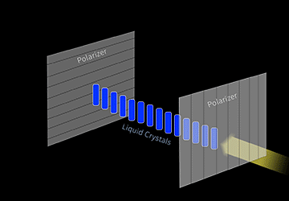
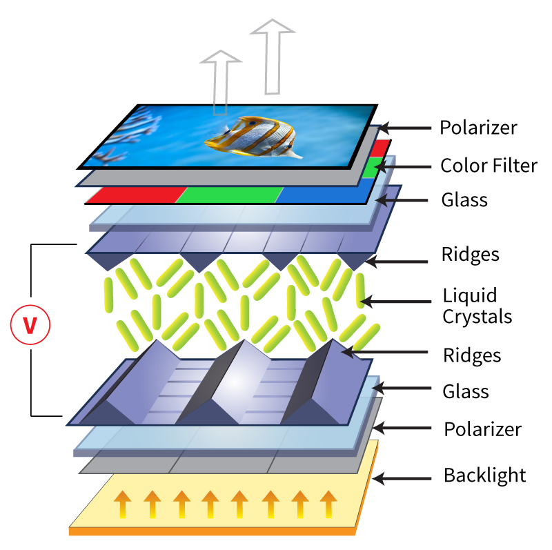

# IPS、TN、VA 与 FFS TFT 面板技术对比

!!! abstract "快速结论"
    本指南解释了比较TFT面板技术,相关的设计权衡以及在选择显示解决方案时工程师应该验证的点.

## 核心要点

- 系统了解IPS、TN、VA 与 FFS TFT 面板技术对比，包括关键原理、优缺点、应用场景和工程选型要点。
- 根据下文比较相关技术、应用条件和设计取舍。
- 最终选型前，应确认光学、电气、结构、环境与量产要求。

## IPS TFT LCD

在平面交换 (IPS) 技术在LCD内部的液晶上作用,因此当使用电压时,液晶并行旋转 (或在平面中),使光线通过而不是直动.这种水晶的行为显著改善了显示器的许多视觉方面.

<figure markdown="span" class="displaywiki-figure">
  [{ width="760" loading="lazy" }](tft-panel-technologies-ips-tft-lcd.jpeg){ .displaywiki-image-link title="查看原图" }
  <figcaption>IPS TFT LCD</figcaption>
</figure>

与普通的TN电池板相比,IPS在颜色,视角上优越,由于其高亮度,这些TFT甚至可以处理直接阳光.

<figure markdown="span" class="displaywiki-figure">
  [{ width="760" loading="lazy" }](tft-panel-technologies-how-does-ips-work.gif){ .displaywiki-image-link title="查看原图" }
  <figcaption>如何运行IPS?</figcaption>
</figure>

在上述动画中,两种线性极化过器的传输轴都朝着同一个方向. 为了获得两块玻璃板之间没有应用电场 (OFF状态) 的液晶层的90度扭曲的纳米结构,将玻璃盘内部表面处理以直角对边界的液晶分子进行排列. 由于电极的排列在同一平面和单个玻璃板上,它们基本上产生与这个板并行的电场.

液晶分子具有积极的光异性质,并与应用电场平行的长轴相结合.在OFF状态下,进入的光通过极化器被线性分极化. 扭曲的纳米液晶层将通过光的极化轴旋转90度,以至于理想情况下没有光通过极化器. 在 ON状态下,在电极之间施加足够的电压,产生相应的电场,使液晶分子重新排列起来,光可以通过极化器.

## VA/MVA TFT LCD

视频:垂直调整

MVA:多域垂直调整

这些显示器提供了广的视角,良好的黑色深度,快速响应时间以及良好的颜色复制和深度.MVA整理TFT内的每个像素由三个子像素 (红色,绿色和蓝色) 组成.

每个子像素分为两个或多个子画素,由于状的偏差玻璃而液晶随机排列起来.当对晶体管施加电荷时,晶体扭曲.

随着这些晶体被随机放置,它允许背光在所有不同的方向中清扫,保持预期的颜色和,同时给显示器一个150°的视角.

<figure markdown="span" class="displaywiki-figure">
  [{ width="760" loading="lazy" }](tft-panel-technologies-premium-mva-tft-displays.jpeg){ .displaywiki-image-link title="查看原图" }
  <figcaption>优质 (MVA) TFT显示器</figcaption>
</figure>

通过使用MVA技术,这些显示器提供丰富的黑色,并且能够在各方75°角度保持持续的颜色复制. 优质TFT显示器的亮度也高于标准TFT屏幕,为更具视觉要求的应用提供了更好的整体图像质量.

## FFS/AFFS TFT LCD

转换机器 (FFS)

AFFS (先进的边缘场交换)

在概念上,AFFS与IPS相似;两者都以平行对基层的方式对结晶分子进行排列,改善视角.然而,AffS更先进,可以更好地优化功耗. 最值得注意的是,AFFS具有高传输率,这意味着液晶层内吸收的光能量较少,而向表面传递更多.IPS TFT LCD通常具有更低的传输能力,因此需要更亮的背光. 这种传输率差异的根源在于AFFSs每一个像素下面的紧,最大化活跃细胞空间.

自2004年以来,开发了AFFS的Hydis已经向日本公司Hitachi Displays授权了 AFFS,在那里人们正在开发复杂的AFFs液晶面板.Hidis改善了屏幕外可读性等显示性能,使其更有吸引力用于其主要应用: 移动电话显示.

## TN IPS MVA比较

TN (Twisted Nematic),IPS (In-Plane Switching) 和MVA (Multi-Domain Vertical Alignment) 是三种普遍使用的液晶显示屏技术.每个技术都有独特的特性,影响了显示器的性能,图像质量和适合不同应用. 本文根据几个标准进行了TN,IPS和MVA技术的比较.

主要的区别

TN (Twisted Nematic) 板

技术:扭曲的纳米

制造过程:生产更简单,更便宜

导向:当激活时,液晶在90度扭转

IPS (飞机内交换) 面板

技术:飞机中转换

制造过程:更复杂和昂贵

导向:液晶与板平行旋转

多域垂直调整 (MVA) 面板

技术:多域垂直调整

制造过程:中间复杂性

导向:液晶垂直排列,在激活时倾斜

优势和缺点

电池板

### 优势

- 反应时间:通常是最快的响应时间,

- 成本:通常生产和购买最便宜.

- 可用性:在预算监测器和笔记本电脑中广泛使用.

### 局限

- 颜色精度:颜色复制率较差,颜色校准性更低.

- 视角:狭窄的视角,在侧面看时导致颜色和对比变化.

- 与IPS和MVA板相比,对比率较低.

- IPS 面板

### 优势

- 颜色精度:优质的颜色准确性和一致性,非常适用于需要精确颜色表示的工作 (例如图形设计,照片编辑).

- 视角:宽的视角,颜色和对比变化最小.

- 图像质量:一般使用鲜的颜色更好的整体图片质量.

### 局限

- 响应时间:与TN板相比,反应时间较慢,这可能导致快速移动的场景中运动模糊.

- 成本:由于复杂的制造过程,生产和购买更昂贵.

- 电力消耗:与TN板相比,电力使用量较高.

- 动态电池板

### 优势

- 对比比例:比TN和IPS更高的对比率,提供更深的黑色和更好的整体对比.

- 颜色精度:比TN面板更准确,但不像IPS面板那么好.

- 视角:比TN面板更宽的视角,但通常比IPS面板较窄.

### 局限

- 响应时间:比TN板的响应速度较慢,这可能不适合快速游戏.

- 成本:通常比TN板更昂贵,但低于IPS板.

- 图像质量:虽然比TN面板更好,但图像的质量通常不高于IPS面板.

- 使用案例和应用

- TN 面板应用:

- 游戏监测器:快速响应时间使它们适合竞争性游戏.

- 预算监测器:一般计算和办公工作的负担得起选择.

- 笔记本电脑:由于成本低,在预算和中产的笔记型电脑中常见.

- IPS面板应用:

- 专业监测器:适合图形设计,照片和视频编辑以及其他颜色关键任务.

- 高端监视器:用于高级显示器和显示屏,以提高观看体验.

- 平板电脑和智能手机:在移动设备中受欢迎,因为其颜色复制性优越,视角广.

- 采用MVA面板:

- 家庭娱乐:由于高对比率,适合观看电影和一般媒体消费.

- 一般使用监测器:适合平衡工作和娱乐,提供TN和IPS之间的中间路线.

- 商业监视器:在办公环境中使用,希望图像质量比TN更好,而没有IPS的成本更高.

## 结论

每个TN,IPS和MVA板都有独特的优点和弱点,使它们适用于不同的应用:

TN LCD:由于快速响应时间和低成本,最适合游戏和预算友好的显示器.

IPS LCD:最适用于专业使用和高端显示器,因为它们的颜色精确性和广的视角.

MVA LCD:为一般使用和家庭娱乐提供良好的平衡,比TN面板更高的对比率和图像质量,但成本低于IPS面板.

## 相关阅读

- [a-Si、LTPS 与 IGZO TFT 背板技术对比](tft-backplane-technologies.md)
- [OLED 显示结构、工作原理及与 LCD 的对比](oled-display-basics.md)
- [透射式、反射式与半反半透式 LCD 对比](transmissive-reflective-transflective.md)
