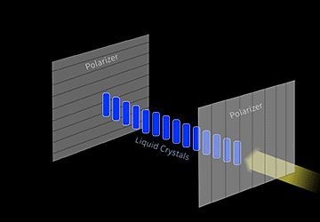
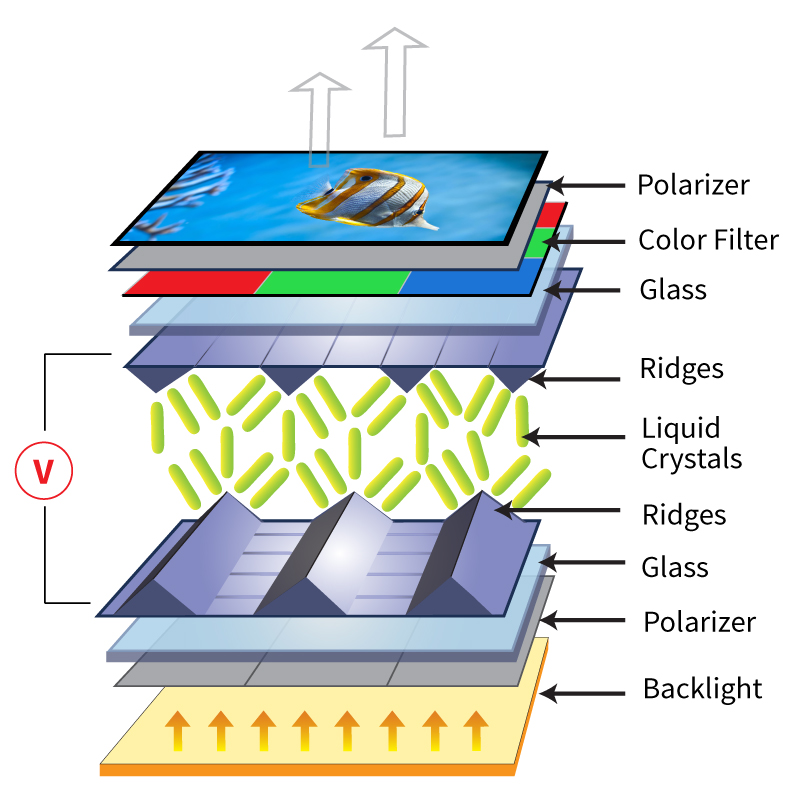

# IPS、TN、VA 与 FFS TFT 面板技术对比

!!! abstract "快速结论"
    TFT 面板技术之间的差异，根源在于液晶分子的排列方式与加电后的翻转方向。TN 胜在响应速度与成本，IPS / FFS 胜在广视角与色彩稳定，VA / MVA 胜在对比度与深黑。选型应以实测光电曲线与样品为准，不能只凭技术名称推断亮度、寿命或环境等级。

## 核心要点

- 四类技术的分野在液晶排列与电场方向：TN 在两片基板间扭转 90°，IPS / FFS 的液晶在平行于基板的平面内旋转，VA / MVA 的液晶垂直于基板排列。
- 视角与色彩稳定性看 IPS / FFS，深黑与高对比度看 VA / MVA，成本与响应速度看 TN。
- 面板模式不能推定亮度、寿命或环境等级，这些取决于背光方案、驱动方式与实测数据。
- 最终选型前，应确认光学、电气、结构、环境与量产要求。

## 1. TN：扭曲向列

TN（Twisted Nematic，扭曲向列）是结构最简单、成本最低的一类液晶模式。液晶分子在两片玻璃基板之间呈 90° 螺旋排列，上下各贴一片偏光片，两者的传输轴相互正交。

在不加电的状态下，液晶层把入射光的偏振方向旋转 90°，光得以穿过第二片偏光片，像素呈亮态；加电后液晶分子转向电场方向排列，旋光作用消失，光被挡住，像素变暗。这种"不加电即透光"的方式称为常白模式。

常白模式制造简单、透光率高，代价是视角窄：从侧面观看时，液晶层的有效相位延迟发生变化，画面出现发白与色偏。

**主要特点**

- 响应速度：在三种主流模式中最快。
- 成本：结构简单，生产与采购成本最低。
- 透光率：较高，同等背光条件下亮度占优。
- 视角与色彩：视角窄，侧视时色彩与对比度偏移明显。

## 2. IPS：面内切换

IPS（In-Plane Switching，面内切换）把两个电极都做在同一片玻璃基板上，电场方向因此平行于基板，液晶分子在平行于基板的平面内旋转，而不像 TN 那样立起。

<figure markdown="span" class="displaywiki-figure">
  [{ width="760" loading="lazy" }](tft-panel-technologies-ips-tft-lcd.jpeg){ .displaywiki-image-link title="查看原图" }
  <figcaption>IPS 与 TN 的可视角度对比：IPS（左）在斜视角下仍保持色彩与亮度一致，TN（右）侧视时明显发白、色彩偏移</figcaption>
</figure>

无电场时，液晶分子在基板平面内一致排列，透过第一片偏光片的光在液晶层中几乎不改变偏振方向，被第二片偏光片挡住，呈暗态；加电后液晶在平面内旋转，改变光的偏振方向，像素变亮。

由于液晶始终在基板平面内运动，从不同角度观看时液晶层的光程变化更小，因此 IPS 的视角与色彩稳定性相比 TN 有明显改善。配合高亮背光，这类面板也可以用在有直射阳光的场景。

<figure markdown="span" class="displaywiki-figure">
  [{ width="760" loading="lazy" }](tft-panel-technologies-how-does-ips-work.gif){ .displaywiki-image-link title="查看原图" }
  <figcaption>液晶层在上下两片正交偏光片之间的排列与光调制；图中所绘为 90° 扭曲向列结构，IPS 的液晶则在平行于基板的平面内旋转</figcaption>
</figure>

## 3. VA / MVA：垂直配向

VA（Vertical Alignment，垂直配向）的液晶分子在不加电时垂直于基板排列。此时穿过第一片偏光片的光在液晶层中几乎不改变偏振状态，被第二片偏光片完全挡住，形成"常黑"状态；加电后液晶分子向电场方向倾斜，光开始透过，像素变亮。

常黑带来的直接好处是黑场足够深，对比度显著高于 TN 与 IPS。

VA 的短处同样来自垂直排列：斜视时液晶层的光程差异很大，画面出现亮度与色偏。MVA（Multi-domain Vertical Alignment，多域垂直配向）的解决办法是把每个像素划分成多个子域，通过基板上的凸起（ridges）让不同子域的液晶朝不同方向倾斜，用多个方向的补偿把视角拉开。

<figure markdown="span" class="displaywiki-figure">
  [{ width="760" loading="lazy" }](tft-panel-technologies-premium-mva-tft-displays.jpeg){ .displaywiki-image-link title="查看原图" }
  <figcaption>MVA 面板的截面结构：上下偏光片之间是带凸起（Ridges）的基板与垂直排列的液晶层，底部为背光</figcaption>
</figure>

MVA 面板的每个像素由红、绿、蓝三个子像素组成，每个子像素再细分为两个或多个子域，液晶因带凸起的基板而在各子域内朝不同方向倾斜。加电后液晶倾斜，背光从多个方向出射，在保持色彩还原的同时把可视角拉开到约 150°。

这类面板的典型表现是黑场饱满、深色层次丰富，并能在各方向约 75° 以内维持较为一致的色彩还原。

## 4. FFS / AFFS：边缘场切换

FFS（Fringe Field Switching，边缘场切换）与 AFFS（Advanced Fringe Field Switching，高级边缘场切换）可以看作 IPS 的改进型：同样让液晶在平行于基板的平面内排列以获得广视角，但电极结构不同，改用透明电极之间的边缘场来驱动液晶。

AFFS 最突出的优势是透光率更高：液晶层吸收的光能更少，更多光被送到显示面，因此不需要 IPS 那样亮的背光。这一差异的来源，是 AFFS 把每个像素下方的有效开口区做得更紧凑、更充分。

2004 年起，AFFS 的开发者 Hydis 将这项技术授权给日本 Hitachi Displays，由后者开发工艺更复杂的 AFFS 液晶面板。Hydis 也持续改善了显示性能，包括屏幕的户外可读性，使其在主要应用场景——手机显示屏——中更具吸引力。

## 5. TN、IPS、MVA 横向对比

TN（Twisted Nematic）、IPS（In-Plane Switching）与 MVA（Multi-Domain Vertical Alignment）是三类最常见的液晶显示技术。三者在性能、画质与适用场景上各有取向，下面按统一维度对照。

### 5.1 技术原理

| 项目 | TN | IPS | MVA |
|---|---|---|---|
| 全称 | Twisted Nematic | In-Plane Switching | Multi-Domain Vertical Alignment |
| 液晶排列 | 不加电时呈 90° 螺旋扭转 | 平行于基板，加电后在平面内旋转 | 不加电时垂直排列，加电后倾斜 |
| 电场方向 | 垂直于基板 | 平行于基板 | 垂直于基板，多域倾斜 |
| 制造复杂度 | 简单、成本低 | 复杂、成本高 | 中等 |
| 常态 | 常白 | 常黑 | 常黑 |

### 5.2 优劣势对照

| 维度 | TN | IPS | MVA |
|---|---|---|---|
| 响应速度 | 最快 | 较慢 | 较慢 |
| 对比度 | 最低 | 中等 | 最高，黑场最深 |
| 可视角 | 最窄 | 最宽 | 中等偏宽 |
| 色彩准确度 | 较差 | 最好 | 优于 TN，不及 IPS |
| 成本 | 最低 | 最高 | 中间 |
| 功耗 | 较低 | 较高 | 中等 |

### 5.3 TN 面板

- 优势：响应时间最快，适合高速动态画面；生产与采购成本最低；在预算型显示器与笔记本中应用广泛。
- 局限：色彩还原与色彩校准较差；视角窄，侧视时色彩与对比度变化明显；对比度低于 IPS 与 MVA。

### 5.4 IPS 面板

- 优势：色彩准确度与一致性最好，适合图形设计、照片编辑等需要精确色彩还原的工作；视角宽，色彩与对比度偏移最小；画面通透、观感更均衡。
- 局限：响应时间比 TN 慢，高速运动画面可能出现拖影；制造工艺复杂，成本更高；功耗高于 TN。

### 5.5 MVA 面板

- 优势：对比度高于 TN 与 IPS，黑场更深；色彩准确度优于 TN；视角宽于 TN。
- 局限：响应时间比 TN 慢，不适合高速游戏；成本高于 TN、低于 IPS；画质优于 TN 但一般不及 IPS。

## 6. 典型应用场景

| 技术 | 典型应用 |
|---|---|
| TN | 竞技游戏显示器、预算型显示器与笔记本；需要极快响应或观看方向固定的工控设备 |
| IPS / FFS | 专业显示器（设计、影像、视频剪辑）、高端显示器、平板与手机 |
| MVA | 家庭影音、通用办公显示器、需要高对比度的商用与工业显示 |

## 7. 选型要点

面向工控与嵌入式项目时，面板模式的取舍可以从三个问题切入：

1. **观看方式**：多人同时观看或观看角度不固定，优先 IPS / FFS；观看方向固定、单人正视时，TN 的视角短板不构成问题。
2. **画质重心**：看重黑色表现与对比度（如夜间监控、暗部细节），选 VA / MVA；看重色彩还原与一致性，选 IPS / FFS。
3. **成本与响应**：预算敏感或需要高速响应（如动态波形、视频预览），TN 仍有价值。

需要提醒的是，面板模式本身不能决定亮度、寿命或环境等级。户外可读性取决于背光亮度、半透半反结构与表面处理，低温响应取决于液晶配方与盒厚，这些都要以具体型号的规格书与实测数据为准。

## 8. FAQ

??? question "Q1：IPS / FFS 相比 TN 的主要优势是什么？"
    视角更宽、色彩更稳定。IPS / FFS 的液晶在平行于基板的平面内旋转，斜视时光程变化小，因此从侧面观看时的色彩与亮度衰减明显小于 TN。具体能提升多少，仍要看面板的实测视角曲线。

??? question "Q2：VA 为什么以高对比度著称？"
    VA 的液晶在不加电时垂直于基板排列，配合正交偏光片时几乎不透光，形成很深的黑场。黑场越暗，静态对比度就越高，因此 VA / MVA 通常能给出比 TN、IPS 更高的对比度数值。

??? question "Q3：TN 是否已经被淘汰？"
    没有。TN 依然是响应最快、成本最低的方案，在预算型显示器、笔记本以及观看方向固定的工控设备中仍在大量使用。只要它的视角与色彩短板在应用中可以被接受，TN 就是合理选择。

??? question "Q4：哪种面板模式的视角最宽？"
    IPS 与 FFS / AFFS 通常提供最好的广视角色彩稳定性。但视角表现由实测数据决定，同一技术家族内不同设计也可能有明显差异，选型时应查看具体型号的视角曲线与样品。

??? question "Q5：能否用面板模式推断低温下的响应速度？"
    不能。低温响应取决于液晶配方、盒厚、驱动方式与具体灰阶转换，同一面板模式在不同设计下的低温表现可以相差很大，必须查阅具体型号的低温响应数据。

??? question "Q6：工控设备选型时，TN / IPS / VA 该怎么挑？"
    先看观看方式：固定正视方向可接受 TN 的低成本与快响应；多人或斜视场合选 IPS / FFS；看重黑场与对比度选 VA / MVA。之后还要结合背光亮度、透光方式（透射 / 反射 / 半透半反）与工作温度范围综合判断，不能只看面板模式。

## 相关阅读

- [a-Si、LTPS 与 IGZO TFT 背板技术对比](tft-backplane-technologies.md)
- [OLED 显示结构、工作原理及与 LCD 的对比](oled-display-basics.md)
- [透射型、反射式与半反半透式 LCD 对比](transmissive-reflective-transflective.md)

## 参考数据来源

- [7 英寸 TFT LCD 模组规格书示例](../../../assets/datasheet/display/ALL-UE070WV-RB40-A092A.pdf)
- [10.1 英寸 MIPI DSI 模组规格书](../../../assets/datasheet/display/UEDX10260070-DSI-A_SPEC_V1.0.pdf)

!!! info "没有找到您需要的内容？"
    如果您需要更多产品、资源或技术支持，欢迎联系我们的团队：

    [**:material-archive-arrow-down: 知识库**](../../knowledge/tags.md){ .md-button .md-button--primary }
    [**:material-magnify: 产品与解决方案**](https://www.chinasunyee.com){ .md-button }
    [**:material-email: 联系技术支持**](mailto:info@chinasunyee.com){ .md-button }
