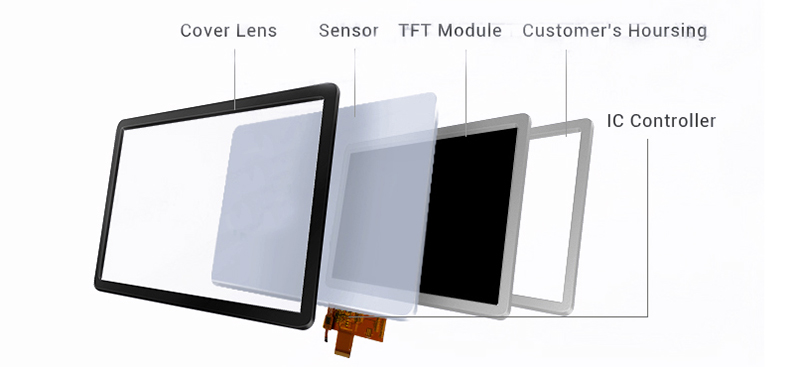
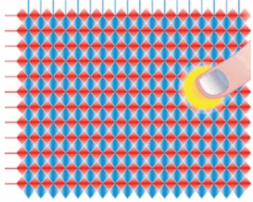
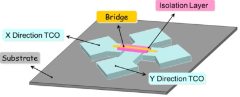
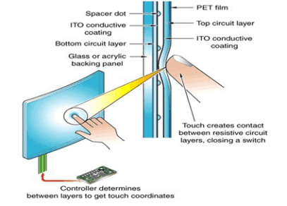

# 电容式与电阻式触摸屏对比

!!! abstract "快速结论"
    本指南解释了电容式与电阻式触摸屏，相关的设计差异以及工程师在选择显示解决方案时应该验证的点。

## 核心要点

- 系统了解电容式与电阻式触摸屏对比，包括关键原理、优缺点、应用场景和工程选型要点。
- 根据下文比较相关技术、应用条件和设计取舍。
- 最终选型前，应确认光学、电气、结构、环境与量产要求。

市场上有多种触摸屏技术，最常见的包括电阻式触摸屏 (RTP)，表面电容式触摸屏，投射式电容触摸屏 (PCAP或CTP)，表面声波 (SAW) 触 触摸屏，红外 (IR) 触摸屏。不同触摸屏的响应特性取决于其底层技术。在本文中，我们将讨论两种最广泛使用的整理，并比较电阻式与电容式触摸屏。

## 电容式触摸屏

<figure markdown="span" class="displaywiki-figure">
  [{ width="760" loading="lazy" }](touch-panel-types-capacitive-touch-panel.jpeg){ .displaywiki-image-link title="查看原图" }
  <figcaption>电容式触摸面板</figcaption>
</figure>

投射式电容式触摸面板 (PCAP) 的发明实际上比第一个电阻式触摸屏早了10年。但直到苹果在2007年首次使用它在iPhone之前，它并没有很受欢迎。此后，PCAP主导了手机，IT，汽车，家电，工业，物联网，军事，航空，ATM等触摸市场。

<figure markdown="span" class="displaywiki-figure">
  [{ width="760" loading="lazy" }](touch-panel-types-capacitive-touch-panel-2.jpeg){ .displaywiki-image-link title="查看原图" }
  <figcaption>电容式触摸面板</figcaption>
</figure>

投射式电容式触摸屏包含X和Y电极，它们之间有隔离层。透明电极通常用ITO和金属桥梁制成钻石图案。

<figure markdown="span" class="displaywiki-figure">
  [{ width="760" loading="lazy" }](touch-panel-types-p-cap-x-and-y-electrode-structure.png){ .displaywiki-image-link title="查看原图" }
  <figcaption>P-CAP X 和 Y 电极结构</figcaption>
</figure>

图1.P-CAPX和Y电极结构

<figure markdown="span" class="displaywiki-figure">
  [{ width="760" loading="lazy" }](touch-panel-types-metal-bridge-in-p-cap.png){ .displaywiki-image-link title="查看原图" }
  <figcaption>在P-CAP中的金属桥</figcaption>
</figure>

图2.P-CAP中的金属桥

 当一个手指用X和Y电极的模式触摸传感器时，人类手指与电极之间发生电容连接，从而改变X和Y电极之间的静电电容，触控芯片（Touch IC）检测到电静场变化和位置。

<figure markdown="span" class="displaywiki-figure">
  [{ width="760" loading="lazy" }](touch-panel-types-projected-capacitive-touch-sensor.png){ .displaywiki-image-link title="查看原图" }
  <figcaption>投射式电容式触摸传感器</figcaption>
</figure>

图3.投射式电容式触摸传感器

**电容式触摸屏的优势**

在 P-CAP 有很多优势：

投射式电容素支持单点和多点触控和多种手势：缩放，滚动，滑动，拖动，旋转，敲击等。

触摸屏盖板可以通过钢化化玻璃制成，例如康宁大猩猩玻璃，可具有9H的表面硬度..

随着新的发展，预测的电容式触摸面板可以支持手套触摸和带水触摸。

## 电阻式触摸屏

在2007年之前，电阻触摸屏很受欢迎。从名称来看，我们知道该技术依赖于电阻。电阻触摸屏由玻璃基板作为下层和薄膜基板 (通常是透明的聚碳酸盐或PET) 为上层制成，每个层都被一个透明的导体层 (ITO:Indium Tin Oxide) 覆盖，当用户用手指或笔触摸屏幕的一部分时，导体ITO薄层接触。它改变电阻，RTP控制器检测到变化并计算触觉位置。

<figure markdown="span" class="displaywiki-figure">
  [{ width="760" loading="lazy" }](touch-panel-types-resistive-touchscreen-technology-rtp.png){ .displaywiki-image-link title="查看原图" }
  <figcaption>电阻触摸屏技术 (RTP)</figcaption>
</figure>

图4.电阻触摸屏技术 (RTP)

<figure markdown="span" class="displaywiki-figure">
  [{ width="760" loading="lazy" }](touch-panel-types-resistive-touchscreens-advantages.jpeg){ .displaywiki-image-link title="查看原图" }
  <figcaption>电阻式触摸屏的优势</figcaption>
</figure>

随着可投射式电容性，电阻式触摸屏设备的快速发展，市场正在迅速缩小，但由于具备低成本和恶劣环境中表现更为可靠的优势，它仍然有部分应用场景。

## 电阻式与电容式触摸屏比较

下面的表显示了电阻式和电容式触摸屏进行比较。

|  | 电阻式触摸 | 电容式触摸 |
| --- | --- | --- |
| 费用 | 低 | 相对高 |
| 多触摸 | 没有 | 是 |
| 触摸手势 | 困难 | 是 |
| 触摸耐用性 | 3H，轻松的划痕 | 高达9H |
| 电力消耗 | 低 | 较高 |
| 触摸敏感性 | 低 | 高 (可调节) |
| 触摸分辨率 | 低 | 高 |
| 显示清晰度 | 一般 | 很好。 |
| 接触水，油 | 没有设计变化 | 需要特殊的设计 |
| 表面装饰 | 困难 | 简单 |
| 不同的形状 | 困难 | 简单 |
| 尺寸 | 小到中等尺寸 | 小到非常大的尺寸 |
| 功能对EMI/RFI敏感 | 低 | 高 |

## 相关阅读

- [GF、GFF、GG 与 PG 电容触摸结构](capacitive-touch-structures.md)
- [显示屏框贴与全贴合对比](air-vs-optical-bonding.md)
- [手套触控、防水触控与抗干扰设计](glove-waterproof-touch.md)

!!! info "没有找到您需要的内容？"
    如果您需要更多产品、资源或技术支持，欢迎联系我们的团队：

    [**:material-archive-arrow-down: 知识库**](../../knowledge/tags.md){ .md-button .md-button--primary }
    [**:material-magnify: 产品与解决方案**](https://www.chinasunyee.com){ .md-button }
    [**:material-email: 联系技术支持**](mailto:info@chinasunyee.com){ .md-button }
