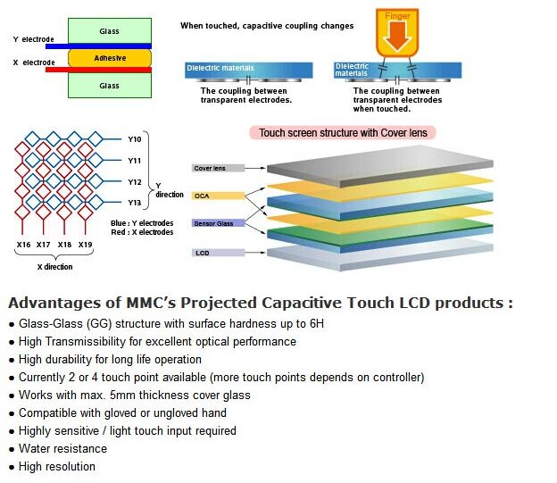
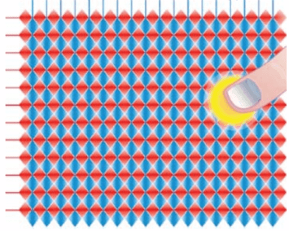
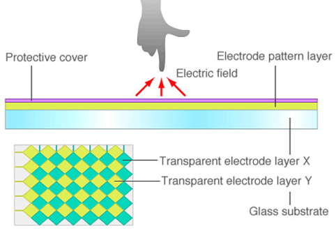
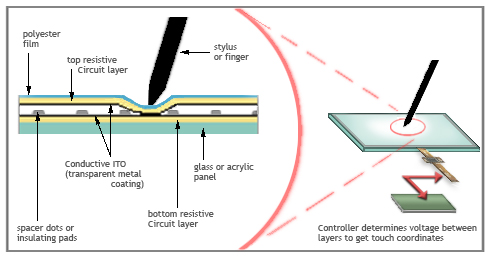

# 电容式与电阻式触摸屏对比

!!! abstract "快速结论"
    电容式与电阻式触摸屏的差别在检测原理：电容屏靠手指与电极之间的电容耦合变化定位，支持多点触控与手势，盖板可达 9H 硬度，但需要导电的触摸体、对 EMI 较敏感；电阻屏靠上下两层 ITO 导电层受压接触导通定位，可用手套或触控笔操作、成本低、抗干扰好，但只能单点、透光率与硬度偏低。2007 年之后电容屏成为主流，电阻屏则保留在低成本与特定环境场景中。

## 核心要点

- 市场上常见的触摸技术包括电阻式（RTP）、表面电容式、投射式电容（PCAP / CTP）、表面声波（SAW）与红外（IR）。
- 电容屏通过 X / Y 电极阵列检测电容耦合变化，支持缩放、滑动、旋转等手势与多点触控。
- 电阻屏依靠上下 ITO 导电层受压接触，优点是可以戴手套或用触控笔操作，且在恶劣环境中相对可靠。
- 选型核心看三点：是否需要多点触控、操作体是否导电、以及环境对 EMI 与成本的约束。

## 1. 触摸屏技术概览

市场上的触摸屏技术种类不少，最常见的包括电阻式触摸屏（RTP）、表面电容式触摸屏、投射式电容触摸屏（PCAP 或 CTP）、表面声波（SAW）触摸屏与红外（IR）触摸屏。不同技术的响应特性，取决于其底层检测原理。

本文重点讨论其中应用最广泛的两种：电容式与电阻式触摸屏。

## 2. 电容式触摸屏

<figure markdown="span" class="displaywiki-figure">
  [{ width="760" loading="lazy" }](touch-panel-types-capacitive-touch-panel.jpeg){ .displaywiki-image-link title="查看原图" }
  <figcaption>电容触摸屏的层叠结构分解：从盖板、传感器、TFT 模组到客户外壳与触控 IC 的装配关系</figcaption>
</figure>

投射式电容触摸屏（PCAP）的发明实际上比第一个电阻式触摸屏早了 10 年，但直到苹果在 2007 年把它用到 iPhone 上，才真正被市场广泛接受。此后，PCAP 主导了手机、IT、汽车、家电、工业、物联网、军事、航空、ATM 等领域的触摸市场。

<figure markdown="span" class="displaywiki-figure">
  [{ width="760" loading="lazy" }](touch-panel-types-capacitive-touch-panel-2.jpeg){ .displaywiki-image-link title="查看原图" }
  <figcaption>X / Y 电极阵列与触摸前后的电容耦合变化，右下为带盖板的触摸屏堆叠结构，下方列出投射式电容方案的典型特性</figcaption>
</figure>

### 2.1 电极结构

投射式电容触摸屏包含 X 与 Y 两组电极，两者之间设有隔离层。透明电极通常采用 ITO，并以金属桥配合形成菱形图案。

<figure markdown="span" class="displaywiki-figure">
  [{ width="760" loading="lazy" }](touch-panel-types-p-cap-x-and-y-electrode-structure.png){ .displaywiki-image-link title="查看原图" }
  <figcaption>P-CAP X 和 Y 电极结构：红蓝菱形电极阵列在手指靠近时形成局部电容耦合</figcaption>
</figure>

<figure markdown="span" class="displaywiki-figure">
  [{ width="760" loading="lazy" }](touch-panel-types-metal-bridge-in-p-cap.png){ .displaywiki-image-link title="查看原图" }
  <figcaption>P-CAP 中的金属桥与隔离层：X 与 Y 方向 ITO 电极通过桥接跨接，隔离层负责绝缘</figcaption>
</figure>

当一个手指触摸传感器表面时，手指与电极之间产生电容耦合，从而改变 X 与 Y 电极之间的静电电容，触控芯片（Touch IC）检测到静电场的变化并解算出触摸位置。

<figure markdown="span" class="displaywiki-figure">
  [{ width="760" loading="lazy" }](touch-panel-types-projected-capacitive-touch-sensor.png){ .displaywiki-image-link title="查看原图" }
  <figcaption>投射式电容触摸传感器的层叠关系：保护盖板、电极图案层与透明电极 X / Y 层叠于玻璃基板之上</figcaption>
</figure>

!!! warning "量产注意"
    在量产或恶劣工况（高低温、湿热、振动、ESD）下，注意该参数的 datasheet 曲线，超出范围会显著降低寿命。

### 2.2 电容式触摸屏的优势

- **多点触控与手势**：支持单点与多点触控，可实现缩放、滚动、滑动、拖动、旋转、敲击等手势。
- **盖板强度高**：盖板可使用钢化玻璃（如康宁大猩猩玻璃），表面硬度可达 9H。
- **持续演进**：随着技术发展，投射式电容面板已能支持手套触摸与带水触摸。

## 3. 电阻式触摸屏

2007 年之前，电阻式触摸屏在市场上非常流行。从名称就能看出，这项技术依赖于电阻变化。

电阻屏由玻璃基板作为下层、薄膜基板（通常是透明的聚碳酸酯或 PET）作为上层构成，每一层都覆盖一层透明导电材料 ITO（Indium Tin Oxide）。当用户用手指或触控笔按压屏幕的某一点时，上下两层 ITO 导电层接触，电阻随之改变，RTP 控制器检测到这一变化并计算出触摸位置。

<figure markdown="span" class="displaywiki-figure">
  [{ width="760" loading="lazy" }](touch-panel-types-resistive-touchscreen-technology-rtp.png){ .displaywiki-image-link title="查看原图" }
  <figcaption>电阻式触摸屏结构：上下两层 ITO 导电层由间隔点隔开，受压时局部接触闭合，控制器据此解算坐标</figcaption>
</figure>

<figure markdown="span" class="displaywiki-figure">
  [{ width="760" loading="lazy" }](touch-panel-types-resistive-touchscreens-advantages.jpeg){ .displaywiki-image-link title="查看原图" }
  <figcaption>电阻式触摸屏剖面：聚酯膜与玻璃面板之间的上下电阻电路层由间隔点隔开，触控笔按下后两层接触导通</figcaption>
</figure>

随着投射式电容技术的快速发展，电阻式触摸屏的市场份额在快速缩小，但凭借低成本与在恶劣环境中表现更可靠的优势，它在部分应用场景中仍有保留价值。

## 4. 电容式与电阻式触摸屏对比

| 对比项 | 电阻式触摸 | 电容式触摸 |
|---|---|---|
| 成本 | 低 | 相对高 |
| 多点触控 | 不支持 | 支持 |
| 触摸手势 | 难以实现 | 支持 |
| 表面硬度 | 3H，易划伤 | 最高可达 9H |
| 功耗 | 低 | 较高 |
| 触摸灵敏度 | 低 | 高，可调节 |
| 触摸分辨率 | 低 | 高 |
| 显示清晰度 | 一般 | 很好 |
| 水、油环境 | 无需改设计 | 需要特殊设计 |
| 表面装饰 | 困难 | 简单 |
| 异形加工 | 困难 | 简单 |
| 尺寸范围 | 小到中等尺寸 | 小到非常大尺寸 |
| 对 EMI / RFI 的敏感度 | 低 | 高 |

## 5. 选型建议

- **需要手势与多点触控**：优先选电容式，这是电阻式难以实现的。
- **操作体不导电**：如戴手套、用普通触控笔或需要戴防护手套的产线场景，电阻式更稳妥；若必须用电容屏，需选择支持手套触摸的型号。
- **强电磁干扰环境**：电容屏对 EMI / RFI 较敏感，电阻屏在强干扰环境下相对稳定。
- **成本敏感**：小尺寸、低预算项目可优先考虑电阻式。
- **户外或水油环境**：电容屏需要专门的防水与抗干扰设计，可参考防水触控方案。

## 6. 常见问题（FAQ）

??? question "Q1：电容屏和电阻屏最核心的区别是什么？"
    检测原理不同。电容屏依靠手指与 X / Y 电极之间的电容耦合变化来定位，需要导电的触摸体；电阻屏依靠上下两层 ITO 导电层受压接触导通来定位，任何能施加压力的物体都可以触发。这一根本差异，决定了它们在多点触控、盖板强度、灵敏度与成本上的全部区别。

??? question "Q2：为什么电阻屏可以用手套或触控笔操作？"
    因为电阻屏只检测压力，不检测导电性。无论手指、手套、塑料触控笔还是金属笔，只要能把上层薄膜压到与下层接触，就能形成导通并定位。电容屏依赖人体电荷与电极形成耦合，普通手套与绝缘触控笔无法触发，除非选用专门支持手套触摸的电容方案。

??? question "Q3：电容屏能支持多点触控，电阻屏为什么不行？"
    电容屏的 X / Y 电极构成阵列，可以同时检测多个位置的电容变化，因此能识别多指手势。电阻屏是整面上下两层导电膜，任何位置的按压都会让两层局部接触，控制器只能解算出一个接触点，无法区分多个同时发生的按压，因此本质上只支持单点。

??? question "Q4：电阻屏在恶劣环境下更可靠吗？"
    在很多场景下是的。电阻屏结构简单、对电磁干扰不敏感，且在潮湿、多尘或需要隔离操作的环境（如戴手套的产线、需要触控笔的工业终端）中适应性更好。此外它的功耗更低，也便于做低功耗设计。

??? question "Q5：触摸屏盖板硬度 3H 和 9H 意味着什么？"
    这里说的是铅笔硬度等级，数值越高越耐划。电阻屏表面是相对柔软的薄膜层，通常只有 3H 左右，容易被尖锐物体划伤；电容屏可以使用钢化玻璃盖板，硬度可达 9H，日常使用中更耐磨。因此对耐久性要求高的场景应优先考虑电容屏配合强化盖板。

??? question "Q6：强电磁干扰环境下该选哪种触摸屏？"
    电阻屏对 EMI / RFI 的敏感度明显更低，因此在变频器、大功率电机等强干扰环境中更稳妥。若必须使用电容屏，需要从触控 IC 选型、走线屏蔽、滤波与固件算法等多个层面做抗干扰设计，并针对现场环境做充分验证。

## 相关阅读

- [GF、GFF、GG 与 PG 电容触摸结构](capacitive-touch-structures.md)
- [显示屏框贴与全贴合对比](air-vs-optical-bonding.md)
- [手套触控、防水触控与抗干扰设计](glove-waterproof-touch.md)

## 参考数据来源

本文涉及的标准、规格与资料：

- [CO5300 触控驱动 IC 规格书](../../../assets/datasheet/display/CO5300.pdf)
- [IPC-A-610 电子组件的可接受性](https://shop.ipc.org/ipc-a-610)

!!! info "没有找到您需要的内容？"
    如果您需要更多产品、资源或技术支持，欢迎联系我们的团队：

    [**:material-archive-arrow-down: 知识库**](../../knowledge/tags.md){ .md-button .md-button--primary }
    [**:material-magnify: 产品与解决方案**](https://www.chinasunyee.com){ .md-button }
    [**:material-email: 联系技术支持**](mailto:info@chinasunyee.com){ .md-button }
