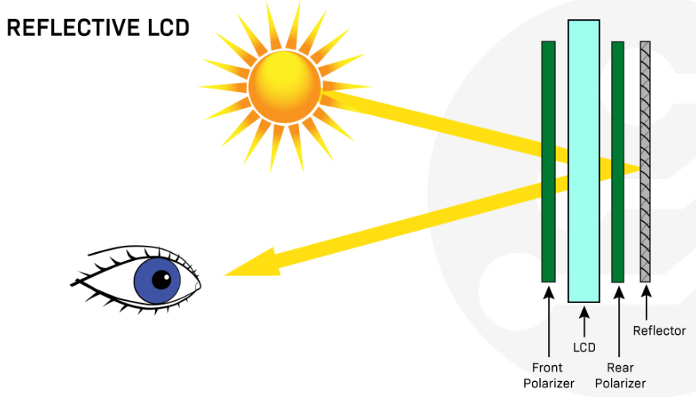
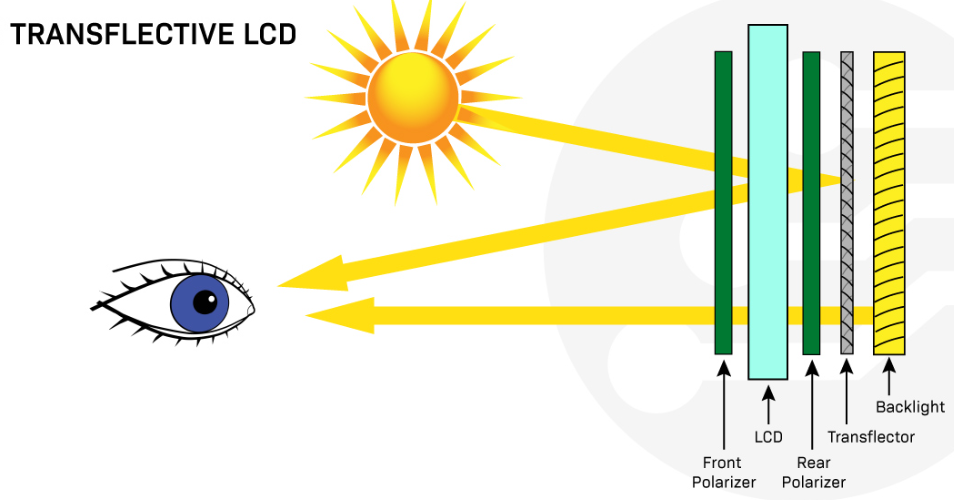
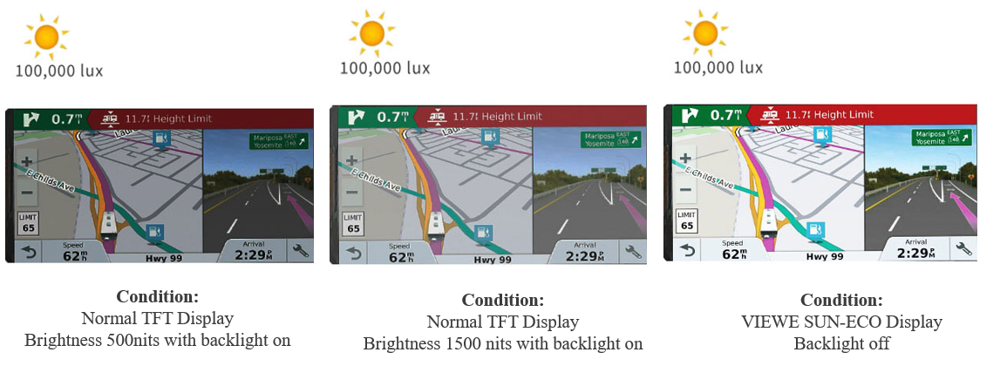
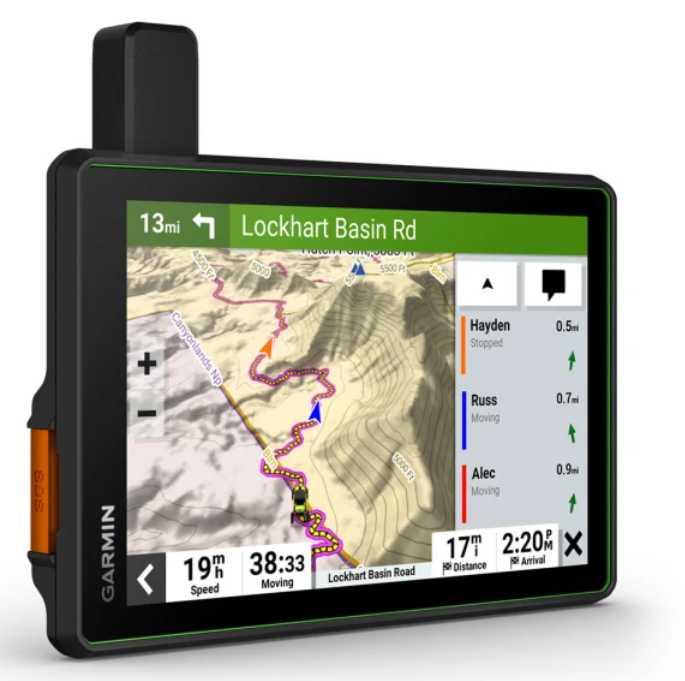
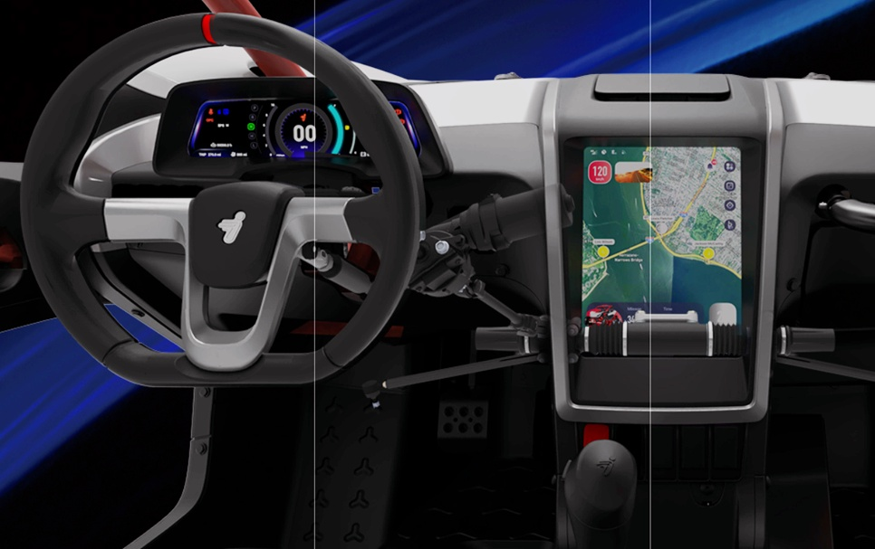
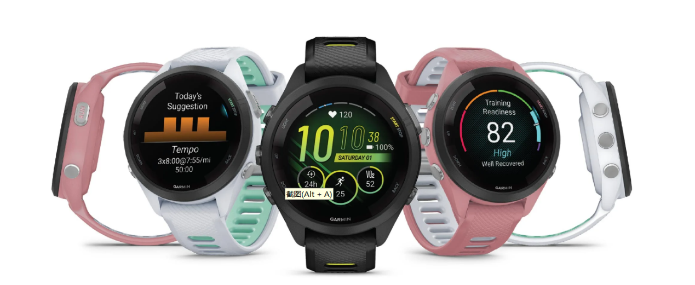
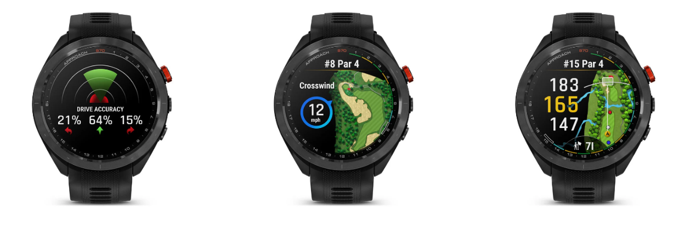

# 透射式、反射式与半反半透式 LCD 对比

!!! abstract "快速结论"
    本指南解释了透射式与反射式和半反半透式,相关的设计权衡以及工程师在选择显示解决方案时应该验证的点.

## 核心要点

- 系统了解透射式、反射式与半反半透式 LCD 对比，包括关键原理、优缺点、应用场景和工程选型要点。
- 根据下文比较相关技术、应用条件和设计取舍。
- 最终选型前，应确认光学、电气、结构、环境与量产要求。

## 透射式、反射式与半反半透式显示

常见问题1:传递,反射显示和半反半透式显示之间的区别是什么?

常见问题2:透射特性,反射性和半反半透特性哪种更好?

问题3:转反射式显示是什么?

常见问题4:转反射式显示的优点或缺点是什么?

常见问题5:用于什么?

常见问题6:透射式显示是什么?

问卷7:反射显示是什么?反射式显示是否好?

常见问题8:Blanview和反射式显示的区别是什么?

### 介绍

液晶显示器 (LCD) 在各种行业的电子设备中被广泛使用.它们通常根据其光传输模式分为三种显示整理.

主要的区别在于它们如何使用光来照亮显示屏中的像素.

液晶模式的整理:

透射式 LCD需要背光,以确保清晰的可见性.

反射式 LCD没有背光,依赖于外部的光源.

半反半透式 LCD具有透射特性和反射性.

<figure markdown="span" class="displaywiki-figure">
  [{ width="760" loading="lazy" }](transmissive-reflective-transflective-transflective-lcds-combine-both-transmissive-and-reflective-properties.jpeg){ .displaywiki-image-link title="查看原图" }
  <figcaption>半反半透式 LCD结合透射特性和反射性</figcaption>
</figure>

每个显示模式都有与可用的照明条件和应用环境相关的自己的优势和缺点.

### 透射式 LCD

透射式显示屏依赖于背光可见.为此类显示器,显示器玻璃背面发出的光必须通过LCD向前移动照亮像素.传输型LCD适合低光环境中,因为它们依赖背光来看到. 这些显示器也用于高分辨率的图像,视频和高质量的应用,这就是为什么你通常会发现具有透射式显示模式的TFT显示器.

透射式显示器是如何工作的?

透射式显示器通过传输光线通过显示屏表面工作. 这可通过使用一系列层,包括一种可以操纵来控制光线的流体水晶层,提供光源的后照明以及保护玻璃或塑料的外部层来实现. 当电流被应用到显示器中的像素上时,它允许多或少的光通过,

<figure markdown="span" class="displaywiki-figure">
  [{ width="760" loading="lazy" }](transmissive-reflective-transflective-transmissive-lcd-uses.png){ .displaywiki-image-link title="查看原图" }
  <figcaption>透射式 LCD仪的使用</figcaption>
</figure>

最常见的使用透射式 LCD设备是智能手机,平板电脑,计算机显示器和电视.它们也用于数字摄像头,摄像机,汽车显示屏,导航系统,飞行中娱乐系统,医疗设备,亭子和销售点 (POS) 终端.

透射式 LCD的优势

高图像质量:透射式 LCD可以产生高品质,明亮,生动的图像,具有广泛的颜色范围和高对比率.

在低光环境中可见性良好:透射式 LCD依赖于背光,使其适合更黑暗的照明条件.

广视角:透射式 LCD具有宽的视角,使得从各种位置可以轻松查看显示器.

适合高分辨率:透射式 LCD可以处理高分别的图像和视频.

透射式 LCD的缺点

高功耗:透射式 LCD需要可见的背光,从而增加功耗并缩短终端产品的电池寿命.

在明亮的阳光下可见度降低:透射式 LCD不适合在直射阳光下的使用,因为后照会冲洗屏幕.

易受光:透射式 LCD可能受到光的影响,使在某些照明条件下难以查看显示屏.

### 反射式 LCD

反射显示器依赖于明亮的环境光线,可见.这种显示器内部没有后照源;相反,光从周围的环境中反射,使得像素可以看到.

反射显示器是如何工作的?

反射式 LCD通过使用反射层和极化过器一起工作,以反射光向用户的眼睛而不是从背光中发出光.液晶层调节反射的光量,从而创造了所需的图像.

<figure markdown="span" class="displaywiki-figure">
  [{ width="760" loading="lazy" }](transmissive-reflective-transflective-reflective-lcd-uses.png){ .displaywiki-image-link title="查看原图" }
  <figcaption>反射液晶使用</figcaption>
</figure>

反射式 LCD适合户外或阳光可读的应用,在设备暴露于直接阳光.这些显示器也用于小型手持设备中,电力消耗是一个问题.

使用反射式 LCD的最常见设备是户外应用,如GPS设备和电子阅读器,摄像头查看器和数字手表等便携式设备.

反射式 LCD的优势

低功耗:反射式 LCD不需要背光,从而减少其功耗并延长设备的电池使用寿命.

在阳光中可见度很高:显示器的反射性质使其在明亮的阳光下可以轻松阅读.

薄和轻量:反射式 LCD比透射式 LCD更薄,较轻,因为它们没有背光,因此适合便携设备.

反射式 LCD的缺点

视角有限:反光液晶显示器的视角是有限的,因此很难从某些角度读取显示器.

在低光下性能差:反射式 LCD不适合低光环境,因为它们依赖于明亮的环境光线来可见.

减少颜色深度:反射式 LCD通常与透射式 LCD相比具有较小的颜色 深度,这可能会影响整体图像质量.

### 半反半透式 LCD

变体显示器结合后照和环境光反射以照亮像素,从而产生具有透射特性和反射性的显示屏.

转光液晶显示器是如何工作的?

在透光液晶显示器中,用于在室内或夜间等低照明条件下照亮屏幕的后照.在户外或直接阳光等明亮的环境下,可以通过反射LCD表面的环境光来查看屏幕.

<figure markdown="span" class="displaywiki-figure">
  [{ width="760" loading="lazy" }](transmissive-reflective-transflective-transflective-lcd-uses.png){ .displaywiki-image-link title="查看原图" }
  <figcaption>转光液晶使用</figcaption>
</figure>

光液晶显示器通常用于户外设备,工业和医疗设备,在任何照明条件下都必须具有高可见性.

转光液晶显示器的优势

高可见性和对比度:反光液晶显示器结合反射式和透射式显示屏的好处,在阳光照明和低照明环境中提供了良好的可视性.

低功耗:光变液晶显示器不需要始终开放后照明,从而降低了电力消耗和延长了后照的电池寿命.

宽视角:反光液晶显示器的视角比反光 LCD更广.

变光液晶显示器的缺点

颜色深度有限:反光液晶显示器通常与透射式 LCD相比具有较小的颜色 深度,这可能会影响整体图像质量.

### 结论

总而言之,透射式 LCD适用于低光使用,反射式LCD适用于亮光使用.

<figure markdown="span" class="displaywiki-figure">
  [{ width="760" loading="lazy" }](transmissive-reflective-transflective-conclusion.png){ .displaywiki-image-link title="查看原图" }
  <figcaption>结论</figcaption>
</figure>

在需要高质量的图像和视频,如电视,计算机显示器和智能手机的应用中将继续使用传输屏幕.

反射显示器将继续用于电力消耗问题应用中,例如电子阅读器,小型手持设备和户外应用.

预计在变化的照明条件下可见性至关重要的更便携式设备和应用中将使用半反半透式显示器.

### 半反半透式与反射式显示应用场景

坚固的电话和户外手持设备:

<figure markdown="span" class="displaywiki-figure">
  [{ width="760" loading="lazy" }](transmissive-reflective-transflective-outdoor-transport-vehicle-motor-e-bike-bike-computer.jpg){ .displaywiki-image-link title="查看原图" }
  <figcaption>户外交通工具:摩托车,电动自行车,自行机计算机</figcaption>
</figure>

<figure markdown="span" class="displaywiki-figure">
  [{ width="760" loading="lazy" }](transmissive-reflective-transflective-outdoor-transport-vehicle-motor-e-bike-bike-computer.png){ .displaywiki-image-link title="查看原图" }
  <figcaption>户外交通工具:摩托车,电动自行车,自行机计算机</figcaption>
</figure>

<figure markdown="span" class="displaywiki-figure">
  [{ width="760" loading="lazy" }](transmissive-reflective-transflective-outdoor-transport-vehicle-motor-e-bike-bike-computer-2.png){ .displaywiki-image-link title="查看原图" }
  <figcaption>户外交通工具:摩托车,电动自行车,自行机计算机</figcaption>
</figure>

<figure markdown="span" class="displaywiki-figure">
  [{ width="760" loading="lazy" }](transmissive-reflective-transflective-sports-devices.png){ .displaywiki-image-link title="查看原图" }
  <figcaption>运动设备</figcaption>
</figure>

<figure markdown="span" class="displaywiki-figure">
  [{ width="760" loading="lazy" }](transmissive-reflective-transflective-sports-devices.jpeg){ .displaywiki-image-link title="查看原图" }
  <figcaption>运动设备</figcaption>
</figure>

<figure markdown="span" class="displaywiki-figure">
  [{ width="760" loading="lazy" }](transmissive-reflective-transflective-sports-devices-2.png){ .displaywiki-image-link title="查看原图" }
  <figcaption>运动设备</figcaption>
</figure>

<figure markdown="span" class="displaywiki-figure">
  [{ width="760" loading="lazy" }](transmissive-reflective-transflective-sports-devices-3.png){ .displaywiki-image-link title="查看原图" }
  <figcaption>运动设备</figcaption>
</figure>

## 相关阅读

- [IPS、TN、VA 与 FFS TFT 面板技术对比](tft-panel-technologies.md)
- [a-Si、LTPS 与 IGZO TFT 背板技术对比](tft-backplane-technologies.md)
- [OLED 显示结构、工作原理及与 LCD 的对比](oled-display-basics.md)
