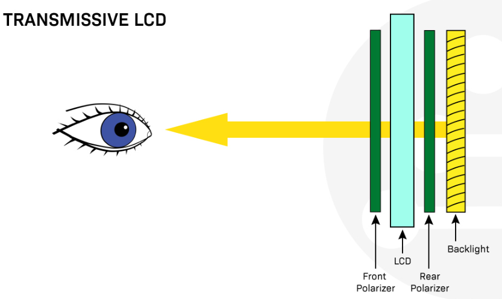
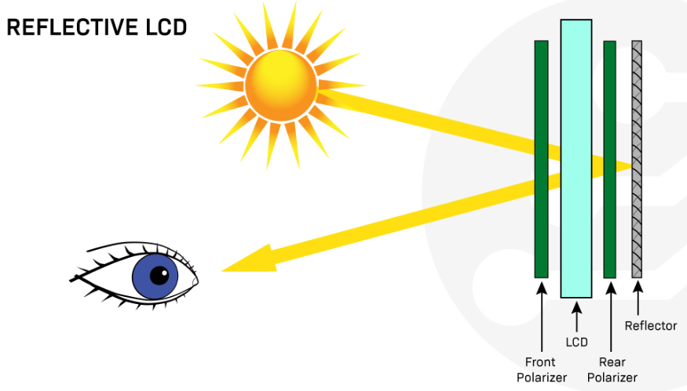
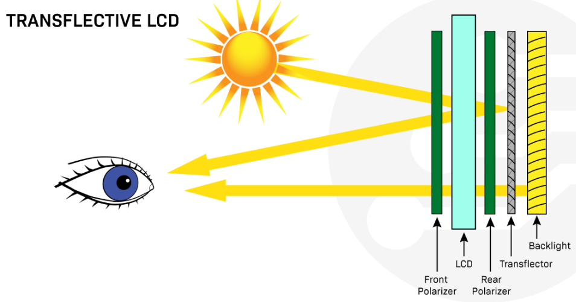
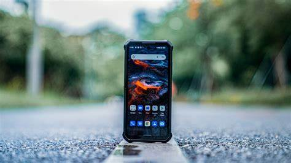
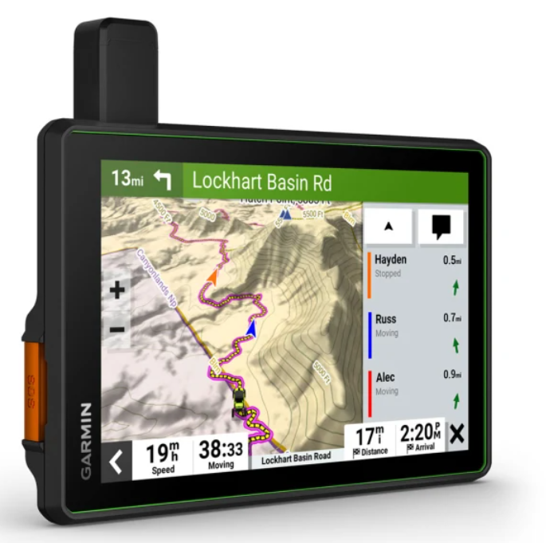
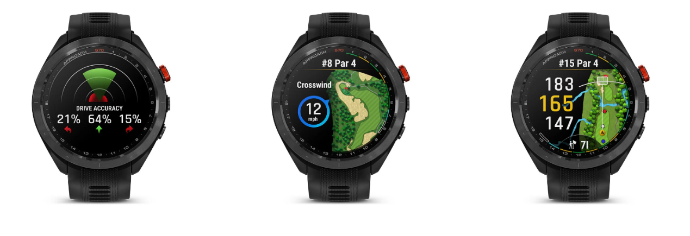

# 透射型、反射式与半反半透式 LCD 对比

!!! abstract "快速结论"
    LCD 按透光方式分为三类：透射型需要背光才能看清，反射型完全依赖环境光，半反半透型同时具备背光与反射结构。选型的核心不是"哪种更好"，而是设备会在什么光照条件下使用——室内为主选透射型，强光户外且功耗敏感选反射型或半反半透型。

## 核心要点

- 三者的根本差别在于"像素靠什么光被照亮"：背光、环境光，或两者兼有。
- 透射型画质与视角最好，但强光下背光容易被阳光冲淡，且功耗最高。
- 反射型功耗最低、阳光下可读性最好，但暗环境下无法使用，色深与视角也较弱。
- 半反半透型在两者之间取得平衡：弱光开背光、强光靠反射，代价是色深与成本的折中。

## 1. 三种透光方式的区别

液晶显示器在各种行业的电子设备中被广泛使用，按其透光方式可以分为三类，根本区别在于它们如何照亮屏幕中的像素：

<figure markdown="span" class="displaywiki-figure">
  [{ width="760" loading="lazy" }](transmissive-reflective-transflective-transflective-lcds-combine-both-transmissive-and-reflective-properties.jpeg){ .displaywiki-image-link title="查看原图" }
  <figcaption>三种透光方式在弱光（月光）环境下的照明方式对比：左侧为传统透射型（依靠背光单元），中间为反射型（依靠前光单元），右侧为半反半透型；三者的差别集中在"光源从哪里来"。</figcaption>
</figure>

- **透射型 LCD**：需要背光才能保证清晰可见。
- **反射型 LCD**：没有背光，依赖外部环境光。
- **半反半透型 LCD**：同时具备透射特性与反射特性。

每种模式都有与其适用照明条件和应用环境相对应的优缺点。

## 2. 透射型 LCD

### 2.1 工作原理

透射型显示屏依靠背后的光源来照亮像素：从屏幕玻璃背面发出的光必须穿过液晶盒向前传播，才能被观察者看到。

<figure markdown="span" class="displaywiki-figure">
  [{ width="760" loading="lazy" }](transmissive-reflective-transflective-transmissive-lcd-uses.png){ .displaywiki-image-link title="查看原图" }
  <figcaption>透射型 LCD 的光路：背光（Backlight）提供光源，光线依次穿过其后偏光片（Rear Polarizer）、液晶盒（LCD）与前偏光片（Front Polarizer）后射向观察者，液晶负责调节透过量。</figcaption>
</figure>

这类显示器由一系列层叠结构实现：可以控制光线的液晶层、提供光源的背光，以及保护性的玻璃或塑料外层。当电流施加到像素上时，液晶允许或多或少的透过光量。由于依赖背光，透射型 LCD 适合低光环境，也常用于高分辨率图像、视频等对画质要求高的场景——这正是 TFT 显示器普遍采用透射式的原因。

### 2.2 优势与局限

**优势**

- **画质高**：可呈现明亮、生动的图像，具备较宽的色域与较高的对比度。
- **低光环境可见性好**：依赖背光，适合较暗的照明条件。
- **视角宽**：从不同位置都能较容易地看清画面。
- **适合高分辨率**：可支持高分辨率图像与视频。

**局限**

- **功耗高**：必须持续点亮背光，增加功耗并缩短终端产品的电池寿命。
- **强光下可读性下降**：背光会被阳光冲淡，不适合长时间直射阳光下使用。
- **受环境光影响**：在某些照明条件下，环境光反射会干扰观看。

**典型应用**：智能手机、平板电脑、计算机显示器、电视，以及数码相机、摄像机、车载显示屏、导航系统、机载娱乐系统、医疗设备、自助终端与 POS 收银机。

## 3. 反射型 LCD

### 3.1 工作原理

反射型显示器依赖明亮的环境光，内部没有背光源；环境光从周围射入后经反射层返回，像素因此可见。

<figure markdown="span" class="displaywiki-figure">
  [{ width="760" loading="lazy" }](transmissive-reflective-transflective-reflective-lcd-uses.png){ .displaywiki-image-link title="查看原图" }
  <figcaption>反射型 LCD 的光路：没有背光，环境光（阳光）从正面进入，穿过前偏光片（Front Polarizer）与液晶盒（LCD）后被反射片（Reflector）反射回观察者，液晶调节反射的光量以形成图像。</figcaption>
</figure>

反射型 LCD 通过反射层与偏光片配合工作，把光反射向用户的眼睛，而不是从背光发出光。液晶层调节反射光量，从而形成所需图像。这类显示器适合户外或阳光可读的应用，也用于功耗敏感的便携设备。

### 3.2 优势与局限

**优势**

- **功耗低**：无需背光，显著降低功耗、延长电池寿命。
- **阳光下可读性高**：反射特性使其在明亮阳光下依然清晰易读。
- **轻薄**：因为没有背光结构，比透射型更薄更轻，适合便携设备。

**局限**

- **视角有限**：斜视时较难读取。
- **低光下表现差**：依赖明亮环境光，暗环境下无法使用。
- **色深较低**：与透射型相比颜色层次较少，影响整体图像质量。

**典型应用**：户外 GPS 设备、电子阅读器、取景器与数字手表等便携设备。

## 4. 半反半透式 LCD

### 4.1 工作原理

半反半透型同时结合背光与环境光反射来照亮像素，因此既具备透射特性，也具备反射特性。

<figure markdown="span" class="displaywiki-figure">
  [{ width="760" loading="lazy" }](transmissive-reflective-transflective-transflective-lcd-uses.png){ .displaywiki-image-link title="查看原图" }
  <figcaption>半反半透型 LCD 的光路：结构上兼有背光与半透半反膜（Transflector）。室内或夜间等弱光条件下开启背光照明；户外强光下则可依靠半透半反膜反射环境光看清画面。</figcaption>
</figure>

在低照明条件（室内或夜间）下，背光负责照亮屏幕；在明亮环境（户外或直射阳光）下，屏幕可以借由反射环境光而被看清。因此这类显示器常用于户外设备、工业与医疗设备等对任意光照条件下可见性都有要求的场合。

### 4.2 优势与局限

**优势**

- **高可见性与对比度**：兼顾反射与透射的长处，在阳光与低光环境中都有良好可视性。
- **功耗低**：不必始终开启背光，降低功耗、延长背光寿命。
- **视角较宽**：相比纯反射型，视角表现更好。

**局限**

- **色深有限**：与透射型相比颜色层次较少，会影响整体图像质量。
- **成本与结构更复杂**：半透半反膜与双光源设计会带来额外的工艺与成本。

## 5. 三种透光方式横向对比

| 维度 | 透射型（Transmissive） | 反射型（Reflective） | 半反半透型（Transflective） |
|---|---|---|---|
| 光源来源 | 背光 | 环境光 | 背光 + 环境光反射 |
| 强光下可读性 | 差（背光被冲淡） | 好 | 好 |
| 暗环境可读性 | 好 | 差 | 好（开背光） |
| 功耗 | 高 | 最低 | 中低 |
| 色深与画质 | 好 | 较低 | 中等 |
| 视角 | 宽 | 窄 | 较宽 |
| 厚度 | 较厚（含背光） | 薄 | 中等 |

## 6. 强光下的实测对比

在 100,000 lux 的直射强光下，不同方案的差异非常直观。下图为同一导航界面在三种条件下的实拍：普通 TFT 在 500 nits 与 1500 nits 背光全开时的表现，以及半反半透屏在**关闭背光**时的表现。

<figure markdown="span" class="displaywiki-figure">
  [{ width="760" loading="lazy" }](transmissive-reflective-transflective-conclusion.png){ .displaywiki-image-link title="查看原图" }
  <figcaption>100,000 lux 强光下的可读性对比：普通 TFT（500 nits、背光开）、普通 TFT（1500 nits、背光开）与优奕视界 SUN-ECO 半反半透屏（背光关）。半透半反屏在关闭背光的条件下仍能保持画面清晰，说明强光可读性并不只取决于亮度数值。</figcaption>
</figure>

这张对比揭示了一个常被忽略的事实：在直射阳光下，单纯提高背光亮度会遇到边际收益递减，因为屏幕表面的反射光同样被放大；而半反半透方案把环境光本身变成光源，反而能在背光关闭时取得更好的可读性，同时把功耗降下来。

## 7. 典型应用场景

半反半透与反射型方案主要服务于强光户外与低功耗两大诉求，常见形态包括户外手持与交通工具、运动与可穿戴设备。

**三防手机与户外手持设备**

<figure markdown="span" class="displaywiki-figure">
  [{ width="760" loading="lazy" }](transmissive-reflective-transflective-outdoor-transport-vehicle-motor-e-bike-bike-computer.jpg){ .displaywiki-image-link title="查看原图" }
  <figcaption>三防手机：户外作业与运动场景下，屏幕经常处于直射阳光下，透光方式比峰值亮度更关键。</figcaption>
</figure>

**户外 GPS 导航仪**

<figure markdown="span" class="displaywiki-figure">
  [{ width="760" loading="lazy" }](transmissive-reflective-transflective-outdoor-transport-vehicle-motor-e-bike-bike-computer.png){ .displaywiki-image-link title="查看原图" }
  <figcaption>户外 GPS 导航仪：长期暴露在强光下，且以电池供电，适合采用半反半透或反射型方案。</figcaption>
</figure>

**电动摩托车仪表**

<figure markdown="span" class="displaywiki-figure">
  [{ width="760" loading="lazy" }](transmissive-reflective-transflective-outdoor-transport-vehicle-motor-e-bike-bike-computer-2.png){ .displaywiki-image-link title="查看原图" }
  <figcaption>电动摩托车仪表：骑行者视角常处于逆光或强光下，仪表需要在各种光照下都保持可读。</figcaption>
</figure>

**自行车码表**

<figure markdown="span" class="displaywiki-figure">
  [{ width="760" loading="lazy" }](transmissive-reflective-transflective-sports-devices.png){ .displaywiki-image-link title="查看原图" }
  <figcaption>自行车码表：小尺寸、低功耗、强光可读，是半反半透方案的典型场景。</figcaption>
</figure>

**电动越野车驾驶舱**

<figure markdown="span" class="displaywiki-figure">
  [{ width="760" loading="lazy" }](transmissive-reflective-transflective-sports-devices.jpeg){ .displaywiki-image-link title="查看原图" }
  <figcaption>电动越野车驾驶舱：中控与仪表屏在开放式座舱中直接暴露于阳光，需评估强光下的可读性。</figcaption>
</figure>

**运动手表**

<figure markdown="span" class="displaywiki-figure">
  [{ width="760" loading="lazy" }](transmissive-reflective-transflective-sports-devices-2.png){ .displaywiki-image-link title="查看原图" }
  <figcaption>运动手表：户外跑步、骑行时长时间在阳光下使用，功耗与可读性同时受限。</figcaption>
</figure>

**高尔夫手表**

<figure markdown="span" class="displaywiki-figure">
  [{ width="760" loading="lazy" }](transmissive-reflective-transflective-sports-devices-3.png){ .displaywiki-image-link title="查看原图" }
  <figcaption>高尔夫手表：需要在开阔场地的强光下长时间显示球道图与击球数据，属典型的阳光下可视应用。</figcaption>
</figure>

## 8. 选型要点

- **先定使用光照环境**：以室内为主选透射型；长期户外强光、且不便供电选反射型；光照条件在明暗之间频繁切换选半反半透型。
- **量化可读性需求**：不要只看亮度（nits），应结合环境照度（lux）与实际使用角度评估，必要时用实测图对比。
- **核算功耗预算**：电池供电设备要计算背光占整机功耗的比例，半反半透可在强光下关闭背光，收益明显。
- **确认画质要求**：若对色深、色域有硬性要求，需评估反射/半透半反方案的色深折中是否可接受。
- **核对结构与成本**：半反半透膜、双光源结构会影响厚度与成本，需与整机结构同步确认。

## 9. FAQ

??? question "Q1：透射、反射与半透半反三种屏幕该怎么选？"
    先看设备的使用光照条件：主要在室内或夜间使用，透射型画质最好；长期在户外强光下且以电池供电，反射型功耗最低、阳光下最清晰；使用环境在强光与弱光之间频繁切换（如户外手持设备），半反半透型兼顾两者，是折中但更稳妥的选择。

??? question "Q2：半反半透屏在强光下为什么可以关掉背光？"
    半反半透屏在背光结构前加入了一层半透半反膜（Transflector）：它既能透过背光，也能反射环境光。在强光下，环境光经这层膜反射后回到观察者眼中，亮度足以看清画面，因此背光可以关闭，功耗随之下降。

??? question "Q3：反射型 LCD 在暗环境下完全不能用吗？"
    反射型没有背光源，完全依赖环境光，环境光不足时确实无法看清画面。部分产品会额外加一层前光（Frontlight）来解决暗环境阅读问题，但这会增加结构与功耗成本；若明暗切换频繁，直接选择半反半透方案更合适。

??? question "Q4：半反半透会不会牺牲色彩表现？"
    会有一定折中。半透半反膜的反射层会占去部分透光面积，导致透射模式下亮度与色深不如同规格的纯透射屏，反射模式下的色深也弱于纯反射屏。选型时需确认目标应用对色深的要求，必要时用实拍画面评估可接受程度。

??? question "Q5：前光（Frontlight）和背光有什么区别？"
    背光位于屏幕后方，光线从后向前穿过液晶层；前光位于屏幕前方或侧面，光线照射到显示面后再反射进人眼。反射型与半反半透型在暗环境下通常会借助前光，而不是背光，二者在结构、功耗与光学效果上都有差异。

??? question "Q6：户外强光下，直接提高亮度（nits）能解决问题吗？"
    效果有限。屏幕表面的环境光反射会随外界照度同步增强，单纯提高背光亮度会遇到边际收益递减，功耗却持续上升。相比之下，改变透光方式（采用半反半透把环境光变为光源）往往更有效，这也是半反半透方案在阳光下可视场景中的价值所在。

## 相关阅读

- [IPS、TN、VA 与 FFS TFT 面板技术对比](tft-panel-technologies.md)
- [a-Si、LTPS 与 IGZO TFT 背板技术对比](tft-backplane-technologies.md)
- [OLED 显示结构、工作原理及与 LCD 的对比](oled-display-basics.md)

## 参考数据来源

本文涉及的标准、规格与应用资料：

- [优奕视界半透半反产品系列）](https://www.chinasunyee.com/bfbtp.htm)

!!! info "没有找到您需要的内容？"
    如果您需要更多产品、资源或技术支持，欢迎联系我们的团队：

    [**:material-archive-arrow-down: 知识库**](../../knowledge/tags.md){ .md-button .md-button--primary }
    [**:material-magnify: 产品与解决方案**](https://www.chinasunyee.com){ .md-button }
    [**:material-email: 联系技术支持**](mailto:info@chinasunyee.com){ .md-button }
