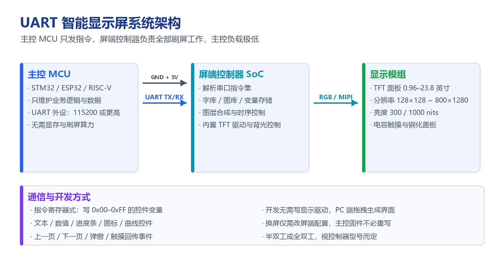

# UART 智能显示屏解决方案

!!! abstract "快速结论"
    UART 智能显示屏（俗称串口屏）把显示驱动、字库、图层合成与时序控制全部交给屏端控制器，主控 MCU 只需通过串口下发指令即可刷新界面。它的价值在于把主控从刷屏算力中解放出来：无需显存、无需写显示驱动，换屏或改界面也不必重写主控固件。代价是刷新率与动画能力受串口带宽限制，适合以数据展示与状态指示为主的场景。

## 核心要点

- 屏端控制器自带 TFT 驱动、字库图库与图层合成，主控 MCU 只负责业务逻辑与串口通信。
- 选型先看三件事：屏端控制器支持的控件与指令集、串口波特率与刷新能力、屏的尺寸分辨率亮度。
- 常见分辨率覆盖 128×128 到 800×1280，尺寸覆盖 0.96 到 23.8 英寸，亮度可选室内 300 nits 或户外 1000 nits。
- 主控侧几乎零显示驱动开发量，PC 端拖拽即可生成界面；瓶颈在串口带宽，全屏动画与视频类内容不适合。

## 1. 什么是 UART 智能显示屏

UART（Universal Asynchronous Receiver/Transmitter）是嵌入式领域最经典、使用最广泛的串行通信协议之一。基于 UART 的智能显示屏，把传统"主控直接驱动面板"的架构拆成两段：主控 MCU 与屏端控制器之间只走一串指令，屏端控制器独立完成显示工作。

<figure markdown="span" class="displaywiki-figure">
  [{ width="760" loading="lazy" }](uart-smart-display-architecture.png){ .displaywiki-image-link title="查看原图" }
  <figcaption>主控 MCU 只发指令，屏端控制器负责字库、图层与时序，显示模组完成光电转换</figcaption>
</figure>

这样分工带来的直接结果：主控不再需要显存、不需要刷屏算力，甚至不需要了解面板的时序参数。通信方式简单而稳定，正是它能在大量场景中替代传统并口屏的原因。

## 2. 典型应用场景

UART 智能屏适合"需要界面、但主控算力或开发资源有限"的项目。常见场景包括：

### 2.1 工业控制

工业自动化设备需要实时监测与数据显示。串口屏可以显示传感器读数、设备状态与控制命令，这类场景要求高可靠性与实时性，屏端控制器的稳定性直接决定产线能否连续运行。

### 2.2 医疗设备

医疗器械需要显示患者监测数据（如心率、血氧饱和度、血压）与操作说明。串口屏可实现低功耗与高精度的数据显示，让医护人员实时获取患者信息。

### 2.3 智能家居

温湿度传感器、空气质量检测仪等设备需要把环境数据展示出来。串口屏可集成到智能家居控制系统中，提供环境信息显示与设备控制入口。

### 2.4 消费电子

智能手表、健身追踪器等产品需要在有限功耗下提供交互界面。串口屏的低功耗特性让这类设备能够长时间续航。

### 2.5 公共信息展示

公共显示屏用于发布广告、公告与实时数据，对视觉质量与远程更新能力要求较高，串口屏可以通过主控统一下发内容。

## 3. 方案优势

| 优势 | 说明 |
|---|---|
| 通信稳定 | UART 是成熟的串行通信协议，在各类工业环境中都能实现可靠传输 |
| 实施简单 | 协议实现简单，各类嵌入式系统与微控制器都能快速集成，缩短开发周期 |
| 低功耗 | 屏端控制器通常采用低功耗设计，适合电池供电设备 |
| 数据传输高效 | 对需要实时更新的场景，串口指令能以很小的数据量完成界面刷新 |
| 兼容性强 | 通用协议，可与各类传感器、外围设备配合，提供统一的数据显示接口 |
| 扩展灵活 | 可外接触摸传感器、摄像头、麦克风等外设扩展功能 |
| 成本可控 | 相比 SPI、I2C 直驱方案，需要的硬件资源更少，整体方案成本更友好 |
| 可靠耐用 | 屏体与控制器通常按工业级要求设计，能适应较苛刻的使用环境 |

## 4. 需求分析

在确定方案之前，需要把需求拆成"用户侧要什么"和"技术侧满足什么"两部分。

**用户侧需求**

| 场景 | 界面需求 |
|---|---|
| 工业控制 | 实时显示传感器数据与设备状态 |
| 医疗设备 | 显示患者监测数据与操作说明 |
| 智能家居 | 显示环境信息与控制状态 |
| 消费电子 | 显示设备信息与交互入口 |

**技术侧要求**

- 通信稳定性：确保数据在电磁环境复杂的现场也能可靠传输。
- 显示质量：分辨率、亮度与可视角度需满足使用环境。
- 低功耗：电池供电设备需评估屏端控制器与背光的功耗预算。
- 实时性能：对用户操作与数据更新要有足够快的响应。

## 5. 设计与开发要点

### 5.1 硬件设计

**显示板**

- 分辨率：128×128 到 800×1280
- 尺寸：0.96 到 23.8 英寸
- 亮度：室内 300 nits、户外 1000 nits

**控制器**

- 处理器：ARM Cortex-M / RISC-V 系列或其他低功耗 MCU（STM32、ESP32 等）
- UART 模块：支持多种波特率的集成 UART 接口
- 扩展接口：RS-232 / RS-485 / CAN

**电源管理**

- 支持较宽的供电范围
- 整机按低功耗目标设计

### 5.2 软件设计

**运行环境**

- 裸机 GUI：不依赖操作系统的图形应用
- RTOS：FreeRTOS 等实时操作系统

**固件**

- UART 驱动：实现稳定的串口通信
- 显示驱动：面板初始化与图像渲染
- 数据解析：对串口收到的指令进行解析与分发

**应用层**

- 用户界面：简洁直观的图形界面
- 数据更新：保证信息及时准确
- 错误处理：具备可靠的状态检测与异常处理机制

### 5.3 测试与验证

**硬件测试**：对显示板、控制器与电源管理组件做完整测试，并在不同环境下验证稳定性与可靠性。

**软件测试**：执行功能测试，确认串口通信、显示驱动与界面运行正常；在高负载条件下做性能测试，验证响应能力。

**用户体验测试**：邀请目标用户试用，收集反馈并改进，确保界面与交互方式符合使用习惯。

## 6. 选型要点

- **看控件与指令集**：是否支持文本、数值、进度条、图标、曲线等常用控件，指令是否易于集成。
- **看波特率与刷新能力**：115200 是常见起点，界面复杂或数据刷新频繁要评估更高波特率与屏端缓冲机制。
- **看屏体规格**：尺寸、分辨率、亮度、可视角度需要与应用环境匹配，户外场景优先考虑高亮或半反半透方案。
- **看扩展接口**：需要接 RS-485、CAN 等工业总线时，确认控制器是否原生支持或留出扩展位。
- **看开发方式**：PC 端可视化编辑能显著缩短界面开发周期，也要确认是否支持自定义字库与图片资源。
- **看供货与一致性**：批量项目中屏体批次一致性、长期供货与技术支持同样重要。

## 7. 常见问题（FAQ）

??? question "Q1：UART 智能屏和 SPI 屏、RGB 并行屏有什么区别？"
    SPI 屏与 RGB 并行屏通常由主控直接驱动面板，主控需要承担初始化、刷屏与显存管理的工作。UART 智能屏把显示驱动、字库与图层合成下放到屏端控制器，主控只发指令，因此主控负载极低、开发量很小。代价是刷新能力受串口带宽限制，全屏动画和高帧率内容不如主控直驱方案。

??? question "Q2：用串口屏的话，主控 MCU 需要多大算力和显存？"
    基本不需要显存。主控只需运行串口外设与业务逻辑，常见 Cortex-M0/M3 级别 MCU 即可胜任，ESP32、STM32 等都可轻松驱动。真正需要评估的是串口带宽：界面越复杂、刷新越频繁，对波特率和屏端控制器的缓冲能力要求越高。

??? question "Q3：UART 智能屏能显示中文和自定义字库吗？"
    可以。屏端控制器通常内置字库与图库存储空间，支持常用中文字库与自定义字库导入，也可存放图标、开机画面等资源。选型时要确认字库容量、支持的字符集范围以及是否允许用户自行烧录资源。

??? question "Q4：触摸事件怎么回传给主控？"
    电容触摸由屏端控制器采样后，通过串口以事件或坐标报文的形式主动上报给主控，主控无需自己处理触摸扫描。部分控制器还支持触摸与显示同一条串口传输，省去额外的触摸接口。选型时需确认上报格式、是否支持多点触控以及响应延迟。

??? question "Q5：串口波特率该选多少？"
    简单界面与低频数据更新用 115200 已足够；界面元素多、刷新频繁或需要较快响应时可提升到 230400、460800 甚至更高，前提是屏端控制器与主控都支持并保证误码率。盲目提高波特率会带来抗干扰压力，长线缆场景尤其要谨慎。

??? question "Q6：换屏或改界面时，主控固件需要重写吗？"
    通常不需要。UART 智能屏的界面资源与逻辑大多保存在屏端控制器内，换屏时只需按新屏的指令集与变量表做适配，主控的通信逻辑往往可以复用。这也是串口屏在快速迭代与小批量定制项目中的主要优势。

## 相关阅读

- [定制与阳光下可读显示解决方案](custom-sunlight-readable-displays.md)
- [高可靠性显示解决方案](high-reliability-displays.md)
- [IoT 与 AIoT 智能显示解决方案](iot-aiot-display.md)

## 参考数据来源

本文涉及的标准、规格与资料：

- [TFT LCD 模组规格书示例（7 英寸 WVGA）](../../../assets/datasheet/display/ALL-UE070WV-RB40-A092A.pdf)
- [IPC-A-610 电子组件的可接受性](https://shop.ipc.org/ipc-a-610)

!!! info "没有找到您需要的内容？"
    如果您需要更多产品、资源或技术支持，欢迎联系我们的团队：

    [**:material-archive-arrow-down: 知识库**](../../knowledge/tags.md){ .md-button .md-button--primary }
    [**:material-magnify: 产品与解决方案**](https://www.chinasunyee.com){ .md-button }
    [**:material-email: 联系技术支持**](mailto:info@chinasunyee.com){ .md-button }
