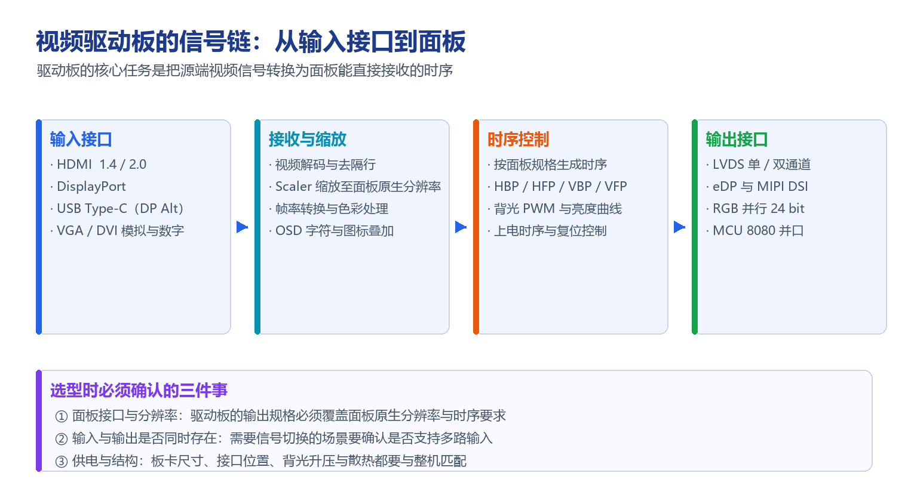

# 视频驱动板显示解决方案

!!! abstract "快速结论"
    视频驱动板的核心任务只有一句话：把源端输出的视频信号，转换成目标面板能直接接收的接口与时序。它解决的是"信号对不上"的问题——电脑、主板、摄像头输出的是 HDMI 或 DisplayPort，而面板需要的是 LVDS、eDP、MIPI DSI 或 RGB 并行。选型时要盯住三件事：面板接口与原生分辨率、输入输出是否同时存在、供电与结构是否匹配。

## 核心要点

- 驱动板处理的是接口与时序转换，不是图像内容本身；分辨率、帧率与色深必须在链路带宽内。
- 四类常见形态：HDMI / VGA 输入型、DisplayPort 输入型、USB Type-C 输入型、以及显示接口之间的互转板。
- 当源端分辨率与面板原生分辨率不一致时，需要 Scaler 完成缩放，否则画面会被拉伸或留黑边。
- 选型先确认面板接口与原生分辨率，再核对输入接口类型、是否需要多路切换，最后落地供电与结构。

## 1. 视频驱动板做什么

视频驱动板在各种显示设备与嵌入式系统中承担信号桥接的角色，负责把不同格式的视频信号转换成显示屏能够识别的格式。它通常包含接收、解码、缩放、时序生成与背光控制几个环节。

<figure markdown="span" class="displaywiki-figure">
  [{ width="760" loading="lazy" }](video-driver-board-signal-chain.png){ .displaywiki-image-link title="查看原图" }
  <figcaption>从输入接口到面板：接收、缩放、时序控制与输出接口构成的完整信号链</figcaption>
</figure>

## 2. 四类常见驱动板

### 2.1 HDMI / VGA 转 LVDS / MIPI / RGB 并行 / eDP 驱动板

- **功能**：把 HDMI 或 VGA 信号转换为 LVDS、MIPI、RGB 并行或 eDP 信号，用于驱动对应接口的 LCD 显示屏。
- **应用**：广泛用于计算机、一体机与显示终端等场景。

### 2.2 DisplayPort 转 LVDS / MIPI / RGB 并行 / eDP 驱动板

- **功能**：把 DisplayPort 信号转换为 LVDS、MIPI、RGB 并行或 eDP 信号，适用于高分辨率显示器。
- **应用**：主要用于需要高带宽视频传输的设备，如高端显示器与工业显示系统。

### 2.3 USB / Type-C 转 LVDS / MIPI / RGB 并行 / eDP 驱动板

- **功能**：把 USB Type-C（DP Alt Mode）信号转换为 LVDS、MIPI、RGB 并行或 eDP 信号，适用于高分辨率显示器，并可同时传输音频。
- **应用**：最新的计算机、笔记本电脑、平板与移动设备。

### 2.4 MCU / RGB 并行 / MIPI / LVDS / eDP 接口互转板

- **功能**：在不同显示接口之间相互转换（MCU、RGB 并行、MIPI、LVDS、eDP），让同一块面板可以适配不同主板的输出。
- **应用**：需要把标准主板与既有面板拼装在一起的改造型项目。

## 3. 接口速查表

| 接口 | 线数与形态 | 典型单通道带宽量级 | 常见用途 |
|---|---|---|---|
| RGB 并行（MCU 8080 / 6800） | 数据线 + 控制线，较多 | 较低 | 小尺寸屏、MCU 直驱 |
| SPI | 4 线起 | 低 | 小屏、低速刷新 |
| LVDS | 差分对，单 / 双通道 | 中 | 工控屏、笔记本屏 |
| MIPI DSI | 差分 lane，1–4 lane | 高 | 手机、平板、高 PPI 屏 |
| eDP | 差分 lane | 高 | 笔记本、一体机、高分辨率屏 |
| HDMI / DisplayPort | 差分对 | 很高 | 外部视频源输入 |

## 4. 选型要点

- **接口能不能对上**：先确认面板的接口类型、lane 数与原生分辨率，再选驱动板的输出规格。
- **分辨率与带宽**：源端分辨率高于面板时要有 Scaler；低于面板时会拉伸，需确认是否接受。
- **是否需要多路输入**：需要在多个信号源之间切换时，确认驱动板是否支持多路输入与切换控制。
- **触摸与音频**：触摸屏需要 USB 或串口回传通道；带扬声器的场景要确认音频是否能随视频一起传输。
- **供电与散热**：确认板卡的供电电压范围、整机功耗与散热条件，高亮屏还要考虑背光升压电路。
- **结构尺寸**：板卡外形、接口位置与固定孔位必须能装进整机结构。

## 5. 常见问题（FAQ）

??? question "Q1：视频驱动板和普通转接排线有什么区别？"
    转接排线只做物理连接，要求两端接口电气规格完全一致；驱动板内部包含接收、解码与缩放环节，可以把一种接口和时序主动转换成另一种。因此源端与面板接口不同、或分辨率不一致时，必须用驱动板而不是排线。

??? question "Q2：HDMI 转 LVDS 后能支持多高的分辨率？"
    取决于具体方案。单通道 LVDS 通常对应较低分辨率，更高分辨率需要双通道 LVDS 并提高像素时钟；同时还要看驱动芯片的解码能力与线缆质量。选型时应以驱动板规格书标注的最大分辨率为准，并留出一定余量。

??? question "Q3：为什么需要 Scaler？"
    因为源端输出分辨率往往与面板原生分辨率不一致。没有 Scaler 时，画面要么超出显示区域被裁切，要么在屏幕内留黑边。Scaler 把画面缩放到面板原生分辨率，是保证满屏且不失真的关键环节。

??? question "Q4：驱动板能同时把触摸信号回传给主机吗？"
    可以，但需要确认驱动板是否提供触摸回传通道。常见做法是触摸屏控制器通过 USB 或串口把坐标送回主机，主机侧把它识别为标准的触摸或指点设备。若驱动板只处理视频，触摸需要单独走一路接口。

??? question "Q5：MIPI DSI 和 LVDS 该选哪个？"
    两者都是差分串行接口。MIPI DSI 引脚更少、单位带宽更高，适合高 PPI 与小尺寸高分辨率面板；LVDS 在工控与笔记本类面板中应用成熟、生态配套完善，长线缆与抗干扰设计案例更多。实际选型一般由面板原生接口决定，驱动板只需匹配。

??? question "Q6：驱动板的供电与散热要注意什么？"
    供电要确认输入电压范围与峰值电流，背光升压电路通常是功耗大头，需要与面板的背光规格匹配。散热方面要评估驱动芯片与电源器件的温升，密闭结构内应留出散热路径，高温环境下优先选择宽温器件。

## 相关阅读

- [定制与阳光下可读显示解决方案](custom-sunlight-readable-displays.md)
- [高可靠性显示解决方案](high-reliability-displays.md)
- [UART 智能显示屏解决方案](uart-smart-display.md)

## 参考数据来源

本文涉及的标准、规格、应用笔记与官方资料：

- [HDMI 2.1 规范摘要](https://www.hdmi.org/spec/hdmi2_1)
- [VESA 显示标准（DisplayPort / eDP）](https://www.vesa.org/vesa-standards/)

!!! info "没有找到您需要的内容？"
    如果您需要更多产品、资源或技术支持，欢迎联系我们的团队：

    [**:material-archive-arrow-down: 知识库**](../../knowledge/tags.md){ .md-button .md-button--primary }
    [**:material-magnify: 产品与解决方案**](https://www.chinasunyee.com){ .md-button }
    [**:material-email: 联系技术支持**](mailto:info@chinasunyee.com){ .md-button }
