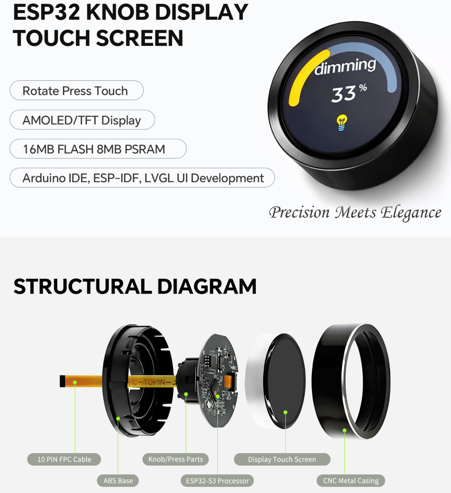
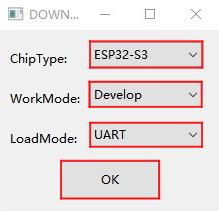
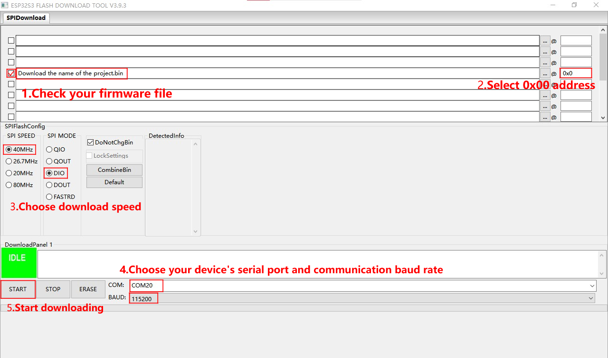

# 1.5 英寸 466x466 ESP32-S3 触摸旋钮屏

<div class="grid cards" markdown>

-   **UEDX46460015-MD50ET**
    ---
    基于 **ESP32-S3** 的智能旋钮屏。配备 1.5 英寸 **466x466** AMOLED 显示屏（QSPI）、电容触摸、旋转编码器与按键。适用于 IoT 控制面板、智能家居设备与工业 HMI。

    [:material-arrow-left: 返回系列列表](../esp32/){ .md-button }
    [:material-cart: 官方旗舰店](https://shop277726935.taobao.com/){ .md-button .md-button--primary }
    [:simple-gitee: Gitee 仓库](https://gitee.com/VIEWESMART/UEDX46460015-MD50ESP32-1.5inch-Touch-Knob-Display){ .md-button }

</div>

<div align="center">
    
</div>

---

## 1. 产品简介

**UEDX46460015-MD50ET** 是一款面向旋钮式 HMI 应用的紧凑型智能显示模组，将 1.5 英寸 AMOLED 显示屏（466x466 像素）与电容触摸屏、旋转编码器与硬件按键集成在一起。它由 **ESP32-S3-R8**（16 MB Flash、8 MB Octal PSRAM）驱动，提供 Wi-Fi 与蓝牙 5 (LE) 连接能力，并支持 **Arduino**、**ESP-IDF** 与 **PlatformIO** 开发。

### 1.1 产品特性

#### 处理器与无线

- **处理器**：ESP32-S3。Xtensa® 双核 32 位 LX7 MCU，主频最高 240 MHz。
- **无线**：集成 2.4 GHz Wi-Fi (802.11 b/g/n) 与蓝牙 5 (LE)。

#### 存储

- **Flash**：16 MB Quad SPI。
- **PSRAM**：8 MB Octal SPI。

#### 显示屏

| 参数 | 规格 |
| :--- | :--- |
| 尺寸 | 1.5 英寸 |
| 分辨率 | 466 x 466 |
| 面板类型 | IPS AMOLED |
| 接口 | QSPI |
| 驱动 IC | CO5300AF-42 |
| 触摸 IC | CST820 |
| 触摸接口 | 电容式多点触摸，I²C |

#### 外设

- **旋钮输入**：旋转编码器（PHA / PHB），提供精确的旋钮输入。
- **按键**：硬件按键，与 BOOT 共用。
- **连接**：USB-C（USB / UART，用于烧录与调试），以及 UART 扩展（FPC）。
- **扩展**：FPC 接口，额外引出 GPIO、5 V、GND 与 UART0。

### 1.2 应用场景

- 智能家居控制旋钮
- 工业旋钮式 HMI
- IoT 设备旋钮
- 可穿戴 / 紧凑型人机界面

## 2. 硬件说明

### 2.1 模块概览

板载主要功能区块如下：

| 元件 | 说明 |
| :--- | :--- |
| ESP32-S3-R8 | 主控 SoC（16 MB Flash / 8 MB Octal PSRAM）。 |
| 1.5 英寸 AMOLED | 466x466 像素显示屏，由 QSPI 驱动（CO5300AF-42）。 |
| CST820 | 电容触摸控制器（I²C）。 |
| 旋钮编码器 | 两相（PHA / PHB）编码器，用于旋钮旋转输入。 |
| 按键 | BOOT 按键（也用于固件下载）。 |
| USB-C | 烧录、调试（通过 USB 的 UART）与供电（5 V）。 |
| FPC 连接器 | 引出额外的电源、UART0 与 UART2 信号。 |

### 2.2 GPIO 定义（引脚图） { #22-gpio-definition-pinout }

#### 显示屏（QSPI）

| 屏幕引脚 | ESP32-S3 引脚 |
| :---: | :---: |
| CS | IO12 |
| PCLK | IO10 |
| DATA0 | IO13 |
| DATA1 | IO11 |
| DATA2 | IO14 |
| DATA3 | IO9 |
| RST | IO8 |
| BACKLIGHT | IO17 |

#### 触摸（CST820）

| 触摸引脚 | ESP32-S3 引脚 |
| :---: | :---: |
| SDA | IO0 |
| SCL | IO1 |
| RST | IO3 |
| INT | IO4 |

#### 按键

| 按键引脚 | ESP32-S3 引脚 |
| :---: | :---: |
| BOOT | IO0 |

#### 旋钮编码器

| 编码器引脚 | ESP32-S3 引脚 |
| :---: | :---: |
| PHA | IO6 |
| PHB | IO5 |

#### USB / UART

| USB / UART 引脚 | ESP32-S3 引脚 |
| :---: | :---: |
| USB-DN | IO19 |
| USB-DP | IO20 |

#### FPC 接口定义

| FPC 引脚 | 适配信号 | ESP32-S3 引脚 |
| :---: | :--- | :--- |
| 1 | 5V | 5V |
| 2 | PB7 | – |
| 3 | GND | GND |
| 4 | RX2 | GPIO40 |
| 5 | TX2 | GPIO39 |
| 6 | RX1 | U0RXD / GPIO44 |
| 7 | TX1 | U0TXD / GPIO43 |
| 8 | NC | CHIP-EN |
| 9 | D+ (USB-DP) | GPIO20 |
| 10 | D- (USB-DN) | GPIO19 |

## 3. 软件开发

仓库提供可直接运行的示例，包含已移植好的 LVGL 工程，覆盖 **Arduino**、**PlatformIO** 与 **ESP-IDF** 三套框架。

### 3.1 软件示例

所有示例代码均可在 [Gitee 仓库](https://gitee.com/VIEWESMART/UEDX46460015-MD50ESP32-1.5inch-Touch-Knob-Display/tree/main/examples) 中找到。

| 框架 | 示例路径 | 说明 |
| :--- | :--- | :--- |
| Arduino | `examples/arduino/gui/lvgl_v8` | **LVGL Benchmark**：LVGL v8 使用示例，可直接在 Arduino IDE 中打开。 |
| ESP-IDF | `examples/esp_idf` | **LVGL port**：在 ESP-IDF 下移植并使用 LVGL 的示例。 |
| PlatformIO | `examples/platformio/lvgl_v8_port` | **LVGL v8 port**：LVGL v8 使用示例。 |

### 3.2 快速入门 { #32-getting-started }

#### 3.2.1 准备工作

- **硬件**：UEDX46460015-MD50ET 开发板、USB-C 数据线。
- **软件**：VS Code（ESP-IDF v5.3+）或 Arduino IDE（v2.0+）或 VS Code（PlatformIO）。
- **库文件**：Arduino IDE 与 PlatformIO 需要安装以下库：

| 库文件 | 版本 | 说明 |
| :--- | :--- | :--- |
| ESP32_Display_Panel | 1.0.3+ | Espressif 出品。驱动屏幕所必需。 |
| ESP32_IO_Expander | Arduino 自动选择 | ESP32_Display_Panel 的依赖库。 |
| esp-lib-utils | Arduino 自动选择 | ESP32_Display_Panel 的依赖库。 |
| lvgl | 8.4.0 | 免费开源的嵌入式图形库。 |

#### 3.2.2 ESP-IDF 环境配置

1. **打开示例**
    - 到 Gitee 仓库下载程序（点击绿色「克隆 / 下载」按钮，或直接克隆）。
    - 用带 ESP-IDF 插件的 VS Code 打开示例目录（例如 `examples/esp_idf`）。
2. **编译与烧录**
    - 点击 **build** 图标编译工程。
    - 用 USB-C 连接开发板。
    - 点击 **upload** 图标烧录固件。

#### 3.2.3 Arduino 环境配置

1. **安装 [Arduino IDE](https://www.arduino.cc/en/software)**
   下载并安装 Arduino IDE（推荐 v2.0 及以上）。
2. **安装 ESP32 开发板包**
    - 打开 Arduino IDE，进入 `文件` > `首选项`。
    - 在 `附加开发板管理器网址` 中添加：
      ```text
      https://espressif.github.io/arduino-esp32/package_esp32_index.json
      ```
    - 进入 `工具` > `开发板` > `开发板管理器`，搜索 Espressif 的 `esp32`，安装 `3.0.0` 及以上版本。
3. **安装库文件**
    - 进入 `项目` > `加载库` > `管理库`。
    - 搜索 Espressif 的 `ESP32_Display_Panel`，安装 `1.0.3` 及以上版本。弹出提示时点击「全部安装」安装依赖。
    - 安装 `lvgl`（版本 `8.4.0`）。
4. **打开示例**
    - 进入 `文件` > `示例` > `ESP32_Display_Panel`。
    - 选择 `Arduino` > `gui` > `lvgl_v8` > `simple_port`。
5. **选择开发板**
    - 目标板：`ESP32S3 Dev Module`。
    - 配置以下选项：
        - **Flash Size**：16MB (128Mb)
        - **Partition Scheme**：16M Flash (3MB APP/9.9MB FATFS)
        - **PSRAM**：**OPI PSRAM**（至关重要）
6. **启用板级配置**
    - 打开示例中的 `esp_panel_board_supported_conf.h`。
    - 将宏 `ESP_PANEL_BOARD_DEFAULT_USE_SUPPORTED` 置为 `1`。
    - 找到 `// #define BOARD_VIEWE_UEDX46460015_MD50ET`，去掉行首的 `//` 取消注释。
    - 确保不同时启用其他开发板定义。
7. **接口相关配置**
    - 本板使用 **QSPI** 接口，请在 `lv_conf.h` 中将 `LV_COLOR_16_SWAP` 设为 `1`。
    - **不要**修改 `LVGL_PORT_AVOID_TEARING_MODE` 与 `LVGL_PORT_ROTATION_DEGREE`（它们仅对 RGB / MIPI 屏有效）。
8. **选择端口并上传**
    - 连接开发板，进入 `工具` > `端口`，选择正确的 COM 口。
    - 点击 **编译**（✓）按钮编译。
    - 点击 **上传**（→）按钮烧录。

!!! tip "配置提示"
    在 `esp_panel_board_supported_conf.h` 中，请确保已取消 `#define BOARD_VIEWE_UEDX46460015_MD50ET` 的注释。

    不要同时启用 `ESP_PANEL_BOARD_DEFAULT_USE_SUPPORTED` 与 `ESP_PANEL_BOARD_DEFAULT_USE_CUSTOM`。
    也不能同时启用多个开发板定义。

#### 3.2.4 PlatformIO 环境配置

1. **打开示例**
   下载仓库，并用带 PlatformIO 插件的 VS Code 打开 `examples/platformio/lvgl_v8_port` 目录。
2. **选择开发板环境**
   打开 `platformio.ini`，将 `default_envs` 改为 `BOARD_VIEWE_UEDX46460015_MD50ET`。
3. **配置示例**
   本板使用 QSPI 接口，请在 `lv_conf.h` 中将 `LV_COLOR_16_SWAP` 设为 `1`；同时保持 `LVGL_PORT_AVOID_TEARING_MODE` 与 `LVGL_PORT_ROTATION_DEGREE` 不变。
4. **编译并上传工程**
    - 点击 **✓**（编译）按钮。
    - 连接开发板后点击 **→**（上传）按钮。

## 4. 相关文档与资源

| 文档 | 链接 |
| :--- | :--- |
| 产品规格书 | [UEDX46460015-MD50ET.pdf](../../../assets/datasheet/UEDX46460015-MD50ET.pdf) |
| 显示屏规格书 | [ALL-UE015WV-RB24-A021A V1.0 SPEC.pdf](../../../assets/datasheet/display/ALL-UE015WV-RB24-A021A%20V1.0%20SPEC.pdf) |
| 触摸 IC 规格书 | [CST820.pdf](../../../assets/datasheet/touch/CST820.pdf) |

**工具**

| 工具 | 说明 |
| :--- | :--- |
| [Flash Download Tool](../../../assets/software/flash_download_tool.zip) | 手动烧录固件工具。 |
| [LVGL Image Converter](https://lvgl.io/tools/imageconverter) | 将图片转换为 LVGL 的 C 数组。 |

更多资源请访问[**资源中心**](../../support/resource.md)。

## 5. 固件下载

若需要手动烧录已编译好的固件，请按以下步骤操作：

1. 打开「Flash Download Tool」（位于工程的 tools 目录，或从 Espressif 官网获取）。
2. 选择芯片类型（**ESP32-S3**）与正确的下载方式。
3. 从 `firmware` 目录加载固件文件，并按固件说明配置偏移地址。
4. 连接开发板并开始下载。若烧录失败，请在按住 **BOOT** 键的情况下上电，然后重试。

<div align="center">
    
    
</div>

## 6. 常见问题

??? question "看完教程还是不知道怎么搭建编程环境，怎么办？"
    请参考[优奕视界常见问题](../../support/faq.md)中的环境搭建说明。

??? question "为什么一打开 Arduino IDE 就提示库文件需要更新？要不要更新？"
    建议**不**更新库文件。不同版本的库文件之间可能不兼容，随意更新可能导致编译报错。

??? question "为什么板上的外部 UART 接口没有串口数据输出？"
    默认情况下，USB 接口被用作调试串口（UART0）。

    - **Arduino 用户**：进入 `工具` 菜单，将 `USB CDC On Boot` 设为 `Disabled`，即可启用外部 UART 引脚。
    - **PlatformIO 用户**：打开 `platformio.ini`，将 `-D ARDUINO_USB_CDC_ON_BOOT=true` 改为 `-D ARDUINO_USB_CDC_ON_BOOT=false`。

??? question "为什么我的板子一直下载不成功？"
    请按住 **BOOT** 按键，再按下并松开 **RESET** 键（或在按住 **BOOT** 的同时给板子重新上电），然后重新下载程序。

!!! info "没找到需要的内容？"
    如需更多产品、资料或技术支持，请联系我们的团队：

    [**:material-archive-arrow-down: 资源中心**](../../support/resource.md){ .md-button .md-button--primary }
    [**:material-magnify: 更多产品**](../esp32/index.md){ .md-button  }
    [**:material-email: 联系技术支持**](mailto:info@chinasunyee.com){ .md-button }
