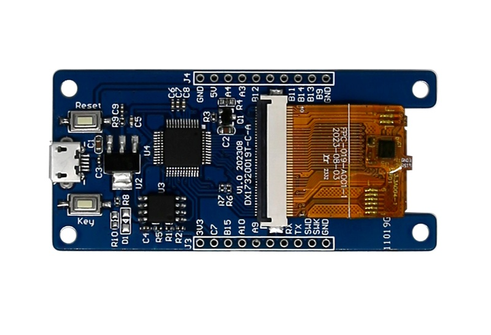
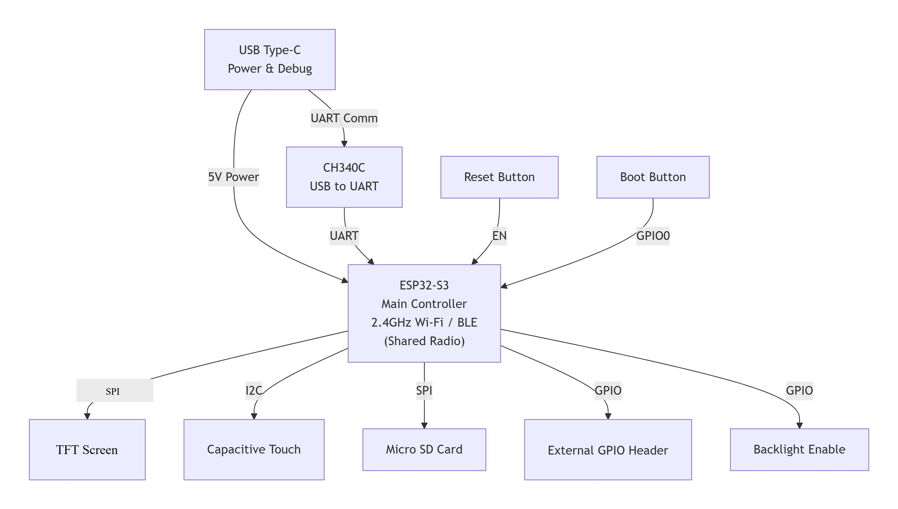

# 1.9 英寸 170x320 ESP32-S3 触控智能屏

<div class="grid cards" markdown>

-   **UEDX17320019E-WB-A**
    ---
    基于 **ESP32-S3** 的紧凑型 AIoT 智能屏。配备 1.9 英寸 **170x320** IPS 显示屏与电容触摸屏，支持 Wi-Fi / 蓝牙 5 (LE)，采用 SPI 通信。

    [:material-arrow-left: 返回系列列表](../esp32/){ .md-button }
    [:material-cart: 官方旗舰店](https://shop277726935.taobao.com/){ .md-button .md-button--primary }
    [:simple-gitee: Gitee 仓库](https://gitee.com/VIEWESMART/UEDX17320019E-ESP32-1.9inch-Touch-Display){ .md-button }

</div>

<div align="center">
  
</div>

---

## 1. 产品简介

**UEDX17320019E-WB-A** 是一款基于 ESP32-S3 的紧凑型智能显示开发板，配备 1.9 英寸 IPS 触摸屏（170x320）。模组由优奕视界设计，适用于需要小尺寸外形并具备 Wi-Fi / 蓝牙连接能力的 IoT 与 HMI 应用。

### 1.1 产品特性

#### 处理器与无线

- **处理器**：Xtensa® 双核 32 位 LX7，主频最高 240 MHz。
- **无线**：集成 2.4 GHz Wi-Fi (802.11 b/g/n)、蓝牙 5 (LE) 及 BLE Mesh。

!!! note "射频共享"
    ESP32-S3 内置 2.4 GHz 射频，同时支持 Wi-Fi (802.11 b/g/n) 与蓝牙 5 (LE)。由于二者共用同一射频前端，Wi-Fi 与 BLE 无法同时收发，射频会按需在两种协议之间切换。

#### 存储

- **PSRAM**：8 MB（Octal SPI）
- **Flash**：16 MB

#### 显示屏

| 参数 | 规格 |
| :--- | :--- |
| 尺寸 | 1.9 英寸 |
| 分辨率 | 170 x 320 |
| 面板类型 | IPS |
| 驱动 IC | GC9307 |
| 接口 | SPI |
| 触摸 IC | CHSC6413 |
| 触摸类型 | 电容式 (CTP) |

#### 外设

- **连接**：板载 USB 口，用于供电、固件下载与串口调试（CH340C）。
- **按键**：RESET 与 BOOT 按键。
- **背光控制**：GPIO38。

#### 其他

- **工作温度**：-20 ~ 70 ℃
- **储存温度**：-30 ~ 80 ℃

### 1.2 应用场景

凭借紧凑尺寸与无线连接能力，UEDX17320019E-WB-A 是以下领域 IoT 设备的理想选择：

- 智能家居控制面板
- 工业自动化 HMI
- 智能家电
- 消费类电子
- 可穿戴设备
- 教育学习平台

## 2. 硬件说明

### 2.1 模块概览

接口分布如下图所示：

<p align="left">
  
</p>

- **主控芯片**：ESP32-S3-R8（双核，最高 240 MHz，8 MB PSRAM，16 MB Flash）。
- **显示接口**：SPI（CS、SCK、MOSI），驱动 IC 为 GC9307。
- **触摸接口**：I2C（SDA / SCL）+ 中断 + 复位，对应 CHSC6413 电容触摸。
- **USB**：5 V 直流供电与固件下载（CH340C USB 转 UART）。
- **按键**：BOOT（GPIO0）进入下载模式；RESET（CHIP-EN）系统复位。
- **背光控制**：GPIO38。

功能框图如下：

<p align="left">
  
</p>

### 2.2 GPIO 定义（引脚图） { #22-gpio-definition-pinout }

#### 显示屏接口（GC9307）

| 引脚 | 功能 | ESP32-S3 引脚 |
| :---: | :--- | :---: |
| CS | SPI 片选 | IO10 |
| SCK | SPI 时钟 | IO12 |
| MOSI | SPI 数据 | IO13 |
| RST | 复位 | IO1 |
| BACKLIGHT | 背光控制 | IO38 |

#### 触摸接口（CHSC6413）

| 引脚 | 功能 | ESP32-S3 引脚 |
| :---: | :--- | :---: |
| RST | 触摸复位 | IO3 |
| INT | 触摸中断 | IO8 |
| SDA | I2C 数据 | IO9 |
| SCL | I2C 时钟 | IO46 |

#### USB（CH340C）

| 引脚 | 功能 | ESP32-S3 引脚 |
| :---: | :--- | :---: |
| D+ (USB-DP) | USB 数据+ | IO20 |
| D- (USB-DN) | USB 数据- | IO19 |

#### 按键

| 按键 | 功能 | ESP32-S3 引脚 |
| :---: | :--- | :---: |
| BOOT | 进入下载模式 | IO0 |
| RESET | 系统复位 | CHIP-EN |

## 3. 软件开发

我们为 **Arduino**、**PlatformIO** 与 **ESP-IDF** 三套框架提供完整支持，并附带显示与触摸功能示例。

### 3.1 软件示例

所有示例代码均可在 [Gitee 仓库](https://gitee.com/VIEWESMART/UEDX17320019E-ESP32-1.9inch-Touch-Display/tree/main/examples) 中找到。

| 框架 | 示例路径 | 说明 |
| :--- | :--- | :--- |
| Arduino | `examples/arduino/` | 面向 Arduino IDE 的显示与触摸示例。 |
| ESP-IDF | `examples/esp_idf/` | 面向 ESP-IDF 的显示与触摸示例。 |
| PlatformIO | `examples/platformio/` | 面向 PlatformIO 的显示与触摸示例。 |

!!! tip "软件兼容性"
    示例均针对 UEDX17320019E-WB-A 开发板编写。编译前请确认已选择正确的板级配置。

### 3.2 快速入门 { #32-getting-started }

#### 3.2.1 准备工作

- **硬件**：UEDX17320019E-WB-A 开发板、USB 数据线。
- **软件**：VS Code（ESP-IDF v5.1+）/ Arduino IDE (v2.0+) / VS Code（PlatformIO）。

**所需库文件（Arduino IDE 与 PlatformIO）：**

| 库文件 | 版本 | 说明 |
| :--- | :--- | :--- |
| GFX Library for Arduino | 最新版 | Moon 出品。驱动 SPI 显示屏所必需。 |
| lvgl | 8.4.0 | 免费开源的嵌入式图形库。 |

**支持的框架：**

| 框架 | 版本 |
| :--- | :--- |
| ESP-IDF | v5.1 / v5.2 / v5.3 |
| Arduino IDE | esp32 >= v3.0.7 |
| PlatformIO | — |

#### 3.2.2 ESP-IDF 环境配置

1. **下载**：到 Gitee 仓库下载 main 分支的程序（点击「克隆 / 下载」）。
2. **打开**：使用带 ESP-IDF 插件的 VS Code 打开示例。
3. **编译与烧录**：
    - 点击右上角 `Build` 编译。
    - 将开发板连接到电脑。
    - 点击 `Upload` 烧录固件。

#### 3.2.3 Arduino 环境配置

!!! tip "新手教程"
    详细操作请参考[优奕视界常见问题](../../support/faq.md)中的环境搭建说明。

1. **安装 Arduino IDE**：从 [arduino.cc](https://www.arduino.cc/en/software) 下载，按系统类型选择安装包。
2. **安装 ESP32 开发板包**：
    - 进入 `工具` > `开发板` > `开发板管理器`。
    - 搜索 Espressif 的 `esp32`，安装版本 **3.0.7+**。
3. **安装库文件**：
    - 进入 `项目` > `加载库` > `管理库`。
    - 搜索并安装 `GFX Library for Arduino`（Moon 出品）。
    - 安装 `lvgl`（推荐 **v8.4.0**）。
4. **打开示例**：
    - 从仓库下载示例并在 Arduino IDE 中打开。
5. **选择开发板与设置**：

    ```text
    // 启用支持的板级配置
    #define ESP_PANEL_BOARD_DEFAULT_USE_SUPPORTED       (1)

    // 仅取消目标板宏定义的注释
    #define BOARD_VIEWE_UEDX17320019E_WB_A
    ```

    !!! warning "重要提示"
        - **不要**同时启用 `ESP_PANEL_BOARD_DEFAULT_USE_SUPPORTED` 与 `ESP_PANEL_BOARD_DEFAULT_USE_CUSTOM`。
        - **不要**同时启用多个板级宏定义。

6. **选择端口**：进入 `工具` > `端口`，选择正确的 COM 口。
7. **编译与上传**：
    - 点击 `✓` 编译。
    - 点击 `→` 上传。

#### 3.2.4 PlatformIO 环境配置

!!! tip "新手教程"
    详细操作请参考[优奕视界常见问题](../../support/faq.md)中的环境搭建说明。

1.  **安装 PlatformIO IDE**：
    - 安装 [Visual Studio Code](https://code.visualstudio.com/Download)。
    - 打开 **扩展**（++ctrl+shift+x++），搜索 **PlatformIO IDE** 并安装。
2.  **打开 PlatformIO 示例**：
    - 到 Gitee 仓库下载程序（点击绿色的「克隆 / 下载」按钮）。
    - 在 VS Code 中打开 **PlatformIO** 文件夹，PlatformIO 会自动识别工程。
3.  **配置 PlatformIO**：
    - 打开工程目录下的 `platformio.ini`。
    - 在 `[platformio]` 段中取消注释并选择要烧录的示例（`default_envs = xxx`）。
4.  **编译并上传工程**：
    - 点击左下角 `✓`（编译）按钮。
    - 将开发板连接到电脑。
    - 点击 `→`（上传）按钮。

## 4. 相关文档与资源

| 文档 | 链接 |
| :--- | :--- |
| 产品规格书 | [UEDX17320019E-WB-A.pdf](../../../assets/datasheet/UEDX17320019E-WB-A.pdf) |
| ESP32-S3 数据手册（英文） | [esp32-s3_datasheet_en.pdf](../../../assets/datasheet/chip/esp32-s3-wroom-1_wroom-1u_datasheet_en.pdf) |

## 5. 固件下载

1. 打开工程 `tools` 目录下的 **ESP32 烧录工具**。
2. 选择正确的烧录芯片与烧录方式，点击 **OK**。
3. 按下图 **1 → 2 → 3 → 4 → 5** 的编号步骤烧录固件。
4. 若烧录失败，请按住 **BOOT** 键后重试。

固件文件位于 [`firmware/`](https://gitee.com/VIEWESMART/UEDX17320019E-ESP32-1.9inch-Touch-Display/tree/main/firmware) 目录，请查看其中的版本说明选择合适的文件。

<p align="center" width="100%">
  
  
</p>

## 6. 常见问题

??? question "看完教程还是不知道怎么搭建编程环境，怎么办？"
    请参考[优奕视界常见问题](../../support/faq.md)中的环境搭建说明。

??? question "为什么一打开 Arduino IDE 就提示库文件需要更新？要不要更新？"
    请选择**不**更新。不同版本的库文件之间可能不兼容，更新后可能破坏现有功能。

??? question "为什么板上的「UART」排针没有串口输出？"
    默认配置把 USB 用作 UART0 串口输出用于调试。外部的「UART」排针同样接在 UART0 上，未重新配置时不会有任何数据输出。

    **PlatformIO 用户：**
    打开 `platformio.ini`，将 `build_flags` 下的 `-D ARDUINO_USB_CDC_ON_BOOT=true` 改为 `-D ARDUINO_USB_CDC_ON_BOOT=false`。

    **Arduino 用户：**
    进入 `工具` > `USB CDC On Boot`，选择 **Disabled**。

??? question "为什么我的板子一直下载不成功？"
    请在点击上传 / 下载时按住 **BOOT** 键，连接建立后再松开，然后重试。

!!! info "没找到需要的内容？"
    如需更多产品、资料或技术支持，请联系我们的团队：

    [**:material-archive-arrow-down: 资源中心**](../../support/resource.md){ .md-button .md-button--primary }
    [**:material-magnify: 更多产品**](../esp32/index.md){ .md-button  }
    [**:material-email: 联系技术支持**](mailto:support@viewedisplay.com){ .md-button }
