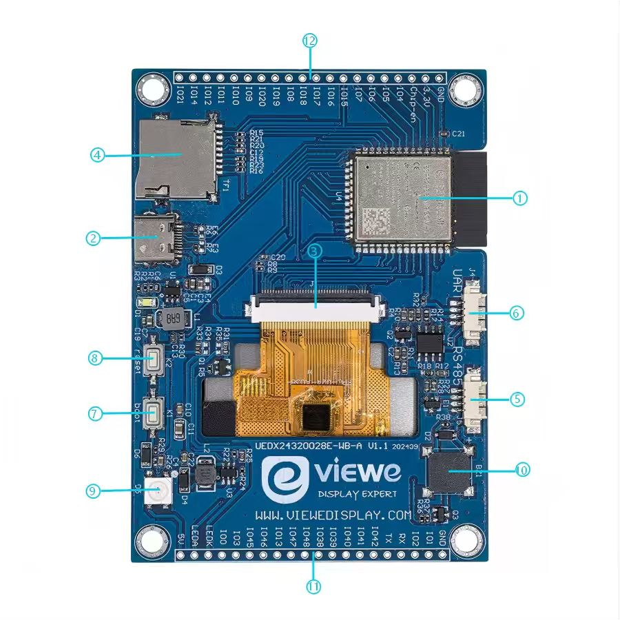

# 3.5 英寸 240x320 ESP32-S3 触控智能屏

<div class="grid cards" markdown>

-   **UEDX24320035E-WB-A**
    ---
    基于 **ESP32-S3** 的主流 AIoT 智能屏。配备 3.5 英寸 **240x320** IPS TFT 显示屏与电容触摸屏，支持 Wi-Fi / 蓝牙 5 (LE)，并拥有丰富的扩展接口。

    [:material-arrow-left: 返回系列列表](../esp32/){ .md-button }
    [:material-cart: 官方旗舰店](https://shop277726935.taobao.com/){ .md-button .md-button--primary }
    [:simple-gitee: Gitee 仓库](https://gitee.com/VIEWESMART/UEDX24320028ESP32-3.5inch-240_320-Touch-Display){ .md-button }

</div>

<div align="center">
  
</div>

---

## 1. 产品简介

**UEDX24320035E-WB-A** 是一款高性能 HMI 智能显示模组，以 **ESP32-S3-WROOM-1 (N16R8)** 模组与 3.5 英寸 **240x320** SPI 显示屏为核心。模组集成 2.4 GHz Wi-Fi 与蓝牙 5 (LE)。

面板通过高速 **SPI 接口**驱动，确保流畅的 UI 交互体验；电容触摸面板由 I2C 上的 **CHSC6540** 触摸 IC 读取。板载丰富的 GPIO 扩展，开箱即支持 **Arduino**、**ESP-IDF** 与 **PlatformIO** 三套主流框架。

### 1.1 产品特性

#### 处理器与无线

- **处理器**：ESP32-S3-WROOM-1（丝印 ESP32-S3-N16R8）。Xtensa® 双核 32 位 LX7 MCU，主频最高 240 MHz。
- **无线**：2.4 GHz Wi-Fi (802.11 b/g/n)、蓝牙 5 (LE) 及 BLE Mesh。

#### 存储

- **Flash**：16 MB（Quad SPI）
- **PSRAM**：8 MB（Octal SPI）

#### 显示屏

| 参数 | 规格 |
| :--- | :--- |
| 尺寸 | 3.5 英寸 |
| 分辨率 | 240 x 320 |
| 面板类型 | IPS TFT |
| 接口 | SPI |
| 驱动 IC | GC9307 |
| 触摸 IC | CHSC6540 |
| 触摸接口 | 电容式，I2C |

#### 外设

- **连接**：USB Type-C（供电 / 固件下载 / UART 调试），板载 CH340C USB 转串口桥。
- **扩展**：GPIO 排针，引出 UART、I2C、SPI 与 IO。
- **存储**：TF 卡槽（SDIO / SPI）。
- **音频**：板载蜂鸣器。

### 1.2 应用场景

- 工业 HMI 控制面板
- 智能家居中控与自动化面板
- 医疗设备与仪器
- IoT 数据看板

## 2. 硬件说明

### 2.1 模块概览

详细的板载元件布局如下图所示：

<p align="left">
  
</p>

| 编号 | 元件 | 说明 |
| :--- | :--- | :--- |
| ① | ESP32-S3-N16R8 | 主控模组（16 MB Flash / 8 MB PSRAM）。 |
| ② | USB-C 接口 | 5 V 供电 / 固件下载 / UART 调试（CH340C）。 |
| ③ | 显示 + 触摸接口 | 40-Pin FPC 连接器，连接显示屏与电容触摸面板。 |
| ④ | TF 卡槽 | 用于外部存储（图片 / 日志）。 |
| ⑤ | RS485 | 预留焊盘 / 排针，用于工业串口通信。 |
| ⑥ | UART | 预留焊盘 / 排针，用于工业串口通信。 |
| ⑦ | BOOT 按键 | 上电时按住可进入下载模式。 |
| ⑧ | RESET 按键 | 硬件系统复位。 |
| ⑨ | RGB 灯珠 | 内置 WS2812B 的可编程幻彩灯。 |
| ⑩ | 蜂鸣器 | 用于提示音输出。 |
| ⑪ ⑫ | 扩展排针 | 引出 GPIO、5 V、3.3 V 与 GND，供外接传感器使用。 |

### 2.2 GPIO 定义（引脚图） { #22-gpio-definition-pinout }

显示屏与触摸接口的引脚映射关系如下。

#### 显示屏（SPI 接口）

| 屏幕引脚 | ESP32-S3 引脚 |
| :--- | :--- |
| CS | IO42 |
| SCK | IO40 |
| MOSI | IO45 |
| DC | IO41 |
| RST | IO39 |
| BACKLIGHT | IO13 |

#### 触摸（CHSC6540）

| 触摸 IC 引脚 | ESP32-S3 引脚 |
| :--- | :--- |
| RST | IO2（未使用） |
| INT | IO4（未使用） |
| SDA | IO1 |
| SCL | IO3 |

#### 外设

**USB（CH340C）**

| 信号 | ESP32-S3 引脚 |
| :--- | :--- |
| D+ (USB-DP) | IO20 |
| D- (USB-DN) | IO19 |

**按键**

| 信号 | ESP32-S3 引脚 |
| :--- | :--- |
| BOOT | IO0 |
| RESET | CHIP-EN |

**TF 卡**

| 信号 | ESP32-S3 引脚 |
| :--- | :--- |
| D1 | IO18 |
| D2 | IO15 |
| MOSI | IO17 |
| MISO | IO16 |

**UART / RS485**

| 信号 | ESP32-S3 引脚 |
| :--- | :--- |
| UART TX | IO43 (U0TXD) |
| UART RX | IO44 (U0RXD) |

**灯珠与蜂鸣器**

| 信号 | ESP32-S3 引脚 |
| :--- | :--- |
| RGB 灯珠 | IO0 |
| 蜂鸣器 | IO38 |

## 3. 软件开发

仓库提供 Arduino、ESP-IDF 与 PlatformIO 三套可直接运行的示例，包含已移植好的 LVGL 工程。

### 3.1 软件示例

所有示例代码均可在 [Gitee 仓库](https://gitee.com/VIEWESMART/UEDX24320028ESP32-3.5inch-240_320-Touch-Display/tree/main/examples) 中找到。

| 框架 | 示例路径 | 说明 |
| :--- | :--- | :--- |
| Arduino | `examples/arduino/gui/lvgl_v8` | LVGL v8 使用示例，也可直接在 Arduino IDE 中打开。 |
| esp-idf | `examples/esp_idf/lvgl_v9_port` | 在 ESP-IDF 下移植并使用 LVGL v9 的示例。 |
| PlatformIO | `examples/platformio/lvgl_v8_port` | 面向 PlatformIO 的 LVGL v8 使用示例。 |

### 3.2 快速入门 { #32-getting-started }

#### 3.2.1 准备工作

- **硬件**：UEDX24320035E-WB-A 开发板、USB-C 数据线。
- **软件**：VS Code（ESP-IDF v5.3+）、Arduino IDE (v2.0+) 或 VS Code（PlatformIO）。
- **库文件**：Arduino IDE 与 PlatformIO 需要安装以下库：

| 库文件 | 版本 | 说明 |
| :--- | :--- | :--- |
| ESP32_Display_Panel | 1.0.3+ | Espressif 出品。驱动屏幕所必需。 |
| ESP32_IO_Expander | Arduino 自动选择 | ESP32_Display_Panel 的依赖库，按提示一并安装。 |
| esp-lib-utils | Arduino 自动选择 | ESP32_Display_Panel 的依赖库，按提示一并安装。 |
| lvgl | 8.4.0 | 免费开源的嵌入式图形库。 |

#### 3.2.2 ESP-IDF 环境配置

1. **获取示例工程**
   到 Gitee 仓库下载程序，点击绿色「克隆 / 下载」按钮即可下载 main 分支。
2. **用 VS Code (ESP-IDF) 打开示例**
3. **编译与烧录**
    - 点击右上角 `build` 编译。
    - 连接开发板到电脑。编译无误后点击 `upload` 下载。

#### 3.2.3 Arduino 环境配置

1. **安装 [Arduino IDE](https://www.arduino.cc/en/software)**
   选择与系统匹配的安装包。新手可先参考[优奕视界常见问题](../../support/faq.md)中的环境搭建说明。
2. **安装 ESP32 开发板包**
    - 打开 Arduino IDE。
    - 进入 `文件` > `首选项`。
    - 在 `附加开发板管理器网址` 中添加：
      ```text
      https://espressif.github.io/arduino-esp32/package_esp32_index.json
      ```
    - 进入 `工具` > `开发板` > `开发板管理器`。
    - 搜索 Espressif 的 `esp32`，安装 3.0.0 或更高版本。
3. **安装库文件**
    - 进入 `项目` > `加载库` > `管理库`。
    - 搜索 Espressif 的 `ESP32_Display_Panel`，安装 1.0.3 或更高版本。弹出依赖提示时点击「全部安装」。
    - 安装 `lvgl`（推荐 v8.4.0）。
4. **打开示例**
    - 进入 `文件` > `示例` > `ESP32_Display_Panel`。
    - 选择 `Arduino` > `gui` > `lvgl_v8` > `simple_port`。
5. **选择开发板**
    - 目标板：`ESP32S3 Dev Module`。
    - 设置：
        - Flash Size: 16MB (128Mb)
        - Partition Scheme: 16M Flash (3MB APP/9.9MB FATFS)
        - PSRAM: OPI PSRAM（至关重要！）
6. **启用板级配置**
   打开示例中的 `esp_panel_board_supported_conf.h`，将 `ESP_PANEL_BOARD_DEFAULT_USE_SUPPORTED` 置为 `1`，并取消本板宏定义的注释：

   ```c
   /**
    * @brief Flag to enable supported board configuration (0/1)
    *
    * Set to `1` to enable supported board configuration, `0` to disable
    */
   #define ESP_PANEL_BOARD_DEFAULT_USE_SUPPORTED       (1)

   // #define BOARD_VIEWE_SMARTRING
   // #define BOARD_VIEWE_UEDX24240013_MD50E
   // #define BOARD_VIEWE_UEDX24320024E_WB_A
   // #define BOARD_VIEWE_UEDX24320028E_WB_A
    #define BOARD_VIEWE_UEDX24320035E_WB_A
   // #define BOARD_VIEWE_UEDX32480035E_WB_A
   // #define BOARD_VIEWE_UEDX46460015_MD50ET
   // #define BOARD_VIEWE_UEDX48270043E_WB_A
   // #define BOARD_VIEWE_UEDX48480021_MD80E_V2
   // #define BOARD_VIEWE_UEDX48480021_MD80E
   // #define BOARD_VIEWE_UEDX48480021_MD80ET
   // #define BOARD_VIEWE_UEDX48480028_MD80ET
   // #define BOARD_VIEWE_UEDX48480040E_WB_A
   // #define BOARD_VIEWE_UEDX80480043E_WB_A
   // #define BOARD_VIEWE_UEDX80480050E_AC_A
   // #define BOARD_VIEWE_UEDX80480050E_WB_A
   // #define BOARD_VIEWE_UEDX80480050E_WB_A_2
   // #define BOARD_VIEWE_UEDX80480070E_WB_A
   ```
7. **配置示例**
    - *[可选]* 修改 `lvgl_v8_port.h` 中的宏定义：
        - 本板使用 `SPI` 接口，**不要**修改 `LVGL_PORT_AVOID_TEARING_MODE` 与 `LVGL_PORT_ROTATION_DEGREE`。
    - *[可选]* 修改 `lv_conf.h` 中的宏定义：
        - 本板使用 `SPI` 接口，可将 `LV_COLOR_16_SWAP` 设为 `1`。
8. **选择正确的端口**
    - 用 USB-C 线连接开发板。
    - 进入 `工具` > `端口`，选择对应端口。
9. **编译与上传**
    - 点击左上角 `√` 编译。
    - 编译无误后连接开发板，点击 `→` 下载。

!!! tip "配置提示"
    在 `esp_panel_board_supported_conf.h` 中，请确保已取消 `#define BOARD_VIEWE_UEDX24320035E_WB_A` 的注释。

    不要同时启用 `ESP_PANEL_BOARD_DEFAULT_USE_SUPPORTED` 与 `ESP_PANEL_BOARD_DEFAULT_USE_CUSTOM`。
    也不能同时启用多个 Espressif 支持的板级配置。

#### 3.2.4 PlatformIO 环境配置

1. **获取示例工程**
   到 Gitee 仓库下载程序，点击绿色「克隆 / 下载」按钮即可下载 main 分支。
2. **用 VS Code (PlatformIO) 打开示例**
3. **配置 PlatformIO**
   该示例默认使用 `BOARD_ESPRESSIF_ESP32_S3_LCD_EV_BOARD_2_V1_5`。请在 `platformio.ini` 的 `[platformio]:default_envs` 中选择 `BOARD_VIEWE_UEDX24320035E_WB_A`。
4. **配置示例**
    - *[可选]* 修改 `lvgl_v8_port.h` 中的宏定义：
        - 本板使用 `SPI` 接口，**不要**修改 `LVGL_PORT_AVOID_TEARING_MODE` 与 `LVGL_PORT_ROTATION_DEGREE`。
5. **编译并上传工程**
    - 点击 `√`（编译）按钮。
    - 将开发板连接到电脑。编译无误后点击 `→`（上传）按钮。

## 4. 相关文档与资源

| 文档 | 链接 |
| :--- | :--- |
| 产品规格书 | [UEDX24320035E-WB-A.pdf](../../../assets/datasheet/UEDX24320035E-WB-A.pdf) |
| 原理图 | [SCH-UEDX24320028E-WB-A.png](../../../assets/schematic/SCH-UEDX24320028E-WB-A.png) |
| 2D 图纸 (DWG) | [UEDX24320035E-WB-A.dwg](../../../assets/dimension/) |

## 5. 固件下载

1. 打开工程的 `tools` 目录，找到 ESP32 烧录工具并运行。
2. 选择正确的烧录芯片与烧录方式，点击 **OK**。按下图 1 → 2 → 3 → 4 → 5 的编号步骤烧录。若烧录失败，请按住 **BOOT** 键后重试。
3. 在工程根目录的 `firmware` 目录中选择待烧录的 bin 文件，其中有版本说明，选择合适的版本即可。

<p align="center" width="100%">
  
  
</p>

## 6. 常见问题

??? question "看完教程还是不知道怎么搭建编程环境，怎么办？"
    请参考[优奕视界常见问题](../../support/faq.md)中的环境搭建说明。

??? question "为什么一打开 Arduino IDE 就提示库文件需要更新？要不要更新？"
    请选择**不**更新库文件。不同版本的库文件之间可能不兼容，不建议更新。

??? question "为什么板上的 UART 排针没有串口输出？是板子坏了吗？"
    默认工程配置把 USB 接口用作 UART0 串口输出用于调试。UART 排针接的是同一组 UART0 引脚，未重新配置时不会有任何输出。

    - **PlatformIO 用户**：打开 `platformio.ini`，将 `build_flags` 下的 `-D ARDUINO_USB_CDC_ON_BOOT=true` 改为 `-D ARDUINO_USB_CDC_ON_BOOT=false`。
    - **Arduino 用户**：打开 `工具` 菜单，将 `USB CDC On Boot` 设为 `Disabled`。

??? question "为什么我的板子一直下载不成功？"
    请在开始下载时按住 `BOOT` 键，连接建立后再松开，然后重试。

!!! info "没找到需要的内容？"
    如需更多产品、资料或技术支持，请联系我们的团队：

    [**:material-archive-arrow-down: 资源中心**](../../support/resource.md){ .md-button .md-button--primary }
    [**:material-magnify: 更多产品**](../esp32/index.md){ .md-button  }
    [**:material-email: 联系技术支持**](mailto:info@chinasunyee.com){ .md-button }
