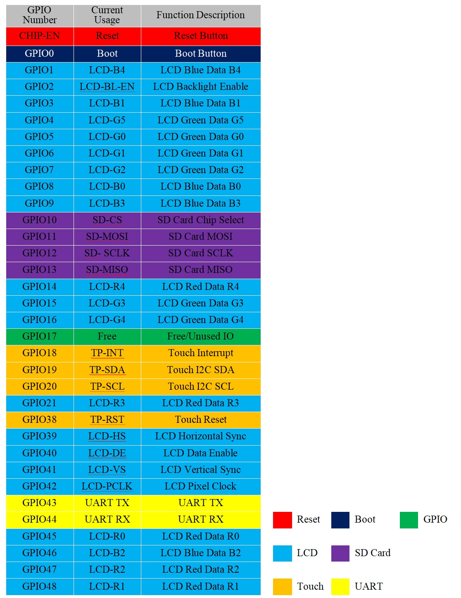
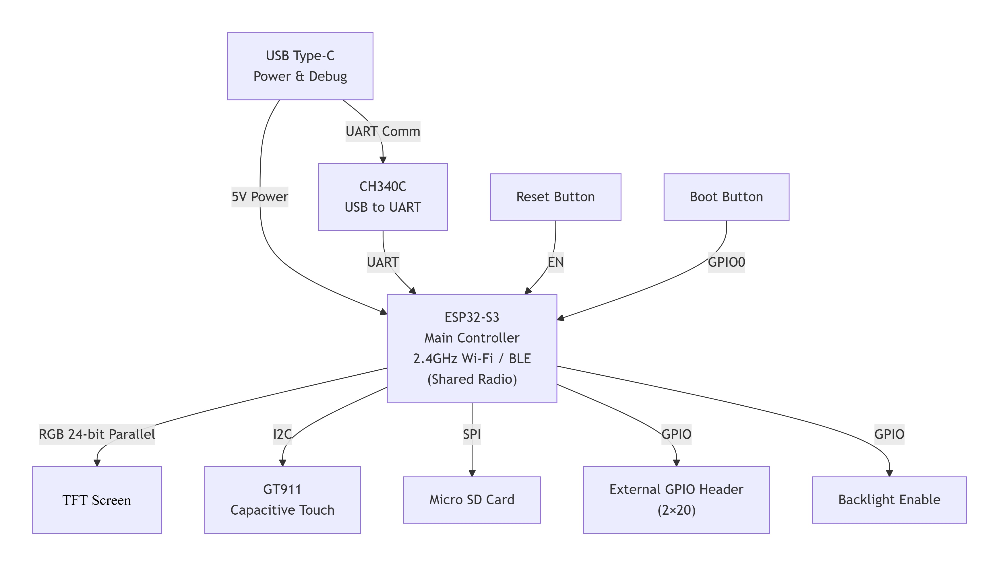

# 4.3 英寸 800x480 ESP32-S3 触控智能屏

<div class="grid cards" markdown>

-   **UEDX80480043E-WB**
    ---
    基于 **ESP32-S3** 的主流 AIoT 智能屏。配备 4.3 英寸 **800x480** IPS TFT 显示屏与电容触摸屏，支持 Wi-Fi / 蓝牙 5 (LE)，并拥有丰富的扩展接口。

    [:material-arrow-left: 返回系列列表](../esp32/){ .md-button }
    [:material-cart: 官方旗舰店](https://shop277726935.taobao.com/){ .md-button .md-button--primary }
    [:simple-gitee: Gitee 仓库](https://gitee.com/VIEWESMART/UEDX80480043ESP32-4.3inch-Touch-Display){ .md-button }

</div>

<div align="center">
  
</div>

---

## 1. 产品简介

**UEDX80480043E-WB-B** 是一款基于 ESP32-S3 的高性能智能显示开发板，配备 4.3 英寸 RGB 触控屏（800x480）。该板由优奕视界设计，适用于需要丰富外设接口与 Wi-Fi / 蓝牙连接能力的 IoT 与 HMI 应用。

### 1.1 产品特性

#### 处理器
- **处理器**：Xtensa® 32 位 LX7 双核处理器，主频最高 240 MHz。
- **无线**：集成 Wi-Fi 2.4GHz (802.11 b/g/n) 与蓝牙 5 (LE) 及 BLE Mesh。

#### 存储
- **PSRAM**：8 MB
- **Flash**：16 MB

#### 外设接口
- 两路 2x21 排针，引出多路可编程 GPIO（SPI、UART、I2C、I2S、LCD、Camera、USB OTG 等）。
- 板载 USB Type-C 接口，用于供电、烧录与串口调试（CH340C）。
- 板载 Micro SD 卡槽（SPI 接口）。
- RESET 与 BOOT 按键。

#### 显示屏
| 参数 | 规格 |
| :--- | :--- |
| 尺寸 | 4.3 英寸 |
| 分辨率 | 800 x 480 |
| 像素排列 | RGB 竖条纹 |
| 接口模式 | 40PIN RGB 24-bit |
| 驱动 IC | ST7262E43-G4 |
| 触摸 IC | GT911 |
| 亮度 | 400 cd/m² |
| 触摸类型 | 电容式 (CTP) |

#### 其他
- **工作温度**：-20 ~ 70 ℃
- **储存温度**：-30 ~ 80 ℃

### 1.2 应用场景

凭借丰富的连接能力与强劲的处理性能，UEDX80480043E-WB-B 是以下领域 IoT 设备的理想选择：

- 智能家居控制面板
- 工业自动化 HMI
- 智能家电
- 消费类电子
- 无线数据记录仪
- 触控交互界面
- 教育学习平台

## 2. 硬件说明

### 2.1 模块概览

各接口与元器件布局如下图所示。

<div align="center">
  
</div>

- **主控芯片**：ESP32S3-MCN16R8（双核，最高 240 MHz）。
- **显示接口**：40-Pin RGB 24-bit 输出（R0-R7、G0-G7、B0-B7）。受芯片限制，仅可使用 RGB565。
- **SD 卡槽**：SPI 接口，用于外部存储扩展。
- **触摸接口**：I2C (SDA/SCL) + 中断 + 复位引脚，用于 GT911 电容触摸。
- **USB Type-C**：5V 直流供电与烧录。
- **UART 串口**：标准 TX/RX，用于调试或通信。
- **RGB 灯珠**：板载 WS2812B。
- **按键**：BOOT (GPIO0) 进入下载模式；RESET (CHIP-EN) 系统复位。
- **4-pin 1.5mm 排针**：可选 I2C / UART 引出。若担心干扰，可移除 RGB 灯珠。
- **外部 GPIO 排针**：双排 2x21 排针，提供 ADC、触摸传感器与数字 I/O。

#### 显示屏接口引脚定义

| 引脚号 | 符号 | I/O | 说明 |
| :---: | :--- | :---: | :--- |
| 1 | LEDK | P | 背光负极电源 |
| 2 | LEDA | P | 背光正极电源 |
| 3 | GND | P | 电源地 |
| 4 | VDD | P | 内部逻辑电源稳压器 (3.3V) |
| 5-12 | R0-R7 | I | 红色数据输入 |
| 13-20 | G0-G7 | I | 绿色数据输入 |
| 21-28 | B0-B7 | I | 蓝色数据输入 |
| 29 | GND | P | 电源地 |
| 30 | CLK | I | 像素时钟输入（负极性） |
| 31 | DISP | I | 待机模式（通常上拉为高） |
| 32 | HSYNC | I | 水平同步信号（负极性） |
| 33 | VSYNC | I | 垂直同步信号（负极性） |
| 34 | DEN | I | 数据输入使能（高电平有效） |
| 35 | NC | I | 空脚 |
| 36 | GND | P | 电源地 |
| 37 | XR | - | 空脚 |
| 38 | YD | - | 空脚 |
| 39 | XL | - | 空脚 |
| 40 | YU | - | 空脚 |

> **图例**：I = 输入；O = 输出；P = 电源

#### 触摸接口引脚定义

| 引脚号 | 符号 | I/O | 说明 |
| :---: | :--- | :---: | :--- |
| 1 | GPIO20 | P | TP SCL |
| 2 | GPIO19 | P | TP SDA |
| 3 | GPIO18 | P | INT（实际未使用） |
| 4 | GND | P | 电源地 |
| 5 | VDD | I | 内部逻辑电源稳压器 (3.3V) |
| 6 | GPIO38 | I | RTP-csb / CTP-rst |
| 7 | GND | P | 电源地 |
| 8 | GND | P | 电源地 |

### 2.2 GPIO 定义（引脚图） { #22-gpio-definition-pinout }

<div align="center">
  
</div>

### 功能框图

<div align="center">
  
</div>

!!! note "共用射频"
    ESP32-S3 内置 2.4 GHz 射频，同时支持 Wi-Fi (802.11 b/g/n) 与蓝牙 5 (LE)。由于二者共用同一套射频前端，Wi-Fi 与 BLE 无法同时收发，射频会在两种协议之间按需切换。功能框图中以“Shared Radio”标注。

## 3. 软件开发

我们为 **Arduino**、**PlatformIO** 与 **ESP-IDF** 三套框架提供完整支持，并已移植好 LVGL 示例。

!!! tip "软件兼容性"
    UEDX80480043E-WB-A 与 UEDX80480043E-WB-B 在软件上没有任何差异。因此下文统一以 **UEDX80480043E-WB-A** 作为开发板名称。

### 3.1 软件示例

所有示例代码均可在 [Gitee 仓库](https://gitee.com/VIEWESMART/UEDX80480043ESP32-4.3inch-Touch-Display/tree/main/examples) 中找到。

| 框架 | 示例路径 | 说明 |
| :--- | :--- | :--- |
| Arduino | `examples/arduino/gui/lvgl_v8` | LVGL Benchmark：演示 800x480 UI 渲染。可直接在 Arduino IDE 中打开。 |
| ESP-IDF | `examples/esp_idf/lvgl_v9_demo_4_3inch` | LVGL 移植：在 ESP-IDF 下移植并使用 LVGL 的示例。 |
| ESP-IDF | `examples/esp_idf/squareline_coffee_4_3inch` | SquareLine 移植：在 ESP-IDF 下移植并使用 SquareLine 的示例。 |
| ESP-IDF | `examples/esp_idf/sd_card_spi` | SD 卡：在设备上使用 SD 卡的示例。 |
| PlatformIO | `examples/platformio/lvgl_v8_port` | LVGL v8 移植：LVGL v8 使用示例。 |

### 3.2 快速入门 { #32-getting-started }

#### 3.2.1 准备工作

- **硬件**：UEDX80480043E-WB-A 或 UEDX80480043E-WB-B 开发板、USB-C 数据线。
- **软件**：VS Code（ESP-IDF v5.3+）/ Arduino IDE (v2.0+) / VS Code（PlatformIO）。

**所需库文件（Arduino IDE 与 PlatformIO）：**

| 库文件 | 版本 | 说明 |
| :--- | :--- | :--- |
| ESP32_Display_Panel | 1.0.3+ | Espressif 出品。驱动屏幕所必需。 |
| ESP32_IO_Expander | 自动选择 | ESP32_Display_Panel 的依赖库，按提示一并安装。 |
| esp-lib-utils | 自动选择 | ESP32_Display_Panel 的依赖库，按提示一并安装。 |
| lvgl | 8.4.0 | 免费开源的嵌入式图形库。 |

#### 3.2.2 ESP-IDF 环境配置

1. **下载**：到 Gitee 仓库下载程序，点击绿色「克隆 / 下载」按钮即可下载 main 分支。
2. **打开**：用带 ESP-IDF 扩展的 VS Code 打开示例。
3. **编译与烧录**：
    - 点击右上角 `Build` 编译。
    - 将开发板连接到电脑。
    - 点击 `Upload` 烧录固件。

#### 3.2.3 Arduino 环境配置

!!! tip "新手教程"
    详细指导请参考 [Arduino 入门教程](../../support/FAQ-Arduino-ESP32.md)。

1. **安装 ESP32 开发板包**：
    - 进入 `工具 > 开发板 > 开发板管理器`。
    - 搜索 Espressif 的 `esp32`，安装 **3.0.0+** 版本。

2. **安装库文件**：
    - 进入 `项目 > 加载库 > 管理库`。
    - 搜索 Espressif 的 `ESP32_Display_Panel`，安装 **1.0.3+**。弹出依赖提示时点击 **全部安装**。
    - 安装 `lvgl`（推荐 **v8.4.0**）。

3. **打开示例**：
    - 进入 `文件 > 示例 > ESP32_Display_Panel > Arduino > gui > lvgl_v8 > simple_port`。

4. **选择开发板与设置**：
    - 目标板：`ESP32S3 Dev Module`
    - Flash Size：**16MB (128Mb)**
    - Partition Scheme：**16M Flash (3MB APP/9.9MB FATFS)**
    - PSRAM：**OPI PSRAM**（至关重要！）

5. **配置支持的板级定义**：
   打开示例中的 `esp_panel_board_supported_conf.h` 并做如下修改：

    ```c
    // 启用支持的板级配置
    #define ESP_PANEL_BOARD_DEFAULT_USE_SUPPORTED       (1)

    // 仅取消目标板定义的注释
    #define BOARD_VIEWE_UEDX80480043E_WB_A
    ```

    !!! warning "重要"
        - **不要**同时启用 `ESP_PANEL_BOARD_DEFAULT_USE_SUPPORTED` 与 `ESP_PANEL_BOARD_DEFAULT_USE_CUSTOM`。
        - **不要**同时启用多个板级定义。

6. **配置示例宏（可选）**：

    在 `lvgl_v8_port.h` 中：
    - 若使用 **RGB/MIPI-DSI** 接口：将 `LVGL_PORT_AVOID_TEARING_MODE` 设为 `1`/`2`/`3`，并将 `LVGL_PORT_ROTATION_DEGREE` 设为目标旋转角度。
    - 若使用**其他接口**：不要修改这些宏。

    在 `lv_conf.h` 中：
    - 若使用 **SPI/QSPI** 接口：将 `LV_COLOR_16_SWAP` 设为 `1`。

7. **选择端口**：进入 `工具 > 端口`，选择正确的 COM 口。

8. **编译与上传**：
    - 点击 `✓` 编译。
    - 点击 `→` 上传。

!!! tip "配置提示"
    在 `esp_panel_board_supported_conf.h` 中，请确保已取消 `#define BOARD_VIEWE_UEDX80480043E_WB_A` 的注释。

    不要同时启用 `ESP_PANEL_BOARD_DEFAULT_USE_SUPPORTED` 与 `ESP_PANEL_BOARD_DEFAULT_USE_CUSTOM`，也不能同时启用多个 Espressif 支持的板级配置。

#### 3.2.4 PlatformIO 环境配置

1.  **打开 PlatformIO 示例**
    * 到 Gitee 仓库下载程序，点击绿色「克隆 / 下载」按钮即可下载 main 分支。
    * 用 VS Code (PlatformIO) 打开示例。
2.  **配置 PlatformIO**：
    * 该示例默认使用 `BOARD_ESPRESSIF_ESP32_S3_LCD_EV_BOARD_2_V1_5`。请在 `platformio.ini` 的 `[platformio]:default_envs` 中选择 `BOARD_VIEWE_UEDX80480043E_WB_A`。
3.  **配置示例**：
    - *[可选]* 修改 `lvgl_v8_port.h` 文件中的宏定义：
        - **若使用 `RGB/MIPI-DSI` 接口**：将 `LVGL_PORT_AVOID_TEARING_MODE` 宏改为 `1`/`2`/`3` 以启用防撕裂功能，随后将 `LVGL_PORT_ROTATION_DEGREE` 宏改为目标旋转角度。
        - **若使用其他接口**：请不要修改 `LVGL_PORT_AVOID_TEARING_MODE` 与 `LVGL_PORT_ROTATION_DEGREE` 宏定义。
4.  **编译并上传工程**：
    - 点击 `√`（编译）按钮。
    - 将开发板连接到电脑。
    - 点击 `→`（上传）按钮。

## 4. 相关文档与资源

| 文档 | 链接 |
| :--- | :--- |
| 产品规格书 | [UEDX80480043E-WB-B.pdf](../../../assets/datasheet/UEDX80480043E-WB-B.pdf) |
| 原理图 | [SCH-UEDX80480043E-WB.pdf](../../../assets/schematic/SCH-UEDX80480043E-WB.pdf) |
| 2D 图纸 (DWG) | [UEDX80480043E-WB-B-2D.dwg](../../../assets/dimension/UEDX80480043E-WB-B-2D.dwg) |
| ESP32-S3-WROOM-1 数据手册（中文） | [esp32-s3-wroom-1_datasheet_cn.pdf](../../../assets/datasheet/chip/esp32-s3-wroom-1_wroom-1u_datasheet_cn.pdf) |
| ESP32-S3-WROOM-1 数据手册（英文） | [esp32-s3-wroom-1_datasheet_en.pdf](../../../assets/datasheet/chip/esp32-s3-wroom-1_wroom-1u_datasheet_en.pdf) |

## 5. 固件下载

1. 打开工程 `tools` 目录下的 **ESP32 烧录工具**。
2. 选择正确的芯片型号与烧录方式，点击 **OK**。
3. 按下图 **1 → 2 → 3 → 4 → 5** 的编号步骤烧录固件。
4. 若烧录失败，请**按住 BOOT-0 按键**后重试。

固件文件位于仓库根目录的 `firmware` 目录下，请参阅其中的版本说明选择合适的文件。

<p align="center" width="100%">
  
  
</p>

## 6. 常见问题

??? question "看完教程还是不知道怎么搭建编程环境，怎么办？"
    请参考[优奕视界常见问题](../../support/faq.md)中的环境搭建说明。

??? question "为什么一打开 Arduino IDE 就提示库文件需要更新？要不要更新？"
    请选择**不**更新库文件。不同版本的库文件之间可能不兼容，更新后可能破坏已有功能。

??? question "为什么 UART 接口没有串口数据输出？"
    默认配置使用 USB 作为 UART0 串口输出用于调试。外部 UART 排针也连接到 UART0，但未重新配置时不会有任何输出。

    **PlatformIO 用户：**
    打开 `platformio.ini`，将 `build_flags` 下的：

    ```text
    -D ARDUINO_USB_CDC_ON_BOOT=true   →   -D ARDUINO_USB_CDC_ON_BOOT=false
    ```

    **Arduino 用户：**
    进入 `工具 > USB CDC On Boot`，选择 **Disabled**。

??? question "为什么板子一直下载程序失败？"
    在点击上传 / 下载时**按住 BOOT 按键**，等连接建立后再松开。

!!! info "没找到需要的内容？"
    如需更多产品、资料或技术支持，请联系我们的团队：

    [**:material-archive-arrow-down: 资源中心**](../../support/resource.md){ .md-button .md-button--primary }
    [**:material-magnify: 更多产品**](../esp32/index.md){ .md-button  }
    [**:material-email: 联系技术支持**](mailto:info@chinasunyee.com){ .md-button }
