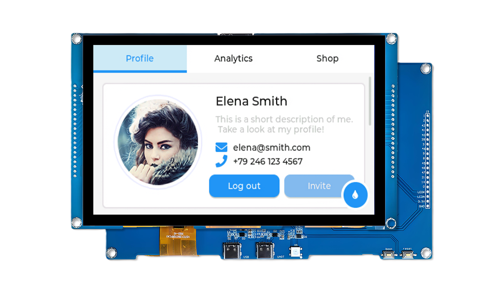
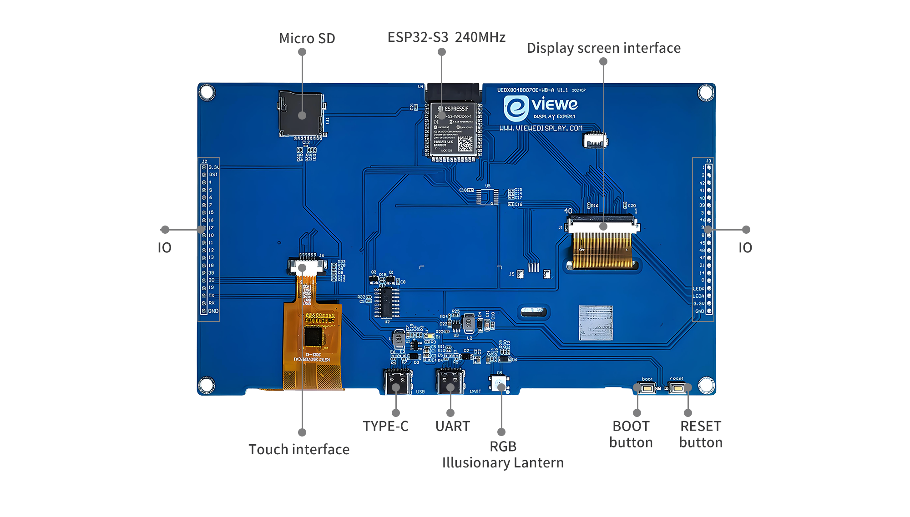
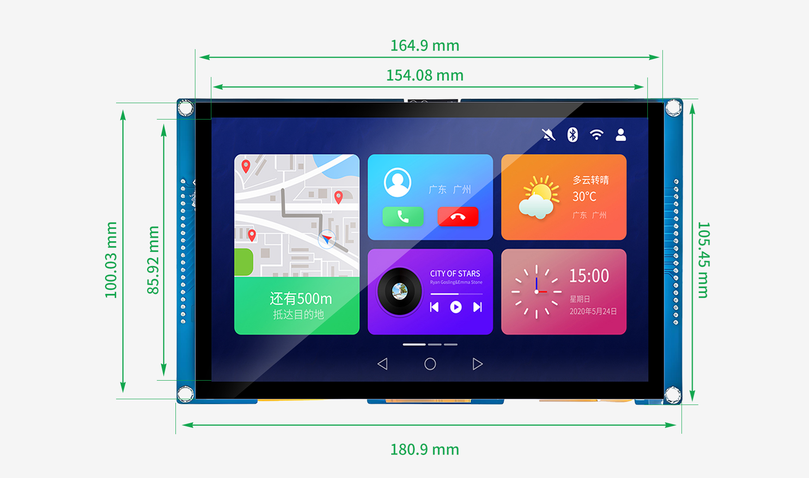

# 7" 800x480 ESP32-S3 智能屏

-   **UEDX80480070E-WB-A**
    ---
    基于 **ESP32-S3** 的**主流 AIoT** 开发板和智能屏。
    配备 7 英寸 **800x480** TFT 显示屏 (RGB 接口)，支持 Wi-Fi & 蓝牙 5 (LE)，拥有丰富的扩展接口。

    [:material-arrow-left: 返回系列列表](../esp32/){ .md-button }
    [:material-cart: 官方商城](https://viewedisplay.com/product/esp32-7-inch-800x480-rgb-ips-tft-display-touch-screen-arduino-lvgl-uart/){ .md-button .md-button--primary }
    [:material-github: GitHub 仓库](https://github.com/VIEWESMART/UEDX80480070ESP32-7inch-Touch-Display){ .md-button }

 
  

---

## 1. 产品简介

**UEDX80480070E-WB-A** 是一款配备 7 英寸 RGB 屏幕 (800x480) 的高性能 HMI 智能显示模组。搭载 **ESP32-S3-WROOM-1-N16R8** 模组，集成了 2.4GHz Wi-Fi 和蓝牙 5 (LE) 通信能力。

该开发板采用高速 **RGB 接口**驱动屏幕，确保流畅的 UI 交互体验 。板载电容触摸屏 (GT911)，提供丰富的 GPIO 扩展，完美支持 **Arduino**, **ESP-IDF**, 和 **PlatformIO** 等主流开发框架。

### 1.1 产品特性
* **处理器**:
    * **ESP32-S3**: Xtensa® 双核 32位 LX7 MCU @ 240MHz.
    * 集成 2.4 GHz Wi-Fi (802.11 b/g/n) & Bluetooth 5 (LE).
* **存储**:
    * **16MB** Quad SPI Flash.
    * **8MB** Octal SPI PSRAM.
* **显示与触摸**:
    * **屏幕**: 7.0 英寸 TFT LCD (800x480 分辨率).
    * **接口**: 16-bit RGB 接口 (高刷新率).
    * **驱动 IC**: EK9716BD3 + EK73002AB2.
    * **触摸**: 电容式多点触控 (GT911)，I2C 接口.
* **外设接口**:
    * **连接**: USB-C (UART/烧录), RS485, CAN, RS232 (可选/扩展).
    * **存储**: TF 卡槽 (SDIO/SPI 模式).
    * **音频**: 板载扬声器接口 & 蜂鸣器.
    * **扩展**: GPIO 排针 (UART, I2C, SPI, IOs).

### 1.2 应用场景
* 工业 HMI 控制面板
* 智能家居中控屏
* 医疗设备与仪器
* IoT 数据看板

---

## 2. 硬件说明

### 2.1 模块概览
详细的板载元件布局如下图所示：

| 编号 | 元件 | 说明 |
| :--- | :--- | :--- |
| **①** | **ESP32-S3-N16R8** | 主控模组 (16MB Flash / 8MB PSRAM). |
| **②** | **USB-C 接口** | **5V 供电** / 固件下载 / UART 调试 (CH340C). |
| **③** | **显示接口** | 40-Pin RGB 接口 FPC 连接器. |
| **④** | **触摸接口** | 6-Pin 电容触摸排针 (I2C). |
| **⑤** | **TF 卡槽** | 用于外部存储 (图片/日志). |
| **⑥** | **UART/RS485** | 预留焊盘/排针，用于工业串口通信. |
| **⑦** | **BOOT 按键** | 上电时按住可进入下载模式. |
| **⑧** | **RESET 按键** | 硬件复位键. |
| **⑨** | **扩展排针** | 引出 GPIO, 5V, 3.3V, GND 供外部传感器使用. |

### 2.2 GPIO 定义 (引脚图)
显示屏与触摸接口的引脚映射关系：

#### **显示屏 (RGB 接口)**
| 引脚名称 | ESP32-S3 引脚 | 功能 |
| :--- | :--- | :--- |
| **DE** | IO40 | 数据使能 (Data Enable) |
| **VSYNC** | IO41 | 垂直同步 (Vertical Sync) |
| **HSYNC** | IO39 | 水平同步 (Horizontal Sync) |
| **PCLK** | IO42 | 像素时钟 (Pixel Clock) |
| **R0 - R4** | IO45, 48, 47, 21, 14 | 红色数据线 |
| **G0 - G5** | IO5, 6, 7, 15, 16, 4 | 绿色数据线 |
| **B0 - B4** | IO8, 3, 46, 9, 1 | 蓝色数据线 |
| **BL** | IO2 | 背光 PWM 控制 |

#### **触摸屏 (GT911)**
| 引脚名称 | ESP32-S3 引脚 | 功能 |
| :--- | :--- | :--- |
| **SDA** | IO19 | I2C 数据 |
| **SCL** | IO20 | I2C 时钟 |
| **INT** | IO18 | 中断信号 |
| **RST** | IO38 | 复位信号 |

#### **外设接口**
| 接口 | ESP32-S3 引脚 | 说明 |
| :--- | :--- | :--- |
| **UART0** | IO43 (TX), IO44 (RX) | USB 转串口 (调试/上传) |
| **SD 卡** | IO10 (CS), IO11 (MOSI), IO12 (CLK), IO13 (MISO) | SPI/SDIO 模式 |
| **RGB 灯** | IO0 | WS2812B (可选贴片) |

### 2.3 机械尺寸
物理尺寸及安装孔位信息：

* **外形尺寸**: 180.9mm x 105.45mm
* **屏幕尺寸**: 7.0 英寸 (对角线)

---

## 3. 软件开发

我们要提供基于 **Arduino**, **PlatformIO**, 和 **ESP-IDF** 框架的全面支持，并提供移植好的 **LVGL** 示例。

### 3.1 快速入门

#### 3.1.1 准备工作
* **硬件**: UEDX80480070E-WB-A 开发板, USB-C 数据线.
* **软件**: Arduino IDE (v2.0+) 或 VS Code (PlatformIO).
* **库文件**: `ESP32_Display_Panel` (必须安装).

#### 3.1.2 Arduino 环境配置
1.  **安装 ESP32 开发板包**:
    * 打开 *工具 > 开发板 > 开发板管理器*.
    * 搜索 `esp32` (Espressif Systems) 并安装版本 **3.0.0+**.
2.  **选择开发板**:
    * 目标板: `ESP32S3 Dev Module`.
    * 设置:
        * **Flash Size**: 16MB (128Mb)
        * **Partition Scheme**: 16M Flash (3MB APP/9.9MB FATFS)
        * **PSRAM**: **OPI PSRAM** (至关重要!)
3.  **安装库文件**:
    * 在库管理器中安装 `ESP32_Display_Panel`.
    * 安装 `lvgl` (推荐 v8.3.x 版本).

### 3.2 软件示例
所有示例代码均可在 [GitHub 仓库](https://github.com/VIEWESMART/UEDX80480070ESP32-7inch-Touch-Display/tree/main/examples) 中找到。

| 框架 | 示例路径 | 说明 |
| :--- | :--- | :--- |
| **Arduino** | `examples/arduino/gui/lvgl_v8` | **LVGL 跑分**: 演示 800x480 分辨率下的 UI 渲染性能. |
| **Arduino** | `examples/arduino/peripherals/sd_card` | **SD 卡测试**: 测试 TF 卡槽的读写功能. |
| **PlatformIO**| `examples/platformio/default_envs` | **出厂固件**: 开发板预装的演示程序. |

> [!TIP]
> **配置说明**: 在 `esp_panel_board_supported_conf.h` 文件中, 请确保取消以下宏定义的注释:
> `#define BOARD_VIEWE_UEDX80480070E_WB_A`

---

## 4. 相关文档与资源

### 📄 开发板文档
| 文档标题 | 类型 | 说明 |
| :--- | :--- | :--- |
| **[产品规格书](../../../assets/datasheet/UEDX80480070E-WB-A V2.0 SPEC.pdf)** | PDF | UEDX80480070E 完整硬件规格书 |
| **[原理图](../../../assets/schematic/UEDX80480070E-WB-A%20V1.1%20sch.png)** | PNG | 电路设计原理图 |
| **[显示屏规格书](../../../assets/datasheet/display/ALL-UE070WV-RB40-A092A.pdf)** | PDF | 液晶面板规格说明 |
| **[触摸驱动手册](../../../assets/datasheet/touch/GT911_EN_Datasheet.pdf)** | PDF | Goodix GT911 触摸芯片数据手册 |

### 🛠️ 工具
* **[Flash 下载工具](../../../assets/software/flash_download_tool.zip)**: 用于手动烧录固件的工具.
* **[图片转换工具](https://lvgl.io/tools/imageconverter)**: 将图片转换为 LVGL 代码的在线工具.

> [!IMPORTANT]
> 更多资源，请访问 [**资源中心**](../../support/resource.md)。

---

## :material-face-agent: 技术支持

-   [**:material-github: GitHub Issues**](https://github.com/VIEWESMART/UEDX80480070ESP32-7inch-Touch-Display/issues)
    ---
    提交 Bug 或功能需求。跟踪开发进度。

-   [**:material-email: 邮件支持**](mailto:smartrd1@viewedisplay.com)
    ---
    获取直接的技术支持与商务咨询。

